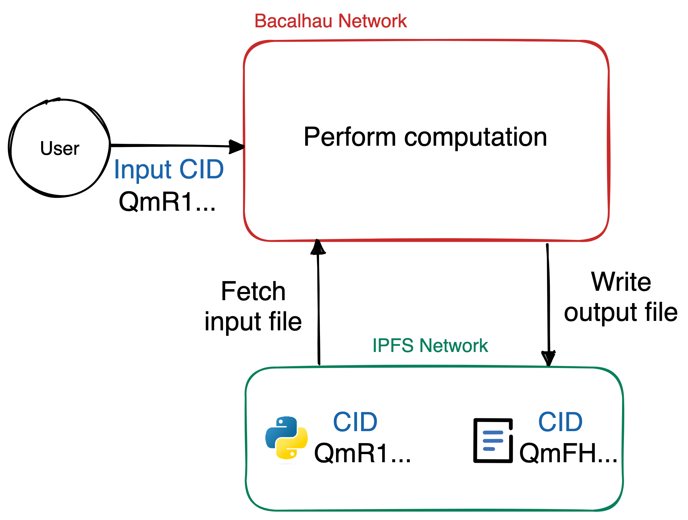
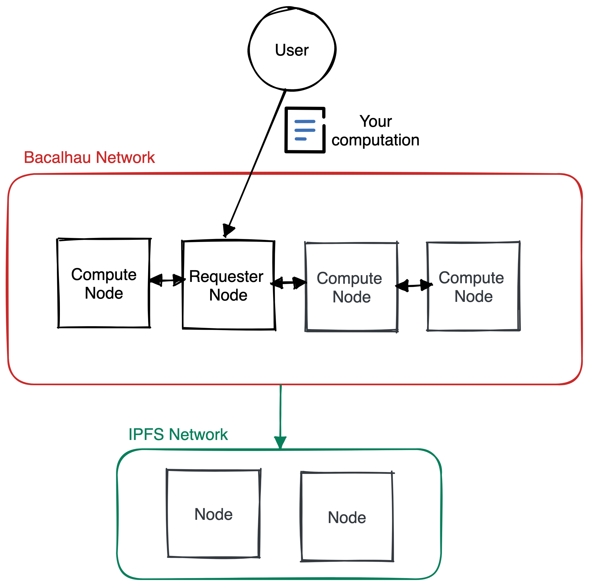

Bacalhau is a framework that allows you to perform distributed computations on IPFS.
These computations are executed in the form of Docker containers or WASM programs.

The **Bacalhau network is a set of computers (nodes) working ready to perform computations**.
You can send your computation (Docker container or WASM) to the Bacalhau network and then read the results.
Every computation has an _input_ and an _output_.
In Bacalhau, the main idea is that the **input is taken from IPFS, and the output is published to IPFS**.

For example, consider that you have a Python script stored on IPFS, with CID `QmR1...`.
This script prints numbers from 0 to 100, and you want to execute it on the Bacalhau network.



First, you provide the CID of the Python script to the Bacalhau network.
The script is fetched from IPFS, and is executed by one or several Bacalhau nodes.
After the computation is finished, the results (the numbers printed) are published to IPFS, with a new CID, `QmFH...`.

## Architecture

Every node in the Bacalhau network can act as a _requester node_ or a _compute node_.
Requester nodes are responsible for receiving the computations (in technical terms, called **jobs**) and delegating them to one or several compute nodes.
Compute nodes are responsible for performing the actual computation.



The lifecycle of a job in Bacalhau is a complex task that includes several steps and verifications.
You can read everything about the Bacalhau architecture in the [official documentation](https://docs.bacalhau.org/about-bacalhau/architecture).

## Tutorial

### Prerequisites
You will need to set up an environment to run Bacalhau. There are three different options you can use:

* **Option 1 –** [Install Bacalhau](https://docs.bacalhau.org/getting-started/installation/#installing-the-bacalhau-cli-locally) on your local machine and Install [Python](https://www.python.org/downloads/) & [Pip](https://pip.pypa.io/en/stable/installation/)

* **Option 2 –** Install [Docker Desktop](https://www.docker.com/products/docker-desktop/) and run [Bacalhau in Docker](https://www.docker.com/products/docker-desktop/)

* **Option 3 –** Run Bacalhau in [Gitpod](https://gitpod.io/#https://github.com/protocol/launchpad-tutorials) in a web browser

### Tutorials
* [Install the Bacalhau Client](https://docs.bacalhau.org/getting-started/installation/#install-the-bacalhau-client) - See instructions for installing Bacalhau on your local machine.
* [Running Pandas in Bacalhau](https://docs.bacalhau.org/examples/workload-onboarding/python-pandas/) – In this tutorial, you will deploy a Python script on Bacalhau. The script is a basic application that uses the Pandas Python library.

### The Bacalhau CLI: Cheat Sheet

| Name | Command | Description |
|--|----------|----------|
| Run a Docker container on Bacalhau |`bacalhau docker run ubuntu echo Hello World` | Creates an Ubuntu Docker container in the Bacalhau network and runs a program that prints 'Hello World'. |
| Check job status by its ID | `bacalhau list --id-filter=${JOB_ID}`  | Gets the status of a certain job in Bacalhau. |
| Mount a volume in the Docker container | `bacalhau docker run -v ${CID}:myfiles ubuntu cat /files/numbers.txt`| Mounts an IPFS file/folder (identified by the `${CID}` variable) to the `myfiles` directory. Then a file inside the folder is read. |
| Get full information of a job | `bacalhau describe ${JOB_ID}`   | Prints a full description of the job deployed on Bacalhau. |

#### Run Bacalhau in Docker
If you are familiar with Docker, you should identify the `docker run` command, which allows you to execute Docker containers.
The Bacalhau CLI adds several options on top of this command.

```bash
> bacalhau docker run \
-v QmfKJT13h5k1b23ja3ZCVg5nFL9oKz2bVXc8oXgtwiwhjz:/files \
ubuntu cat /files/read_csv.py
```

In the previous example, the command `cat /files/read_csv.py` is executed inside an Ubuntu container.
The `-v` (volume) option allows you to mount an IPFS file or folder to a directory inside the Docker container.
The IPFS folder with CID `QmfKJT13h5k1b23ja3ZCVg5nFL9oKz2bVXc8oXgtwiwhjz` is mounted to the `/files` directory inside the container. Therefore:
1. An Ubuntu Docker container is created
2. The `QmfKJT13h5k1b23ja3ZCVg5nFL9oKz2bVXc8oXgtwiwhjz` IPFS folder is mounted to the `/files` directory inside the container.
3. The file is read by using the `cat` command.

Now that you understand the basics of Bacalhau, check out the great examples in the [official documentation](https://docs.bacalhau.org/examples/).
