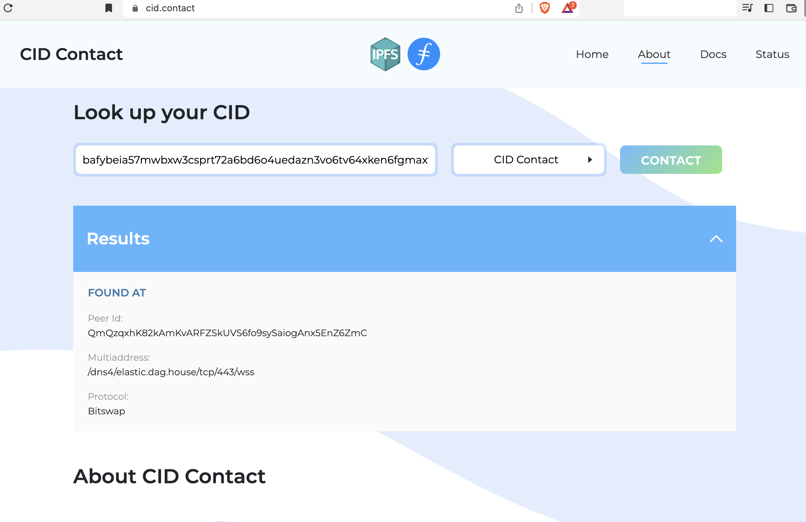
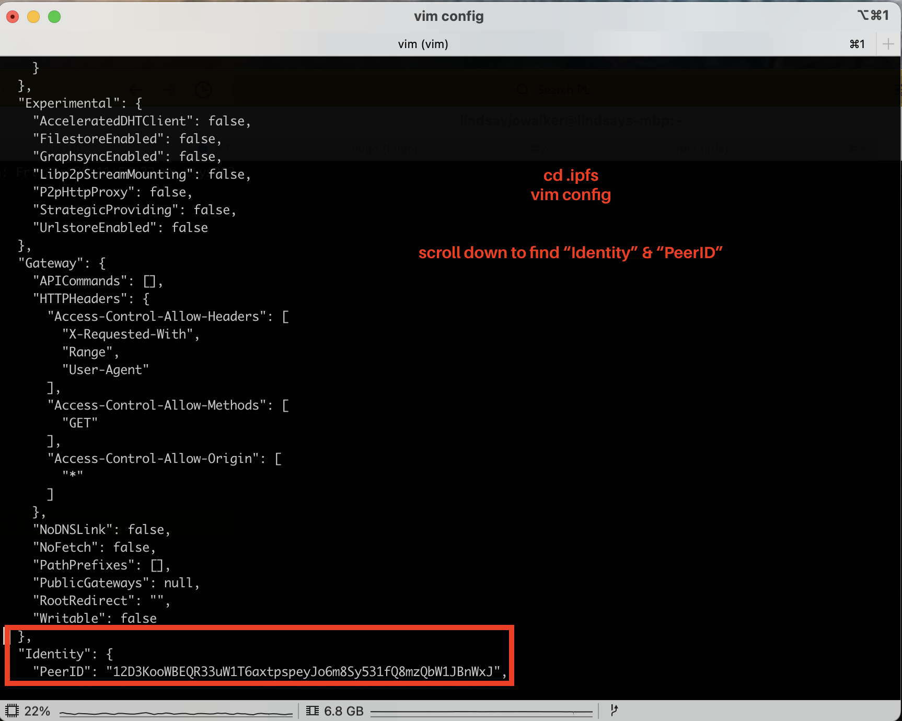
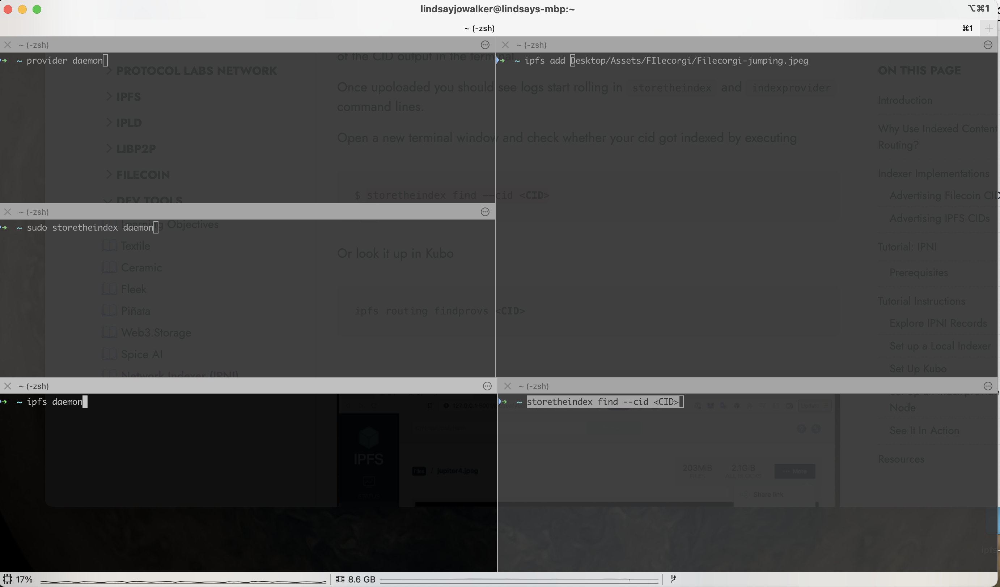
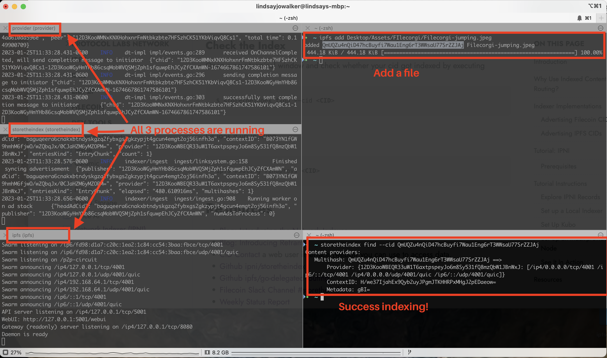

## <Dev Tool> Introduction
The [IPNI network indexer](https://github.com/ipni) is a project created and maintained by Protocol Labs that is designed to index the data on the Filecoin and IPFS networks, and work alongside the Distributed Hash Table (DHT) employed by both the IPFS and Filecoin networks to enable the fast and efficient retrieval of content-addressed data.

## Why Use Indexed Content Routing?
Protocol Labs' Network Indexer (IPNI) enables any user or developer to query both the IPFS and Filecoin public nodes to find content-addresses data using the [CID](../ipfs/content-addressing/#content-addressing).

Since IPFS and Filecoin use different protocols to retrieve data (IPFS uses Bitswap, and Filecion uses Graphsync), there is a need for a solution that makes it possible for anyone who would want to retrieve and use that data to locate and understand which protocol they can use to retrieve that data and use it in other applications.

Kubo 16 introduced Delegated Routing protocol that allows a node to publish its CIDs to alternative routing systems alongside the DHT and be used for subsequent content-addressed data lookups.

IPNI also makes it possible, in a way not achieved before, for people to retrieve data from the Filecoin network, as there is a lot of data stored across Filecoin nodes, but  no way to search and retrieve that data searching either by the CID of multihash of that data. The API calls return json objects that contain information about where and how the data represented with a CID such as `bafybeia57mwbxw3csprt72a6bd6o4uedazn3vo6tv64xken6fgmaxtiugy` can be fetched from.

Though the DHT is an amazing, distributed way to advertise and discover content, IPNI adds another layer that can give you other options for retrieving files for your applications. With an open protocol that anyone can use, as seen here in the [go-delgated-routing](https://github.com/ipfs/go-delegated-routing) library on their server.
With an open protocol that anyone can use on their server, as seen here in the [go-delgated-routing](https://github.com/ipfs/go-delegated-routing) library.
to enable faster discovery and routing, along with load balancing and an alternative market where routing is done, besides the DHT

Laern more about IPNI, the motivations behind it, and potential use cases, see the video **[State of Content Routing| IPFS Camp Lisbon 2022](https://www.youtube.com/watch?v=DLCTEXbF1Es)**


## IPNI Implementations
IPNI builds its index by processing [Advertisements](https://github.com/ipni/storetheindex/blob/main/api/v0/ingest/schema/schema.ipldsch#L40). The Advertisement construct allows a Storage Provider to offer their CIDs to IPNI, which would make these CIDs available for fast lookups once the Advertisement has been processed. Since Filecoin and IPFS store data on separate networks, using different methods of data transfer, there are who different ways that the information about the CIDs are communicated to IPNI.

### Advertising Filecoin CIDs
Storage providers such as [Estuary](https://estuary.tech/) who store on Filecion can publish their content to the indexer using [index-provider](https://github.com/ipni/index-provider) library. When a deal is made and data is published to Filecoin, the would also [advertise](https://github.com/ipni/storetheindex/blob/main/api/v0/ingest/schema/schema.ipldsch#L40) to IPNI. An update is made available on a libp2p to a topic that IPNI follows and then reaches out to the Storage Providers for an update when sees it.

### Advertising IPFS CIDs
When data is added to the IPFS network via kubo version 16 and above, there is an API used with the Reframe or [go-delegated-routing](https://github.com/ipfs/go-delegated-routing) that is used to send data about those CIDs to IPNI. Anyone who published to ipfs using Kubo can configure their node to advertise CIDs into both the DHT and IPNI.

#### Reframe
[Reframe](https://github.com/ipfs/go-delegated-routing) is a Request-response Protocol (RPC) used by IPFS Kubo 16+ that allows the node to publish its own CIDs as well as to look up other CIDs in an alternative routing system such as IPNI alongside the DHT. That doesn't have to be either / or choice - content can be looked up or published to both in the same time.

Kubo doesn't know how to speak to IPNI by itself. Instead it relies on someone translating reframe messages into the IPNI protocol. That is done to enable alternative routing systems market without being bound to the DHT or IPNI protocols.

That job is done by Index Provider process that can be run alongside a Kubo node as a bridge to IPNI.
With versions of kubo 16+, the Refame RPC is integrated as a feature
* Reframe adds an additional way to discover peers, content, and IPNS records
* With Reframe, you can configure your IPFS kubo node to publish a snapshot of all of the CIDs on your node at whatever frequency you would like
* Reframe uses HTTP transport to store this information on an indexer node
* Reframe makes alternative routing systems other than DHT possible
* Content can be published to both the IPFS DHT and Reframe with a tool called ParallelHelper
  Reframe was created from a [kubo spec](https://github.com/ipfs/specs/blob/main/reframe/REFRAME_PROTOCOL.md) (the IPFS go implementation) that allows IPFS nodes to advertise their content to other systems besides the DHT.


## Tutorial: IPNI
In this simple tutorial, we are going to configure and run an IPFS node to communicate data to the indexer and take a look at what that data looks like.

#### Workshop: Indexed Content Routing| IPFS Camp Lisbon 2022
See how to set up a local indexer and index-provider in this workshop from IPFS Camp 2022. In this tutorial you will: 
* Modify the config for your kubo IPFS node
* Set up a local network indexer that the IPFS node is going to advertise its contents to
* Set up index-provider that is going to be used as a bridge between IPNI and IPFS




### Prerequisites
In order to participate in this activity you will need:
* [Go Version 1.18 or later](https://go.dev/doc/install) installed
  * Make sure that `GOPATH/bin` is on your `PATH`

```
$ export GOPATH=$HOME/go
$ export PATH=$PATH:$GOPATH/bin
```
* kubo (IPFS go) version 16 or above installed
  * IPFS install [Tutorial](https://curriculum.pl-launchpad.io/tutorials/ipfs-intro/setup/)
  * [Docs Instructions](http://docs.ipfs.tech.ipns.localhost:8080/install/command-line/#install-official-binary-distributions)
  * [Distributions](https://dist.ipfs.tech/#kubo)
* [IPFS companion](https://chrome.google.com/webstore/detail/ipfs-companion/nibjojkomfdiaoajekhjakgkdhaomnch?hl=en) browser extension or [Brave browser](https://brave.com/download/) to view websites published on IPFS
- Install a [JSON formatter extensio](https://chrome.google.com/webstore/detail/json-formatter/bcjindcccaagfpapjjmafapmmgkkhgoa?hl=en)n for your web browser

## Tutorial Instructions
You can see the video of the workshop called **[Indexed Content Routing](https://www.youtube.com/watch?v=aN7fGturjzA&t=121s)** from IPFS Camp Lisbon 2022. The original instructions are at [https://github.com/ischasny/ipfs-camp-routing](https://github.com/ischasny/ipfs-camp-routing).

### Explore IPNI Records
First, lets take a look at an example IPNI record.
* Check out the [Filecion Saturn website](https://strn.network/), published with the CID `bafybeia57mwbxw3csprt72a6bd6o4uedazn3vo6tv64xken6fgmaxtiugy`.
* Now, look up this CID on [CID contact](https://cid.contact/)
  
* You can also see that same information by constructing the cid.contact url like so:
```
https://cid.contact/cid/<CID>
```

> This one is located at [https://cid.contact/cid/bafybeia57mwbxw3csprt72a6bd6o4uedazn3vo6tv64xken6fgmaxtiugy](https://cid.contact/cid/bafybeia57mwbxw3csprt72a6bd6o4uedazn3vo6tv64xken6fgmaxtiugy)

* Take a look at the providers who are broadcasting CIDs to the network at [https://cid.contact/providers](https://cid.contact/providers)

### Set up a Local Indexer
Installing and running the indexer on your local machine makes it possible for your kubo node to communicate with the indexer, by creating the advertisements in a format the indexer can ingest.

You can see the documentation, CLI commands, and thorough instructions at [https://github.com/filecoin-project/storetheindex/#install](https://github.com/filecoin-project/storetheindex/#install).

Install storetheindex:

```
$ go install github.com/filecoin-project/storetheindex@v0.4.28
```

Initialize the storetheindex repository and configuration:

```
$ storetheindex init
```

Start the indexer

```
$ storetheindex daemon
```


### Set Up Kubo
The next thing you will need to do is modify the configuration file for kubo with the methods from the reframe protocol or HTTP delegated routing, sending queries to both the DHT and the cidContact router, allowing kubo to make queries on CIDs to both places.

[Install Kubo v0.16.0](https://curriculum.pl-launchpad.io/tutorials/ipfs-intro/setup/) or use already configired node. _It's important to make sure that you are on v0.16.0+ version of Kubo or otherwise Reframe won't work._ Initialize a node with `ipfs init`.

> If you already have an ipfs node running on your machine, you can configure the existing `.ipfs/config` file, or else create (`ipfs init`) a new IPFS node for this tutorial, and make a backup copy of the `with cp ~/.ipfs ~/..ipfs` config file, or initialize a new node in a sandboxed vm or container.


To set up custom routing. In a new terminal window, run this command to configure custom routing:

```
ipfs config Routing --json  '{
  "Type": "custom",
  "Methods": {
    "find-peers": {
      "RouterName": "WanDHT"
    },
    "find-providers": {
      "RouterName": "ParallelHelper"
    },
    "get-ipns": {
      "RouterName": "WanDHT"
    },
    "provide": {
      "RouterName": "ParallelHelper"
    },
    "put-ipns": {
      "RouterName": "WanDHT"
    }
  },
  "Routers": {
    "CidContact": {
      "Parameters": {
        "Endpoint": "http://127.0.0.1:50617"
      },
      "Type": "reframe"
    },
    "ParallelHelper": {
      "Parameters": {
        "Routers": [
          {
            "IgnoreErrors": true,
            "RouterName": "CidContact",
            "Timeout": "30m"
          },
          {
            "ExecuteAfter": "2s",
            "IgnoreErrors": true,
            "RouterName": "WanDHT",
            "Timeout": "30m"
          }
        ]
      },
      "Type": "parallel"
    },
    "WanDHT": {
      "Parameters": {
        "AcceleratedDHTClient": true,
        "Mode": "dhtserver",
        "PublicIPNetwork": true
      },
      "Type": "dht"
    }
  }
}'
```

Now if you look in your `.ipfs/config` file, you should see a `Routing` object, which you can modify for a custom setup:
```json
 "Routing": {
    "Methods": {
      "find-peers": {
        "RouterName": "WanDHT"
      },
      "find-providers": {
        "RouterName": "ParallelHelper"
      },
      "get-ipns": {
        "RouterName": "WanDHT"
      },
      "provide": {
        "RouterName": "ParallelHelper"
      },
      "put-ipns": {
        "RouterName": "WanDHT"
      }
    },
    "Routers": {
      "CidContact": {
        "Parameters": {
          "Endpoint": "http://127.0.0.1:50617"
        },
        "Type": "reframe"
      },
      "ParallelHelper": {
        "Parameters": {
          "Routers": [
            {
              "IgnoreErrors": true,
              "RouterName": "CidContact",
              "Timeout": "30m"
            },
            {
              "ExecuteAfter": "2s",
              "IgnoreErrors": true,
              "RouterName": "WanDHT",
              "Timeout": "30m"
            }
          ]
        },
        "Type": "parallel"
      },
      "WanDHT": {
        "Parameters": {
          "AcceleratedDHTClient": true,
          "Mode": "dhtserver",
          "PublicIPNetwork": true
        },
        "Type": "dht"
      }
    },
    "Type": "custom"
  },
```

Start the IPFS node:

```
$ ipfs daemon
```

In the`.ipfs/config` file, find the "Identity" field and write down the `PeerID`:



### Set Up an index-provider Node

The index-provider should be run as a sidecar to both post an announcements on libp2p that they have new data (the CID and other metadata), and make it possible for the indexer to make a connection & transmit the data from your local machine behind a firewall without having to set up port forwarding.


See [https://github.com/ipni/index-provider#install](https://github.com/filecoin-project/index-provider#install) for full instructions on run a standalone provider daemon instance.

Install index-provider:

```
$ go install github.com/filecoin-project/index-provider/cmd/provider@v0.9.0
```

Initialise the index-provider repository and configuration:

```
$ provider init
```


In the provider config, under the `"Router"` object, update the `""ProviderID": "<KUBO_NODE_PEERID>","` with the PeerID from your kubo node that you noted in the previous step:

Open the index-provider config
```
$ vim ~/.index-provider/config
```
Add in your ipfs `PeerID` to the `.index-provider/config` `"ProviderID":` like so:

```json
...
    "Reframe": {
      "ListenMultiaddr": "/ip4/127.0.0.1/tcp/50617",
      "ChunkSize": 1,
      "SnapshotSize": 100,
      "ProviderID": "12D3KooWBEQR33uW1T6axtpspeyJo6m8Sy531fQ8mzQbW1JBnWxJ",
      "Addrs": [
        "/ip4/0.0.0.0/tcp/4001",
        "/ip6/::/tcp/4001",
        "/ip4/0.0.0.0/udp/4001/quic",
        "/ip6/::/udp/4001/quic"
      ]
    }
}
```

Start the index-provider:

```
$ provider daemon
```

### See It In Action

Make sure `ipfs daemon`, the `provider daemon`, and `storetheindex daemon` are all running. You should also have another terminal window open to add & check to see if store-the-index is working.



#### Add a File
Open up a WebUI at [http://127.0.0.1:5001/webui](http://127.0.0.1:5001/webui) and upload a file, then copy the CID (right click on the file).

You can also add a file using the `ipfs add path/to/local/file` command and take note of the CID output in the terminal

Once upoloaded you should see logs start rolling in `storetheindex` and `indexprovider` command lines.

#### Check the Index
Open a new terminal window and check whether your cid got indexed by executing

```
storetheindex find --cid <CID>
```

Or look it up in Kubo

```
ipfs routing findprovs <CID>
```



## Resources
* [Blog: Introducing the Network Indexer](https://filecoin.io/blog/posts/introducing-the-network-indexer/)
* [Blog: Introducing Reframe](https://blog.ipfs.tech/2022-09-02-introducing-reframe/)
* [CID Contact](https://cid.contact/) a web user interface (webUI) you can use to access data.
* [Github ipni/storetheindex](https://github.com/ipni/storetheindex)
* [Github ipfs/go-delegated-routing](https://github.com/ipfs/go-delegated-routing)
* [Filecoin Slack Channel #storetheindex](https://cid.contact/)
* [Weekly Status Report](https://www.notion.so/pl-strflt/Weekly-Status-Report-30699cbe5a99473ea98b4ea4f9a3619b)
