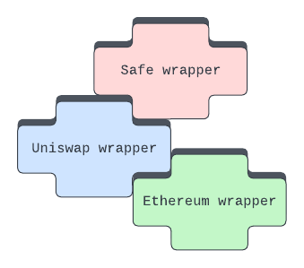
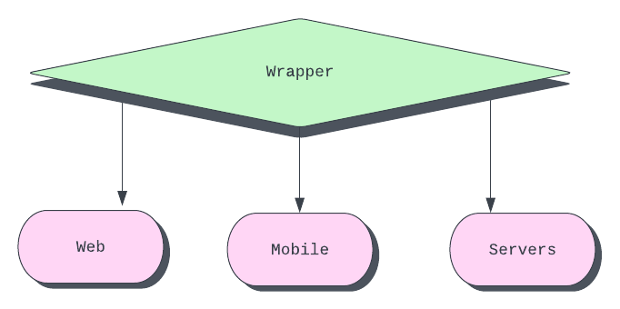

[**Polywrap**](https://polywrap.io/) is a framework for building “wrappers”: composable, portable, and dynamically upgradeable SDKs.✨

Wrappers offer a much better strategy for code reuse and composability than traditional SDKs. Wrappers are:

- **easily composable.** Polywrap wrappers can connect and work together in intuitive ways, opening up endless possibilities for your dApps. Imagine combining a DeFi wrapper with an NFT wrapper to create a brand new dApp experience.

- **portable.** With Polywrap, web3 devs create one web3 protocol wrapper that works everywhere—web, mobile, servers, IoT, so long as the environment has the Polywrap client library installed.

- **updatable on the fly.** Wrappers aren't bundled into applications.  Instead, they're fetched at runtime and any patch updates are done on the fly, without the need to rebuild your entire dApp.
---

# Join us in the future of web3 dApp development!

**Discord:** [https://discord.com/invite/Z5m88a5qWu](https://discord.com/invite/Z5m88a5qWu)

**Documentation:**[https://docs.polywrap.io/](https://docs.polywrap.io/)

