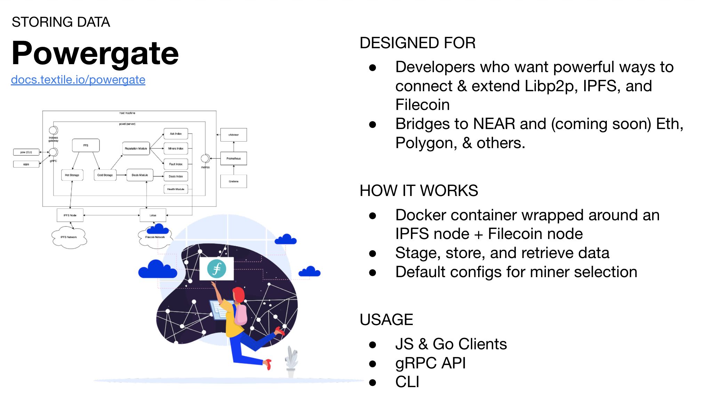

Learn more about textile on the website at [textile.io](https://linktr.ee/textileio) and in the [docs](https://docs.textile.io/)

Textile is designed to connect and extend Libp2p, IPFS, and Filecoin.

Textile’s suite of developer tools, including Powergate, Buckets, and ThreadDB, let developers build meaningful experiences quickly with Web3 protocols like libp2p, IPFS, and Filecoin.

#### Building Web3: Textile and Data Ownership | Filecoin



## Powergate

Powergate is an API for deploying hybrid Filecoin and IPFS storage into your stack. Designed for developers who want powerful ways to connect & extend Libp2p, IPFS, and Filecoin. It is a Docker container wrapped around an IPFS node + Filecoin node which allows you to stage, store, and retrieve data, with default configs for miner selection

## Other Tools

### The Hub
The Hub is your portal to the IPFS network and the fastest way to start building and experimenting with Textile technologies.

[Read More](https://docs.textile.io/hub/)

### Buckets
Buckets are:
* A new way to pin data to IPFS and archive data on Filecoin.
* Dynamic folders published simultaneously over IPFS, IPNS, and HTTP.
* Designed to simplify creating folders of data and pushing that data to remote IPFS peers for backup, persistence, or sharing.

[Read More](https://docs.textile.io/buckets)

### ThreadDB
ThreadDB makes dynamic data on the DWeb easy by providing simple data hosting services and an API familiar to anyone who used MongoDB/Mongoose.

ThreadDB is a secure, decentralized, p2p database built on IPFS and Libp2p.

Spend less time configuring encryption or managing content addresses with ThreadDB.

[Read More](https://docs.textile.io/threads/)

## Other Resources
Join our public Slack, visit our GitHub, follow us on Twitter, and check out the Blog!

[Read More](https://docs.textile.io/powergate/) | [On Github](https://github.com/textileio/powergate/)

Learn more about Filecoin with the [Interview with Andrew Hill](https://filecoin.io/blog/posts/meet-andrew-hill/)

#### Getting Started with Filecion (Using Textile & Powergate) | ETHGlobal – Andrew Hill

A workshop for beginners and intermediate developers with Andrew Hill of Textile. This is for anyone who understands the basics and wants to build something now.


