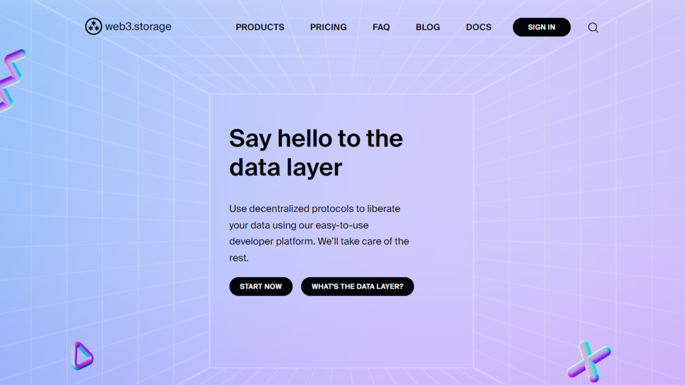

[web3.storage](https://web3.storage/) unlocks the data layer for developers and end-users. You get all the benefits of decentralized data and auth protocols with the frictionless experience you expect in a modern dev workflow.
web3.storage is a service to make building on top of content addressed data as simple as possible, with simple client libraries making data available on IPFS and stored in Filecoin deals. 

The experience is fast and reliable, with an architecture built for scale. Combined with APIs built on User Controlled Authorization Networks [UCANs](https://ucan.xyz/) auth, web3.storage enables user-centric applications that champion portability, limit lock-in, and are more efficient, with integration as simple as pasting a few lines of front-end code.

### Resources

- [Quickstart](https://web3.storage/docs/#quickstart) with NodeJS (current API in docs uses web2 auth)
- Check out our beta UCAN-based API [here](https://blog.web3.storage/posts/w3up-beta-launch)
- [Additional resources](https://blog.web3.storage/posts/resources-to-get-you-started-with-w3up) for beta API
- [More](https://blog.web3.storage/posts/intro-to-ucan) on how we use UCAN
- [Example app](https://web3.storage/docs/examples/image-gallery) using current API that uses web2 auth
- [Example app](https://blog.web3.storage/posts/forever-note) using beta UCAN-based API 
- [Vision](https://blog.web3.storage/posts/say-hello-to-the-data-layer-1-3-intro-to-web3-storage) of product
- [Overview](https://blog.web3.storage/posts/web3-storage-architecture) of current architecture