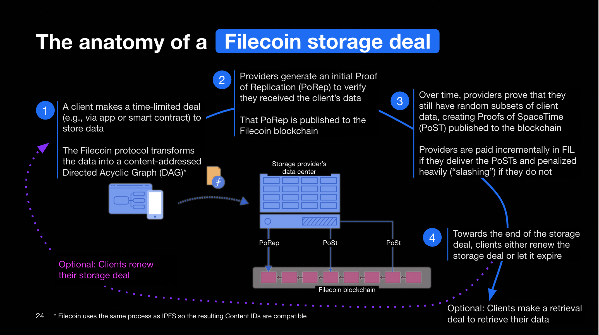
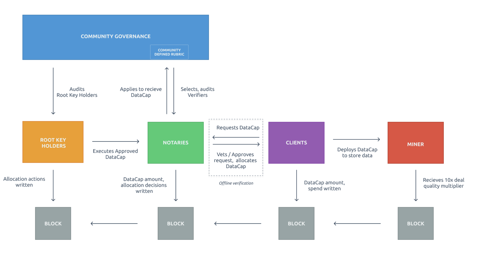

## Filecoin Basics 

_A more thorough explanation of these concepts [can be found in the Filecoin docs](https://docs.filecoin.io/about-filecoin/how-filecoin-works/#the-network)_

The Filecoin network is a distributed, peer-to-peer network formed by Filecoin peers who participate in different ways.

Peers communicate over secure channels to distribute information around the network (gossiping). They transfer data among themselves, discover other peers, and maintain a well-connected swarm; information like blocks and messages flow swiftly even when thousands of peers participate.

#### Filecoin Storage Basics | Rod Vagg

Learn about mining, sealing, sector types, Collateral, making deals, Filecoin+, offline deals.



### [Filecoin Nodes](https://docs.filecoin.io/about-filecoin/how-filecoin-works/#filecoin-nodes)

Filecoin Nodes or Filecoin clients are peers that sync the Filecoin blockchain and validate the messages in every block, which once applied, provide a global state.

Filecoin Nodes can also publish different types of messages to the network by broadcasting them.

## Storage and Retrieval

### [Filecoin Storage Providers (Miners)](https://docs.filecoin.io/about-filecoin/how-filecoin-works/#filecoin-storage-providers)

The storage providers provide services to the network by executing different types of deals and appending new blocks to the chain (every 30 seconds), for which they collect FIL rewards.

#### Storage & Retrieval Markets | Filecoin Research - Juan Benet and Jeromy Johnson

In this 4 minute talk by Jeromy Johnson & Juan Benet, understand how Filecoin, which differs from most blockchains in how it incentivizes storage, interacts with both storage and retrieval markets.



### [Deals]((https://docs.filecoin.io/about-filecoin/how-filecoin-works/#deals))

There are two main types of deals in Filecoin: storage deals and retrieval deals.

Storage deals are agreements between clients and storage providers to store some data in the network. Once a deal is initiated, and the storage provider has received the data to store, it will repeatedly prove to the chain that it is still storing the data per the agreement so that it can collect rewards. If not, the storage provider will be slashed and lose FIL.

### [Proofs](https://docs.filecoin.io/about-filecoin/how-filecoin-works/#proofs)

As mentioned above, storage providers must prove that they are storing the data per the terms of a deal. That means that:

- They must store all the data submitted by the client
- They must store it during the whole lifetime of the deal

### [Gas](https://docs.filecoin.io/about-filecoin/how-filecoin-works/#gas-fees)

Executing messages, for example, by including transactions or proofs in the chain, consumes both computation and storage resources on the network. Gas is a measure of resources consumed by messages. The gas consumed by a message directly affects the cost that the sender has to pay for it to be included in a new block by a storage provider.

**Important Gas Concepts**

* **_GasUsage_**: the amount of gas that a message's execution actually consumes.
* **_BaseFee_**: the amount of FIL that gets burned _per unit of gas consumed_ for the execution of every message.
* **_GasLimit_**: the limit on the amount of gas that a message's execution can consume, estimated and specified by a message sender.
* **_GasFeeCap_**: the maximum token amount that a sender is willing to pay per GasUnit for including a message in a block.
* **_GasPremium_**: a priority fee that is paid to the block-producing storage provider.
* **_Overestimation burn_**: an additional amount of gas to burn that grows larger when the difference between _GasLimit_ and _GasUsage_ is large. (See [current implementation](https://github.com/filecoin-project/lotus/blob/v0.10.0/chain/vm/burn.go#L38)).

### [Actors](https://docs.filecoin.io/about-filecoin/how-filecoin-works/#actors)
Actors are a [software design pattern](https://en.wikipedia.org/wiki/Actor_model) for managing state. Accounts, Multisigs, Storage Providers, and anything with a state, such as an account balance, are implemented as an _actor_.

### [Addresses](https://docs.filecoin.io/about-filecoin/how-filecoin-works/#addresses)
In Filecoin, addresses are used to identify actors. There are 4 address types:

* `0` - ID Address
* `1` - SECP256K1 Public Key Address
* `2` - Actor Address
* `3` - BLS Public Key

### [Filecoin Plus](https://plus.fil.org/)
Filecion Plus is a mechanism for onboarding data into the Filecoin market that incentivizes the storage providers on the Filecoin network to store real, valuable, and usable data. It is a layer of social trust on top of the Filecoin Network to help incentivize this storage. Storage providers who store data that has been approved for DataCap have more power to win block rewards. The [Filecoin Plus Dashboard](https://filplus.info/) provides data about verification, storage, and more.

There are a few ways one can get [approved to store data](https://plus.fil.org/landing) on the Filecoin network, and there are [governance processes and roles](https://github.com/filecoin-project/notary-governance), including root key-holders, notaries, clients, and storage providers who interact through the allocation and spending of DataCap, and help onboard that data to the network.

### Filecoin Deep Dive (Optional)

#### Filecoin for Developers & Builders | Pooja Shah

In this talk by Pooja Shah of Protocol Labs, learn about the basic functioning and purpose of Filecoin. The Core features and use cases of Filecoin will be covered, and Pooja will also go over some of the activity going on in the ecosystem, including the core developer projects that make it possible to implement, develop, and use Filecoin.



### Summary and Links

#### Filecoin Core Features
* Granular control over parameters for data Storage
* Storage receipts
* Control over storage pricing (and what you will pay)
* Content addressing
* Data persistence

#### Filecoin Use Cases
* Filecoin for data storage
* Filecoin for payments
* Ancillary tools and services

#### Filecoin Tools and Services (Products for Developers)
* Filecoin Protocol implementation: These include [Lotus](https://github.com/filecoin-project/lotus), Chainsafe [Forest](https://docs.google.com/document/d/1YkMvSxKtKVLnuaWVLRjxHFkqNrmZy24eYb6sa5EaIAo/edit?usp=sharing), and [Venus](https://github.com/filecoin-project/venus)
* Developer tools: these include Textile [Powergate](https://docs.textile.io/powergate/), Truffle [Ganache](https://trufflesuite.com/docs/filecoin/ganache/overview.html), Fleek [Space Daemon](https://docs.fleek.co/space-daemon/overview/) and more
* Filecoin Networks: Run Localnet to test before releasing your apps on the [Lotus Devnet](https://github.com/textileio/lotus-devnet) or the [Filecoin Devnet](https://docs.filecoin.io/build/local-devnet/). Other developer networks can be [found in the docs](https://docs.filecoin.io/networks/). Learn more about Mainnet on the [Filecoin Website](https://filecoin.io/build/#tools-and-more) and [docs](https://docs.filecoin.io/get-started/)
* Hosted services: These are Filecoin-backed pinning services (FPS) to keep data available for those who don't want to maintain their own nodes. These include [Textile buckets](https://docs.textile.io/buckets/), [Pinata](https://www.pinata.cloud/), [Chainsafe](https://files.chainsafe.io/), [NFT Storage](https://nft.storage/), [Web3 Storage](https://web3.storage/), [Estuary](https://estuary.tech/), and more
* Other useful tools include Docker images, hosted Lotus endpoints, status tools, API clients, CLIs, wallets, remote signing, and more

**Lotus Common Architecture** Currently for those using lotus directly, it is recommended that you have a hardware configuration with 32GB of RAM, an 8-core CPU, and at least 200 GB of SSD storage. See the [Filecoin docs on Hardware requirements](https://docs.filecoin.io/storage-provider/hardware-requirements/)

<!-- ## Getting Started with a Filecoin Node
Add Tutorial here -->
