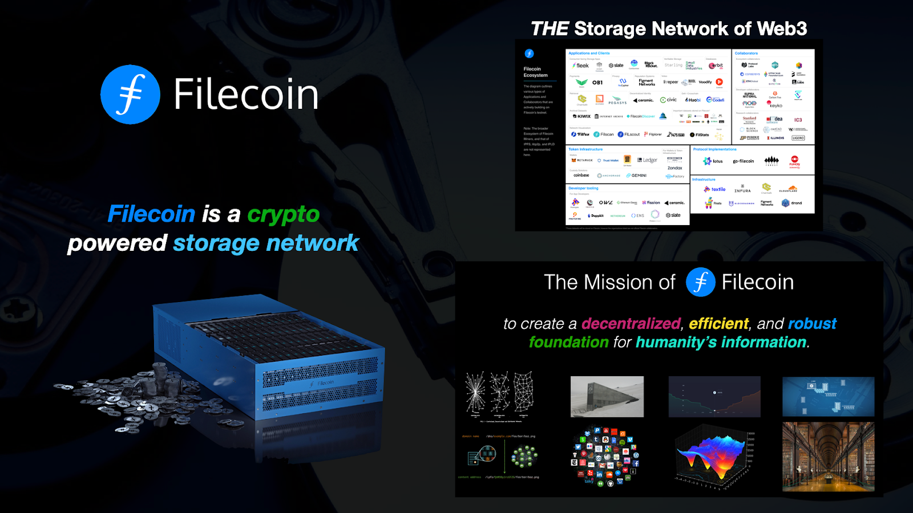
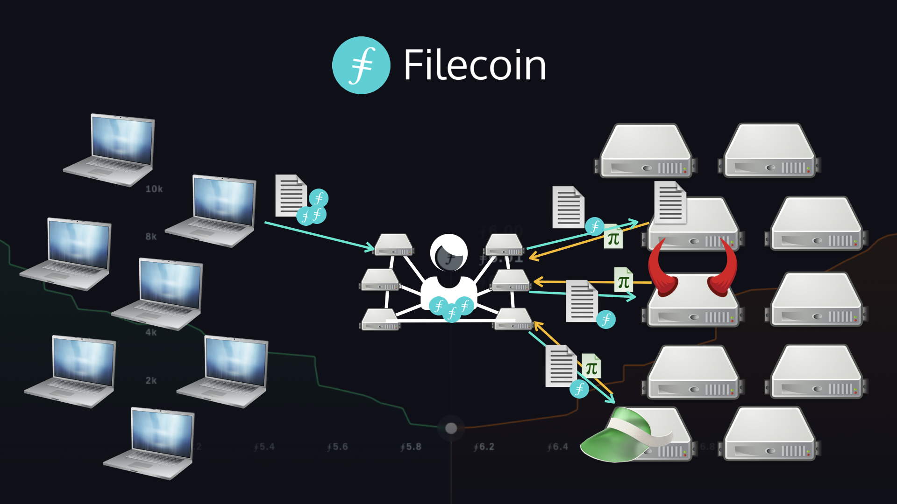

# Filecoin

Filecoin is an independent organization that was founded by, and now collaborates with Protocol Labs and the PLN, and is the token behind decentralized storage. Filecoin uses IPFS, libp2p, IPLD, and many other technologies to create protocols, tools, and services to help radically improve the network and drive breakthroughs in computing.

#### IPFS & Filecoin: The building blocks of an open, decentralized web | Ally Haire

In this talk by DeveloperAlly, she gives a quick overview of the history of IPFS and Filecoin, information about the organizations today, and gives an intro about why Filecoin exists, how it's connected to IPFS, and (at 12:46) the basics of how it works to provide a decentralized and reliable storage system.


 

In Filecoin, users can pay to store their files on storage providers (They can also apply for to be verified clients and allocated DataCap, which incentivizes storage providers to store their data for free & reduced prices). Storage providers are computers responsible for storing files and proving they have stored the files correctly over time. Anyone who wants to store their files or get paid for storing other users’ files can join the Filecoin network.

Available storage, and the price of that storage, is not controlled by any single entity. Instead, Filecoin facilitates open markets for storing and retrieving files that anyone can participate in, and recieve FIL for their participation in the network.

[Read More](https://docs.filecoin.io/about-filecoin/what-is-filecoin/#for-users)

_Filecoin is a data storage and retrieval marketplace that coordinates untrusted parties to buy and sell provable storage._

### Filecoin Features

* **Verifiable storage** – Rather than needing to trust a cloud storage provider or rely on
legal recourse, the Filecoin Protocol cryptographically verifies data storage.
* **Open participation** – Anyone with sufficient hardware and an internet connection can be a stroage provider (Filecoin miner) for the Filecoin Network.
* **Empowers local optimization** – Driven by open participation, market forces will enable more efficient and distributed data storage and communication than centralized storage platforms. The distributed network allows for a more local and resilient architecture and data availability.
* **Flexible storage options** – As an open platform, the network has the flexibility for the creation & disseminations of tools and services provided by the community of developers improving and building on the protocol.
* **A community network** – Filecoin provides participants the opportunity to have stake in the networkʼs success. Participants in the network benefit by working together to improve the Filecoin network as a whole.

#### The Filecoin Economy
Filecoin is more than a network; the protocol and infrastructure lays the groundwork for an economy built around a marketplace for the storage and retrieval of data. The growth of the network depends upon collaboration between researchers, engineers, stakeholders, storage providers, and clients in a market economy, as the network adapts and grows to accommodate additional use cases.

The Filecoin token acts as a medium of exchange, facilitating transactions and production activities, somewhat similar to the in-game currencies of virtual economies in multiplayer online games. In addition, as a currency, the token also acts as a store of value; its minting is tied to adding utility in the form of data storage and other services to the network.

### Tutorials
For those who are newer to the world of Filecoin, Web3, and storage verification, check out the [Protoschool tutorials](https://proto.school/course/filecoin). Tutorials you should complete include:

* [Verifying Storage on Filecoin](https://proto.school/verifying-storage-on-filecoin)

### Data & Information About Filecoin

* [Filecoin Docs](https://docs.filecoin.io/)
* [Filecoin Spec](https://spec.filecoin.io/#section-intro)
* [Lotus Docs](https://lotus.filecoin.io/)
* [https://stats.filecoin.io/](https://stats.filecoin.io)
* [https://dashboard.starboard.ventures/deals](https://dashboard.starboard.ventures/deals)
* [https://status.filecoin.io/](https://status.filecoin.io)

### Links

**IPFS** | [Docs](https://docs.ipfs.io) | [GitHub](https://github.com/ipfs) - **IPLD** | [Docs](https://ipld.io/docs/) | [GitHub](https://github.com/ipld) - **libp2p** | [Docs](https://docs.libp2p.io) | [GitHub](https://github.com/libp2p) - **Filecoin** | [Docs](https://docs.filecoin.io) | [GitHub](https://github.com/filecoin-project)
