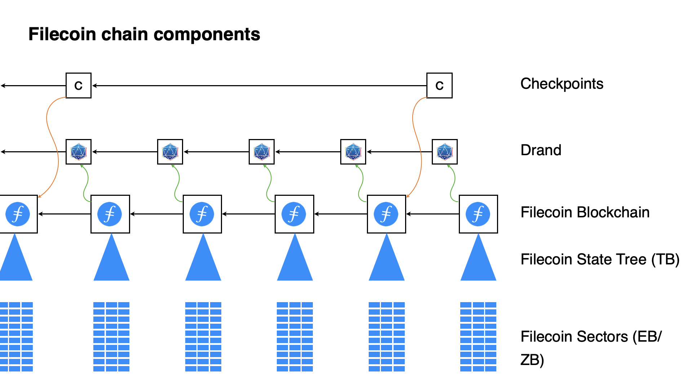

The Filecoin Protocol is a complex and ever evolving technology that involves mining, sealing and proving, consensus, and much more. In this section you will get an overview of the process that occurs to create the Protocol which includes both a _decentralized storage market_ (the storing of data on filecoin storage providers) and a _storage based consensus_, the process of mining Filecoin blocks.

## The Filecoin Blockchain

### Consensus

* https://spec.filecoin.io/#section-algorithms.expected\_consensus

Leaders

### Proofs

The storage providers who mine and provide the data storage services must prove that they are storing the data per the terms of a deal. That means that:

- They must store all the data submitted by the client

- They must store it during the whole lifetime of the deal

## Actors and Addresses

Actors are a [software design pattern](https://en.wikipedia.org/wiki/Actor_model) for managing state. Accounts, Multisigs, Storage Providers, and anything with a state, such as an account balance, are implemented as an _actor_.

###  How Filecoin Actors Work | Zenground0 – Protocol Labs

This talk given in July of 2022 takes a deep dive into the Actors that make up the computational model of the Filecoin protocol. Filecoin actors are hard-coded programs that run concurrently (as opposed to linear, stack based computing) on a blockchain.

Learn about why Filecoin uses actors, the different types of actors and what the current 11 Filecoin actors do, and understand the upgrades that have occured since mainnet launch. As the [Filecoin Virtual Machine (FVM) is developed](https://fvm.filecoin.io/#roadmap-4), the capabilities of Filecoin actors will greatly expand along with the potential for the Filecoin Protocol, by decoupling adding functionality from protocol upgrades and allowing for independent user actors.

{{&lt; youtube 9JbwbTPonv0 >}}

In Filecoin, addresses are used to identify actors. There are 4 address types:

* `0` - ID Address

* `1` - SECP256K1 Public Key Address

* `2` - Actor Address

* `3` - BLS Public Key

## Filecoin Storage Basics

The Filecoin network is a distributed, peer-to-peer network formed by Filecoin Storage Providers. The storage providers do two basic things for the Filecoin network; the nodes that the storage providers contribute to the blockchain consensus in a process known as mining, and also provide data storage. There are different kinds of proofs that the Filecoin protocols employ that data providers must satisfy to participate as a storage provider on the network.

Peers communicate over secure channels to distribute information around the network (gossiping). They transfer data among themselves, discover other peers, and maintain a well-connected swarm; information like blocks and messages flow swiftly even when thousands of peers participate.

### Filecoin Storage Basics | Rod Vagg

Learn about mining, sealing, sector types, Collateral, making deals, Filecoin+, offline deals.

https://www.youtube.com/watch?v=Sz2OQc2WOdA

### Filecoin Nodes

Filecoin Nodes or Filecoin clients are peers that sync the Filecoin blockchain and validate the messages in every block, which once applied, provide a global state.

Filecoin Nodes can also publish different types of messages to the network by broadcasting them.

### Storage and Retrieval

The storage providers provide services to the network by executing different types of deals and appending new blocks to the chain (every 30 seconds), for which they collect FIL rewards.

### Storage & Retrieval Markets | Filecoin Research - Juan Benet and Jeromy Johnson

In this 4 minute talk by Jeromy Johnson & Juan Benet, understand how Filecoin, which differs from most blockchains in how it incentivizes storage, interacts with both storage and retrieval markets.

{{&lt; youtube TzfcqPzSR0s >}}

### Deals

There are two main types of deals in Filecoin: storage deals and retrieval deals.

Storage deals are agreements between clients and storage providers to store some data in the network. Once a deal is initiated, and the storage provider has received the data to store, it will repeatedly prove to the chain that it is still storing the data per the agreement so that it can collect rewards. If not, the storage provider will be slashed and lose FIL.

#### Sectors

Sectors are the units of proven storage which can either be 32GiB or 64Gib. When storage providers make a deal, they submit proof of these sectors of storage, and make a deal, for which they are paid out over time

## DRAND

Drand is a distributed, bias-resistant, unpredictable, and publicly verifiable randomness generator that is key to the Filecoin implementation in how it provides unpredictable, decentralized and publicly verifiable random values for the blockchain. [Learn more about how Drand works in the docs](https://drand.love/docs/overview/#how-drand-works)

### Drand: Distributed, Bias Resistant, Unpredictable and Publicly Verifiable Randomness | Nicolas Gailly

[Drand](https://drand.love/) uses [cryptographic methods](https://drand.love/docs/cryptography/#setup-phase), collective public keys, and a private key share of a collective private key to generate randomness in a distributed manner.

{{&lt; youtube ydwW2HFFxNI >}}

drand is a distributed randomness beacon. It provides publicly-verifiable, unpredictable, and bias-resistant random numbers as a public service. Some of the featuresinclude:

* Threshold Cryptography & Randomness
* Distributed Key Generation
* The Setup and Randomness Generation Phases
* The League of Entropy

## Filecoin Data Retrieval \
Currently, Filecoin node (Lotus) supports direct retrieval from the storage miners which originally stored the data. Clients can directly send retrieval requests to a storage provider to retrieve their data by paying some FIL for retrieval. \
Clients need to provide enough information to storage provider for the data retrieval request, including:

    * Storage Provider ID - The ID of the storage provider where the data is stored.
    * Payload CID - also called Data CID.
    * Address - The address initially used to create the storage deal

Currently, Saturn is the only …

## Filecoin Networks

The active [Mainnet](https://docs.filecoin.io/developers/infrastructure/networks/#mainnet) is the only current production Filecoin network,

### Testnets

* [Calibration](https://docs.filecoin.io/developers/infrastructure/networks/#calibration), a test network for storage providers to test their node configuration.
* [Hyperspace](https://docs.filecoin.io/developers/infrastructure/networks/#hyperspace), the primary test network for smart-contract and actor developers.
* [Wallaby](https://docs.filecoin.io/developers/infrastructure/networks/#wallaby), an early smart-contract and actor test network for bleeding edge [Filecoin Virtual Machine](https://docs.filecoin.io/developers/smart-contracts/filecoin-virtual-machine/) deployments.

[HyperSpace](https://github.com/filecoin-project/testnet-hyperspace)

## Lotus: The Reference Filecoin Implementation

### Hardware Requirements

Currently for those using lotus directly, it is recommended that you have a hardware configuration with 32GB of RAM, an 8-core CPU, and at least 200 GB of SSD storage. See the [Filecoin docs on Hardware requirements](https://docs.filecoin.io/storage-provider/hardware-requirements/)

{}

### Filecoin for Developers & Builders | Pooja Shah

In this talk by Pooja Shah of Protocol Labs, learn about the basic functioning and purpose of Filecoin. The Core features and use cases of Filecoin will be covered, and Pooja will also go over some of the activity going on in the ecosystem, including the core developer projects that make it possible to implement, develop, and use Filecoin.

{{&lt; youtube 0EcBTPyfrt4 >}}

### Filecoin Core Features

* Granular control over parameters for data Storage
* Storage receipts
* Control over storage pricing (and what you will pay)
* Content addressing
* Data persistence

{}

