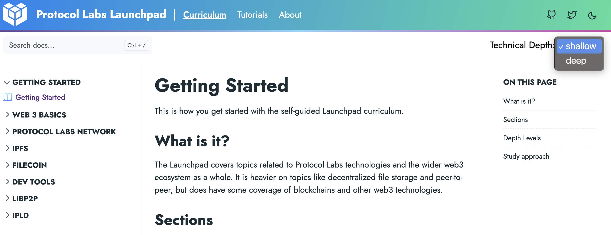

This is how you get started with the self-guided Launchpad curriculum.

## What is it?

The Launchpad covers topics related to Protocol Labs technologies and the wider
web3 ecosystem as a whole. It is heavier on topics like decentralized file
storage and peer-to-peer, but does have some coverage of blockchains and other
web3 technologies.

## Sections

The Launchpad curriculum is split into these topic areas:

- Web3 Basics
- The Protocol Labs Network
- IPFS -- peer-to-peer data storage and sharing
- Filecoin -- incentivized decentralized file storage
- IPLD -- data-model for content addressed data
- libp2p -- universal peer-to-peer networking library

## Depth Levels

There are two study levels: Shallow and Deep. You select a desired level by
choosing from the menu in the upper right. Some advanced sections will
disappear when you select "deep".

## Study approach

1. Read through the material.
2. Watch the reference videos either as you go or at the end.
3. Once you've read and watched, you are then ready to view on of our recorded
   Q&A sessions. In the past we would host live sessions with engineers who would
   talk about the technologies and answer questions. We have some of those
   recorded and linked for you to watch.
4. At this point you have completed everything for the async course. Your next step
   can be to reach out in Filecoin Slack if you have questions. Go to github
   and check out the associated repos. There are issues tagged as good starting tasks, if
   you want to start contributing.
