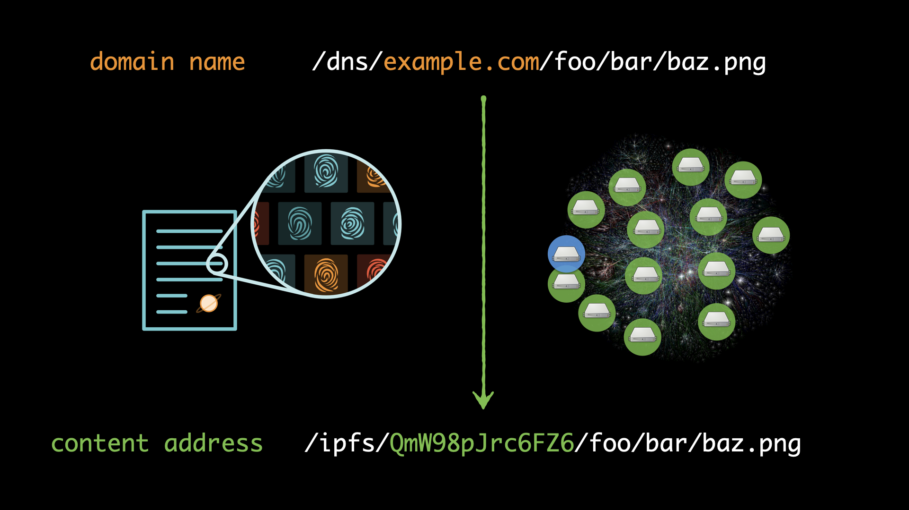
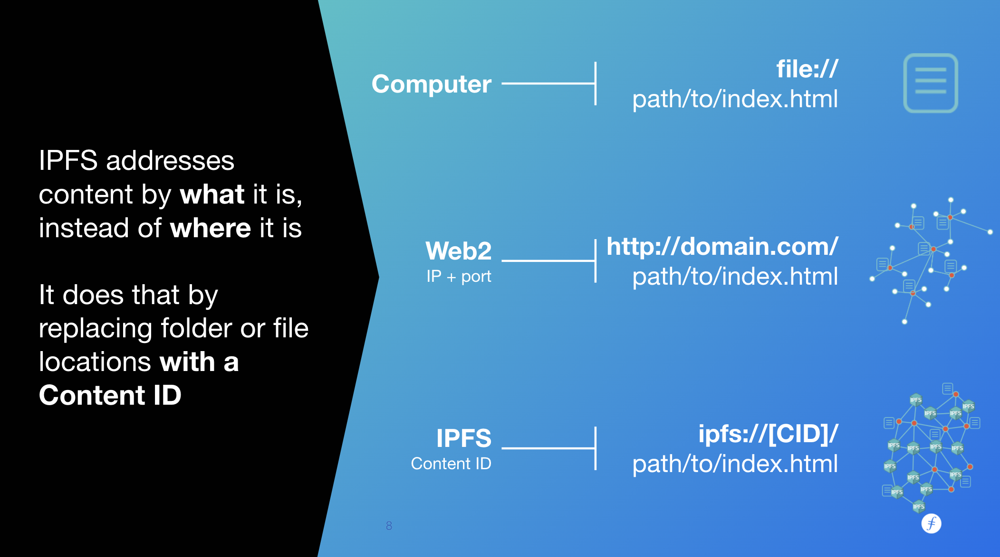
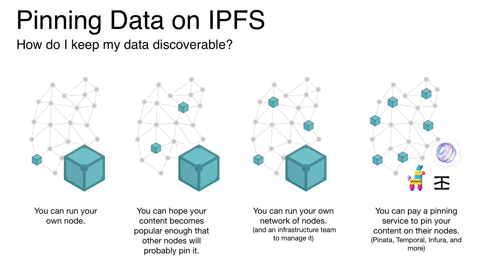

## The Importance of Immutabilty

IPFS allows us to verify the content we received is the content we asked for using hashes.
* Hashes are deterministic, meaning given an input, it will always have the same output. If the input data changes in any way, then the output will also change.
* Since files are immutable, they can never change without generating a brand new hash and, by extension, CID.
* IPFS enables fast caching and deduplication, which means that you can save space by just communicating file changes.
* IPFS allows you to fetch the data you want from anyone, using the immutable CIDs.

## Anatomy of a Content Identifier (CID)

CIDs are unique strings. There must be a way to future proof the seemingly infinite amount of data that will be added on to the network.
* Metadata about a hash (aka a prefix) + the hash itself = CID
* The collection of “metadata prefixes” used in CIDs are part of the [Multiformats](https://multiformats.io/) library.
* Currently, there are 2 different versions of CIDs in IPFS, CIDv0 & CIDv1, the currently widely accepted one being v1 CIDs.
* The Multiformat protocols ensure future-proof compatibility and standards if any algorithm needs to change.



## Content Addressing

### Why location addressing fails us

* A URL only points to a single copy, stored in a single location.
* If that copy disappears, there is no way to know where other copies are.
* It is not possible for a user to validate the integrity of the content:
  * A malicious actor can poison DNS, or change the copy’s location, without the end user noticing.
  * HTTPS is an improvement, but only secures the transport, not the content.
* No request aggregation, resulting in duplication of effort and bandwidth waste (i.e. no options for multicast in the wild).

### Location- vs Content-Addressing

Location addressing asks exactly one remote host for content by name (which may or may not be related to the content).

Content addressing can ask anyone for content by the fingerprint (hash) of that content since the relationship between the fingerprint and the content is immutable. Since we can verify the content we receive matches the fingerprint, it doesn't matter who we receive the content from.

## Pinning Content on IPFS

By default, content on IPFS is not _pinned_. That means when you add a file to IPFS, it will eventually stop being discoverable on the network.

This problem occurs because IPFS uses garbage collection to free disk space on your IPFS node by deleting data that is no longer needed. [Garbage collection](https://en.wikipedia.org/wiki/Garbage_collection_(computer_science)) is a form of automatic resource management widely used in software development.

To mitigate this problem you must _pin_ your content to your [node](https://docs.ipfs.tech/concepts/nodes/#nodes) to ensure it persists on IPFS. Your options for pinning content are:
1. You pin it locally to your own node. Note that if the content is only pinned to your local node, it must be online for peers to get that content.
2. You use a [pinning service](https://docs.ipfs.io/concepts/persistence/#pinning-services). Some pinning services require payment for their services, others offer a [free storage allowance for new users](https://docs.ipfs.tech/concepts/persistence/#ipfs-filecoin-solutions).

Check out this article to find out more about [permanence on IPFS](https://docs.ipfs.tech/concepts/persistence/).

{}
## More IPFS Concepts
_You can also [find this content in IPFS Docs](https://docs.ipfs.io/concepts/)_

Because IPFS is a system that hopes to change how we use the Internet, it comes with many new concepts:

#### Whiteboard Series with NEAR | Ep: 42 Adin Schmahmann



{}
