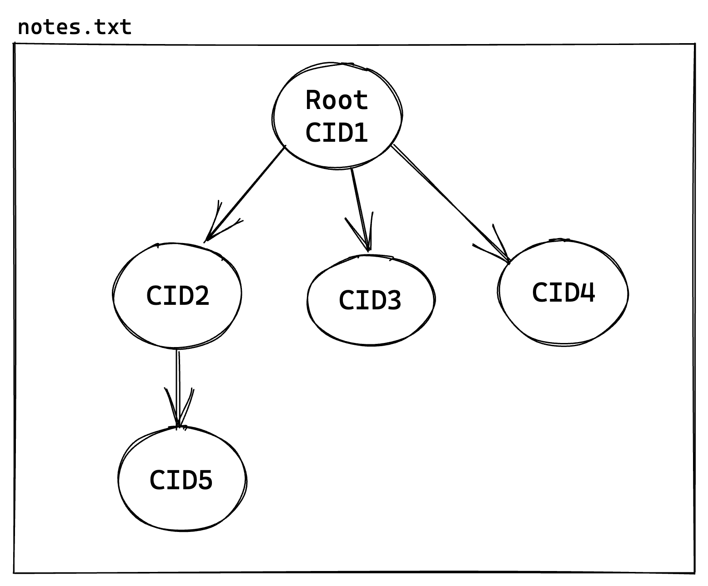
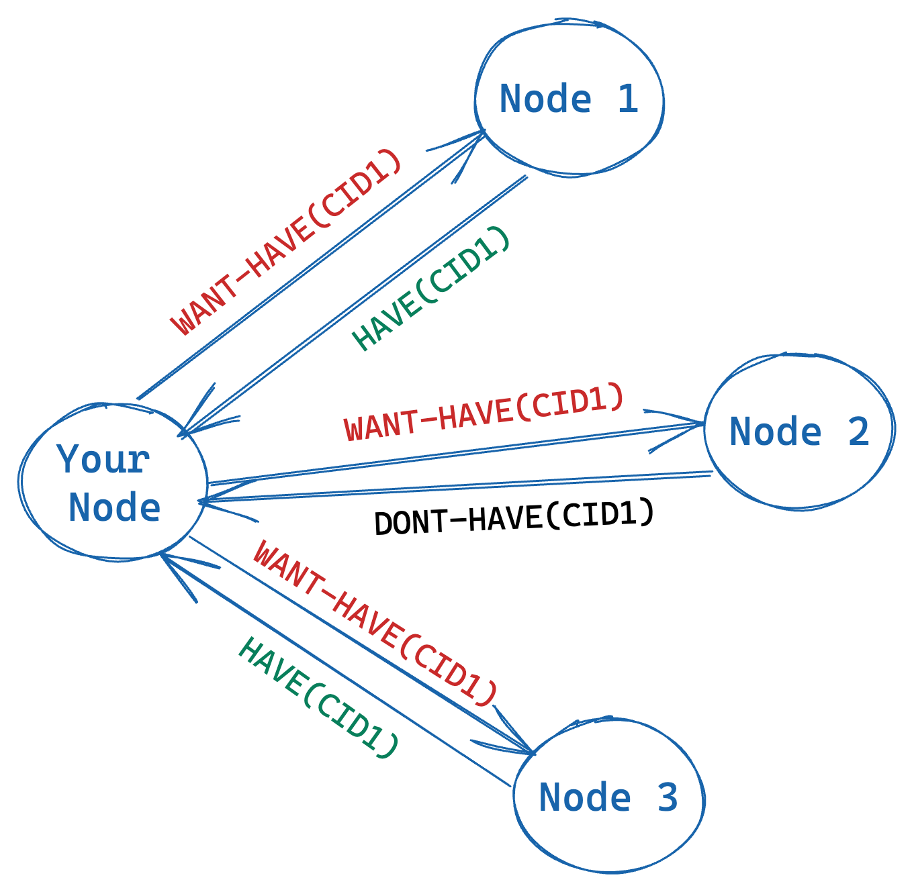
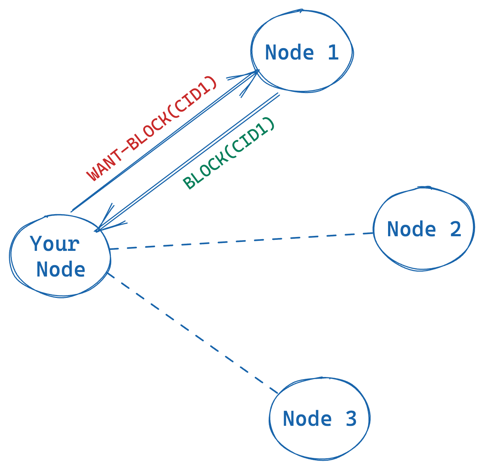
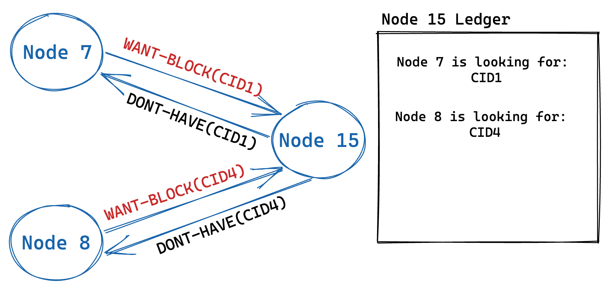
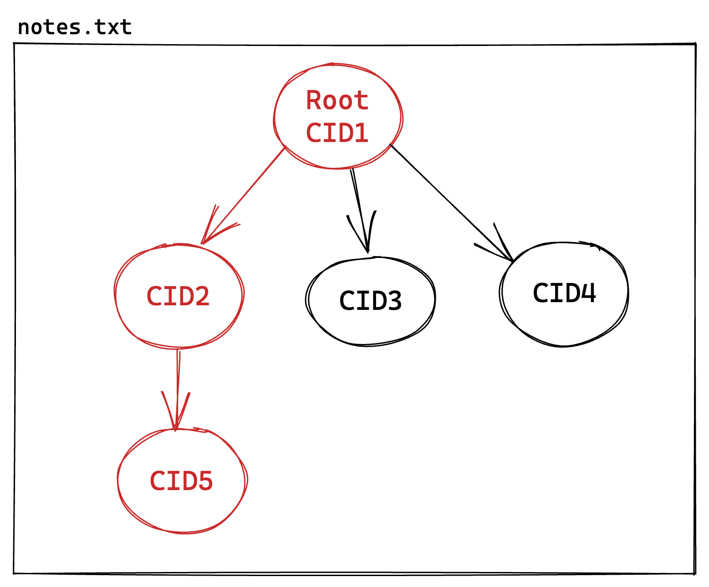

## Introduction

IPFS differs greatly in the way that it stores, shares, and retrieves files. Instead of having clients rely on servers, IPFS allows peers to connect and search for one another in an efficient manner to exchange data directly.

Bitswap is a protocol to exchange blocks (i.e. data) in a peer-to-peer network. IPFS uses Bitswap to retrieve files from other peers in the network. At the interface level, the Bitswap protocol has two operations: `get(CID)` and `put(CID)`. The `get`operation is used to find a block with a specific CID, and the `put` operation is used to announce that the node is storing a block.

## How Bitswap Works

Bitswap is a message-oriented protocol, so communication happens by exchanging messages among peers (pubsub). The messages supported are:
- `WANT-HAVE`(**request**): this message communicates to the network the **interest** in a specific block
- `HAVE`: peers storing the requested block, **respond** with a `HAVE` message
- `DONT-HAVE`: peers NOT storing the requested block, **respond** with `DONT-HAVE`
- `CANCEL`: if the node that sent a `WANT-HAVE` message is no longer **interested** in the block, it sends a `CANCEL` message to the network
- `WANT-BLOCK`(**request**): this message is directed to a single peer that responded with `HAVE`, to now send the actual block data
- `BLOCK`: the peer sends the requested block data along with a `BLOCK` message

Let's say that you're running an IPFS node, and you want to retrieve a file, `notes.txt`, from the network, which has a root block with CID `CID1`.

To get the entire file, it is necessary to traverse the file's graph. In the previous example, to get to the `CID5` block, you must:
1. Get the root block (`CID1`), which points to `CID2`.
2. Get the `CID2` block, which points to `CID5`.
3. Get the `CID5` block.

The process of retrieving a file in Bitswap involves sending `WANT-HAVE` and `WANT-BLOCK` messages for all the different blocks of the file, starting with the root block.

### Getting the Root Block

First, Bitswap checks if the node is hosting the CID in its local blockstore. When you download information from the IPFS network, the content is stored in your local blockstore, so if you requested the CID before, it could already be on your computer.

If the CID is not found locally, then Bitswap opens a _session_. In the context of Bitswap, a _session_ contains the nodes that might potentially store the blocks of the file. In the beginning, the _session_ is composed of the direct peers your node is connected to.

Bitswap sends a `WANT-HAVE(CID1)` message to all the nodes in the session. In the following diagram, the message is sent to four nodes.

Two peers (`Node 1` and `Node 3`) have returned a `HAVE` message, which means that they are storing the block corresponding to the CID. However, Bitswap only asks one peer to actually **exchange the block's data**. This way, you avoid requesting the same content twice.

If a node stores the root block, it could potentially hold the other child blocks of the file. Bitswap keeps the information about `Node1` and `Node 3` in the _session_ to request other blocks of the file in the future.
However, because `Node 2` did not store the root block, Bitswap assumes that this node will not have any other block of the `notes.txt` file, so it is removed from the _session_.
This means that `Node 2` will not be queried anymore to retrieve any of the blocks of the `notes.txt` file.

If none of the peers holds the block, then Bitswap uses the DHT to find other nodes that might be storing the block.

### Getting the rest of the file

Now that Bitswap has retrieved the root block of the file, it must get the children of the root block. In the previous example, the child blocks of `CID1` are `CID2`, `CID3`, and `CID4`. The process to find these blocks is the same as for the root block.

If Bitswap runs out of peers in the _session_ because none of them contains blocks for the file, then new peers must be selected using the DHT.

### The WantList

Consider that you send a `WANT-HAVE(CID1)` message to a node that is not storing the `CID1` block.
You will receive a `DONT-HAVE(CID1)` response, but the node will also take note that you are looking for the `CID1` block.
This way, if the node stores the requested CID in the future, it will send it to you.

Bitswap keeps track of the blocks that other nodes are looking for in a component called _the ledger_.
For example, consider the following diagram.

The `Node 7` node is looking for the `CID1` block, and the `Node 8` node is looking for the `CID4` block. The `Node 15` node does not store any of those blocks, however, it will keep the information in its ledger.
If in the future the `Node 15` node receives any of the blocks, it will send them straight away.

### Bitswap Architecture
Bitswap is composed of several components:

- Connection Manager: manages the connections with other peers to retrieve and announce blocks by interacting with the network interface. In the case of IPFS, the connection manager interacts with a libp2p node.
- Ledger: tracks the interest of other peers for CIDs. It holds _WantLists_
- Session Manager: manages all the active sessions

You can get more information about Bitswap in the following videos:

#### Content Exchange | ResNetLabs on Tour



#### Beyond Bitswap | ResNetLabs on Tour



## Graphsync

To exchange a file in Bitswap, you must request every block one by one on different messages (`WANT-HAVE`, `WANT-BLOCK`, `BLOCK`...), which might be slow in some cases.

In Graphsync, another exchange protocol, you do not request the file block by block. Instead, you use an IPLD selector to specify a path within the file's DAG. For example, consider the following diagram.

Instead of requesting `CID1`, then `CID2`, and then `CID5` in order, Graphsync asks a peer to exchange the three blocks at the same time.

While Bitswap is a message-oriented protocol, Graphsync is a request-response protocol, which means that you must provide the specific location of a peer to establish a connection. It might happen that the peer does not have the requested blocks.

You can find more information about Graphsync in the following video:

#### Future of Decentralized Data Transfer | Hannah Howard


