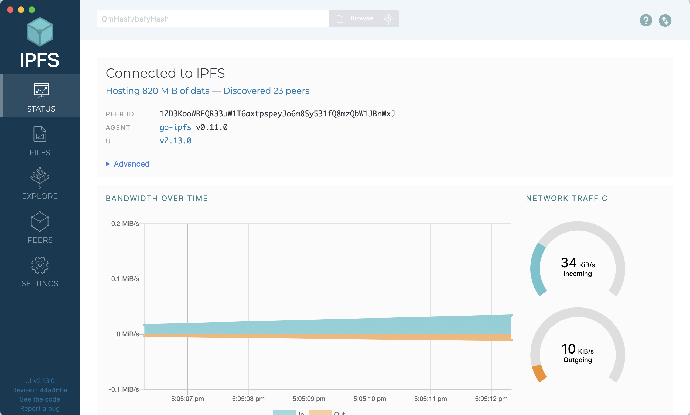
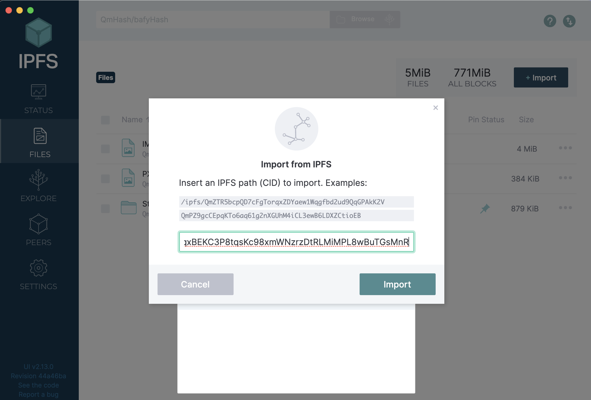
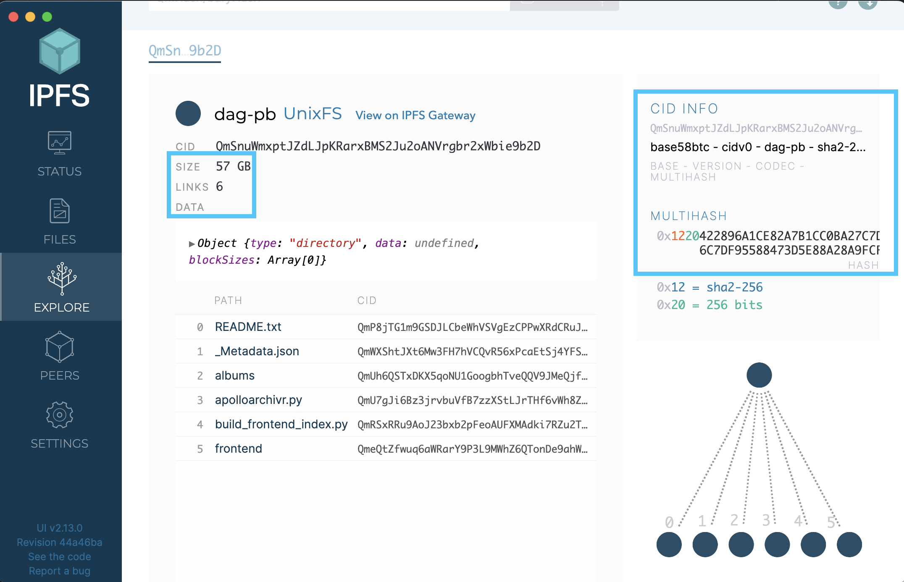
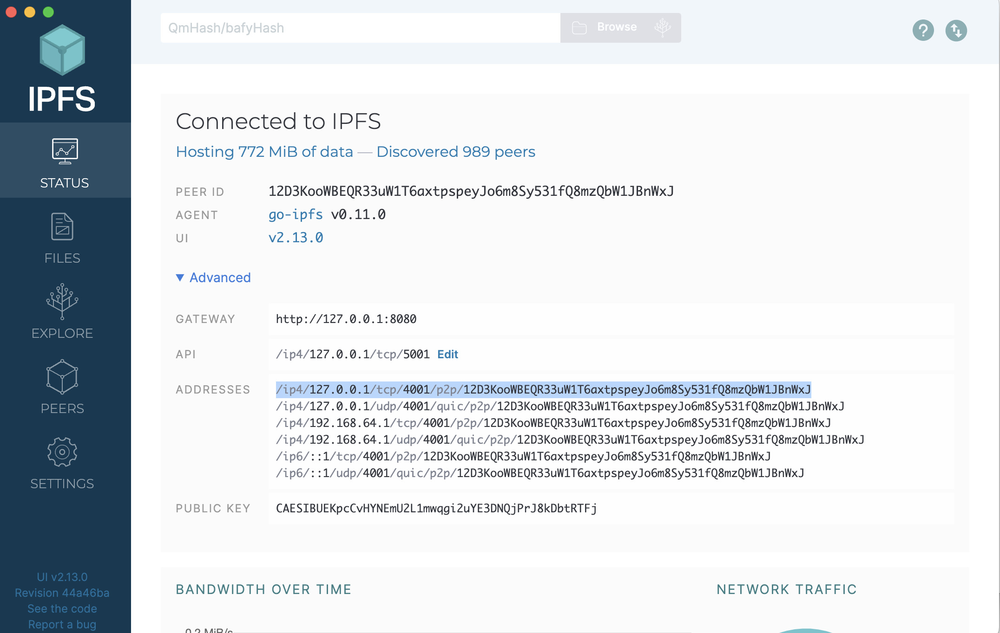

## Background
In this tutorial, you will get an introduction of IPFS Desktop, the graphical interface that you can use to interact with the files, folders, IPNS, pinning services, and more.

## Prerequisites
In this tutorial, you will need to have installed (or updated) IPFS Desktop
* [Install IPFS Desktop](https://docs.ipfs.tech/install/ipfs-desktop/)
* Kill any other nodes you may have started in the CLI with `killall ipfs`
* Start IPFS Desktop on your computers

## Instructions
Explore the best workflows and capabilities with IPFS Desktop

#### Install IPFS Desktop
If you haven't already, follow the [comprehensive tutorial at at docs.ipfs.tech on installing IPFS Desktop](https://docs.ipfs.tech/install/ipfs-desktop/) onto your computer

#### The Status Page

The status is the top screen in the menu for IPFS desktop where you can see the basic information about your IPFS node.

On this page:

* Check and see how much data you have stored on IPFS
* See how many peers you are connected to on IPFS
* Check to see what your PeerID is
* See which kubo version you are running

#### The Files Page
On this page, you can see all files and directories that are pinned to your ipfs node, either from uploading, or those that are pinned from peers on IPFS.

* Try out the **+ Import** button to add a file or folder from your local (computer's) storage
* Now, try pinning a file from IPFS. use the **+ Import** button and put in the CID `QmbWqxBEKC3P8tqsKc98xmWNzrzDtRLMiMPL8wBuTGsMnR`

* Next, click the three dots to the left of the new CID that you just uploaded, click on the 'share link' and share it with your friend (or copy-paste it into the address bar of your own browser window)

#### The Explore Page
With this page, you can select an IPFS file or directory, and explore how this files is broken down into UnixFS files.
* Take a look at the CID, and the multihash
* Pick a file, and check out its size, and the number of links to that file

#### The Peers Page
The peers are the nodes in the IPFS network that you are connected to directly for sharing content. On the peers page:
* Identify how many peers you are connected to
* Notice the location, the types of connections you have.

> Activity: Identify your IPFS address, and connect with a friend

* From the **Status** page click on the **Advanced** dropdown, and copy one of your addresses.

* Send your address to a friend. from the _Peers_ page, click the **+Add connection** button, and enter your friends address to connect as peers.

#### The Settings Page

#### Publishing to IPNS with IPFS Desktop
#### Using Pinning Services with IPFS Desktop

<!-- Summary -->
Now you can ----- . Next you will/can learn to ... See an example of the completed code  **<Link to branch & file with completed code>**
