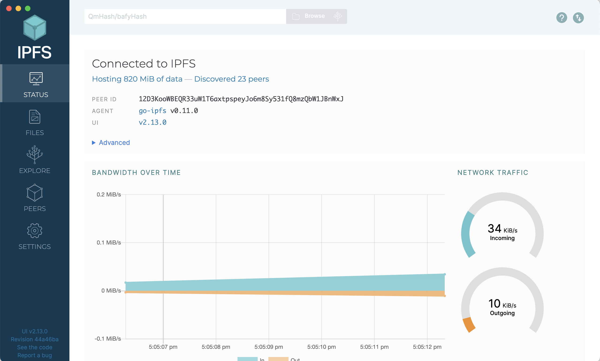
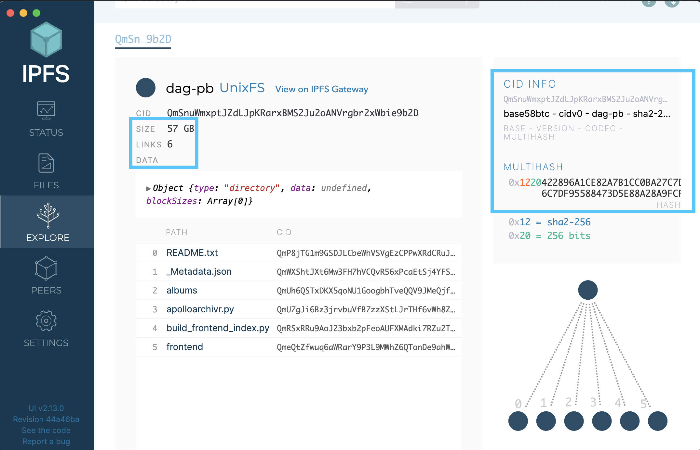
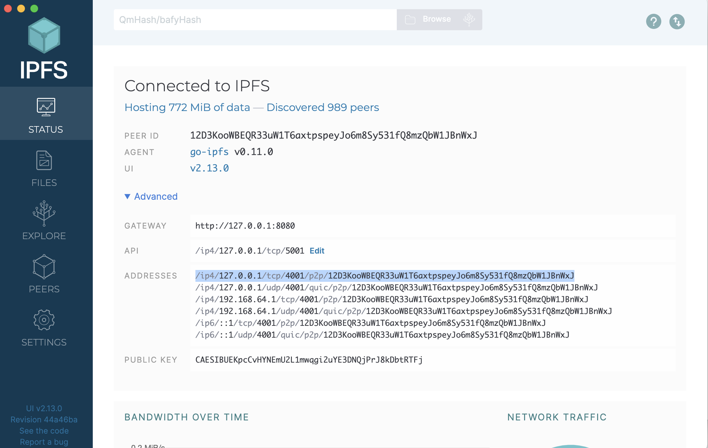

## Background
In this tutorial, you will get an introduction of IPFS Desktop, the graphical interface that you can use to interact with the files, folders, IPNS, pinning services, and more.

## Prerequisites
In this tutorial, you will need to have installed (or updated) IPFS Desktop
* [Install IPFS Desktop](https://docs.ipfs.tech/install/ipfs-desktop/)
* Kill any other nodes you may have started in the CLI with `killall ipfs`
* Start IPFS Desktop on your computer

## Video: IPFS Desktop Walkthrough


## Instructions
Explore the best workflows and capabilities with IPFS Desktop

### Install IPFS Desktop
If you haven't already, follow the [comprehensive tutorial at at docs.ipfs.tech on installing IPFS Desktop](https://docs.ipfs.tech/install/ipfs-desktop/) onto your computer

### The Status Page

The status is the top screen in the menu for IPFS desktop where you can see the basic information about your IPFS node.



On this page:

* Check and see how much data you have stored on IPFS
* See how many peers you are connected to on IPFS
* Check to see what your PeerID is
* See which kubo version you are running

### The Files Page
On this page, you can see all files and directories that are pinned to your ipfs node, either from uploading, or those that are pinned from peers on IPFS.

* Try out the **+ Import** button to add a file or folder from your local (computer's) storage
* Now, try pinning a file from IPFS. use the **+ Import** button and put in the CID `QmbWqxBEKC3P8tqsKc98xmWNzrzDtRLMiMPL8wBuTGsMnR`


* Next, click the three dots to the left of the new CID that you just uploaded, click on the 'share link' and share it with your friend (or copy-paste it into the address bar of your own browser window)


### The Explore Page
With this page, you can select an IPFS file or directory, and explore how this files is broken down into UnixFS files.
* Take a look at the CID, and the multihash
* Pick a file, and check out its size, and the number of links to that file




### The Peers Page
The peers are the nodes in the IPFS network that you are connected to directly for sharing content. On the peers page:
* Identify how many peers you are connected to
* Notice the location, the types of connections you have.

> Activity: Identify your IPFS address, and connect with a friend

* From the **Status** page click on the **Advanced** dropdown, and copy one of your addresses.



* Send your address to a friend. from the _Peers_ page, click the **+Add connection** button, and enter your friends address to connect as peers.


### The Settings Page
There are several useful tools under the settings page of IPFS desktop. Here, you can change the _Gateway_ you use. A _Gateway_ allows you to access IPFS content-addressed content using the typical HTTP addressing that web2 applications use. With a gateway, you can access content on IPFS from your web browser.

There are many gateways available to use, and you can choose a new one.
* Go to the list of IPFS gateways at the Public Gateway Checker found at [https://ipfs.github.io/public-gateway-checker/](https://ipfs.github.io/public-gateway-checker/)
* Choose one of the gateways and copy it.
* In the form box, type in `https://` then paste the public gateway that you copied from the Public Gateway Checker.


You are now using a different gateway to access the same IPFS public network! All of the same pinned data is available, you are just entering IPFS from a different entry point.

### Publishing to IPNS with IPFS Desktop
With IPFS, when you publish a new piece of content, it has a new CID, meaning the data is immutable. This is great when you want to identify a certain piece of data, and make sure you know what you are accessing. There is, however, a use case for mutable data, such as a website.

You want to give people one address where they can access, say, a website, but want to be able to make updates to it, such as adding an event page, or updating a typo. This is where IPNS comes in.

IPNS allows you to tie an address in IPFS with the 'latest' piece of data.

To try this out, do the following steps
* In the **Settings** page, under _IPNS Publishing Keys_, click the **+ Generate Key** button, and choose a name for the key.


* Create or add a folder on the _Files_ page and add at least one file.
* Choose one file, and click on the three buttons on the left side of it, then choose **Publish to IPNS**, and select the key you just created to publish with.

![Publish to IPNS(desktop9.png)

* Once it is published, you can share this IPNS address with your neighbor by copy-pasting it


<!-- Example IPNS Address _(copy-paste into your browser)_:
```
https://ipfs.fleek.co/ipns/k51qzi5uqu5dkb2z7inxiyvc7owjo1wc0mpnltijeizdco3qenov3xuzpop75j
``` -->
* Share the IPNS address you copy-pasted with a neighbor and see if they can retrieve it!

Now, if you were to upload a modified file with the same name to IPFS desktop, you friend could access the new, fresh, updated version of that image with the same IPNS address.

### Using Pinning Services with IPFS Desktop
When you add files and folders to IPFS, typically they are only available for retrieval from others when your own node is up and running, unless someone else just happens to pin your file on their node from the network.

Pinning services provide the service of pinning and maintaining the availability of files on IPFS for you, even when your own node isn't running.

You can sign up with one of the pinning services, and once you have, you an add the API key that is provided when you signed up to make your files permanently available on IPFS.


### Summary
Congratulations! You have officially used IPFS to pin files, share with your friends, and even used IPNS to create mutable content in web3, you are now ready to start storing and sharing on the distributed web!
