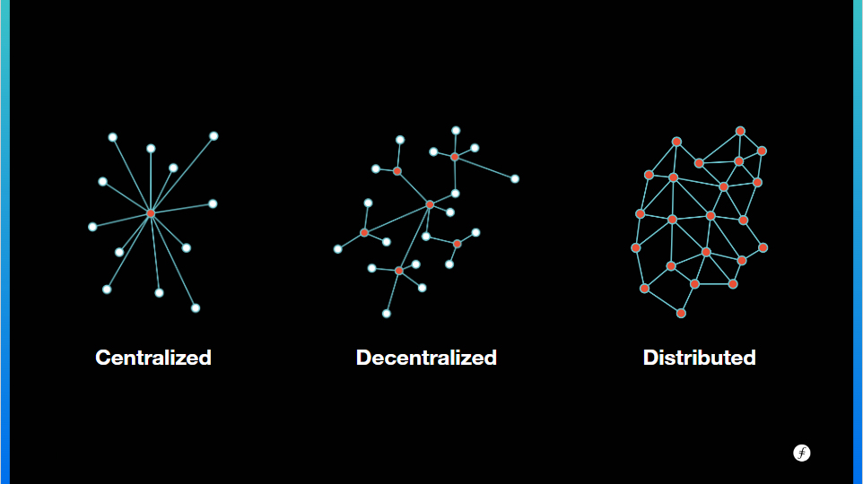

## Objectives

IPFS is one of many [general purpose peer to peer (P2P) networks](https://en.wikipedia.org/wiki/Peer-to-peer#Other_P2P_applications). Peer to peer networks are just everyday computer users that share data directly with each other. In these systems, you don't have to go through an intermediary like Google to share a file with someone. As an example, if we were looking for the [IPFS white paper](https://github.com/ipfs/papers/blob/master/ipfs-cap2pfs/ipfs-p2p-file-system.pdf), we would ask a peer and they will either respond with the paper or pass along the request to another peer. Eventually, someone will return with the paper if they have it saved.

Peer to peer systems are most synonymous with distributed networks. This is because we have direct connections with our peers as opposed to in centralised and decentralised networks, we often still have to go through a mediary to find content. 

These [different types of networks](https://www.gemini.com/cryptopedia/blockchain-network-decentralized-distributed-centralized) offer various tradeoffs. The world wide web is in essense a centralised network. We are familiar with the speed of receiving content, availability of data when we want it, the ease of discovering new things, and straight forward way of securing our accounts.

On the other hand, peer to peer networks excel in everything that centralised networks don't. This includes owning our own data and censorship resistance against governments, corporations, or hackers. They allow us to trust that the data we recieve is the data we ask for, if it is available. And generally the more users sharing data with each other, the better the network will be.

[Decentralised networks](https://petkanics.medium.com/the-benefits-of-decentralization-88a0b5d0fd39) maintain privacy and censorship resistance while being able to discover new content and maintain availability of data. Unfortunately, this comes at the cost of speed. Decentralised networks have to agree on all actions made by users because they save the actions on every computer in the network. Then in the future, all computers can reference any action taken by any single user. For this reason, decentralised networks are generally paid for by the user and use up large amounts of electricty.

## Why IPFS?

The acceleration of innovation over the past few decades, in comparison with the past million years of human evolution, is moving at an incredible pace.

IPFS as an organization is trying to look ahead to the next 10, 100, 1000 years and beyond and think about how computing will shape and impact a future we can't even begin to imagine.



  
Though it gets difficult to predict what is going to happen in the next, say, 100 years, we can start to invest in it now with Web3.

Computation has gone through so many phases; from the first computers, to machines that can timeshare, to multiprocessing and sandboxed VMs, to user terminals, to networked computers with multiprocessing, now with personal computers networked across a worldwide internet that all came from a relatively simple set of functions and data transmission. Now, IPFS is on the front lines of the Web3 evolution that will bring us to the next stage in computing.

**Links**

**IPFS** | [Docs](https://docs.ipfs.io) | [GitHub](https://github.com/ipfs) - **IPLD** | [Docs](https://ipld.io/docs/) | [GitHub](https://github.com/ipld) - **libp2p** | [Docs](https://docs.libp2p.io) | [GitHub](https://github.com/libp2p) - **Filecoin** | [Docs](https://docs.filecoin.io) | [GitHub](https://github.com/filecoin-project)
