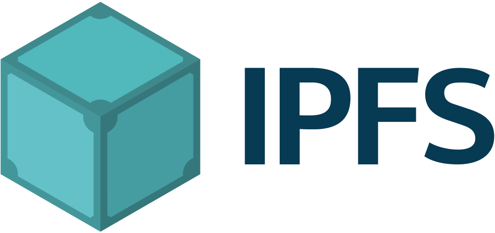

**IPFS** stands for **I**nter**P**lanetary **F**ile **S**ystem.

IPFS is a distributed system for storing and accessing files, websites, applications, and data. Read more about how this works [in the docs](https://docs.ipfs.io/concepts/what-is-ipfs/).

IPFS aims to [decentralize the web](https://docs.ipfs.io/concepts/what-is-ipfs/#decentralization) and connects people to information using [content addressing](https://docs.ipfs.io/concepts/what-is-ipfs/#content-addressing) instead of URLs and servers.

The mission of **IPFS** is to create a resilient, upgradable, open network to preserve and grow humanity's knowledge.

