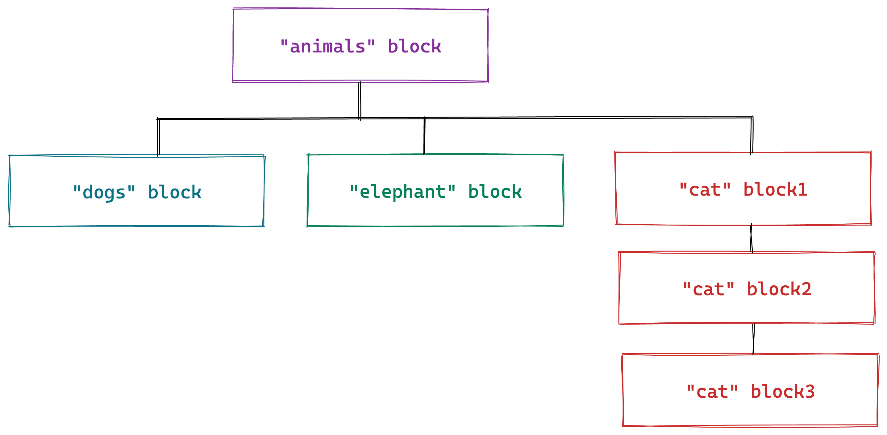
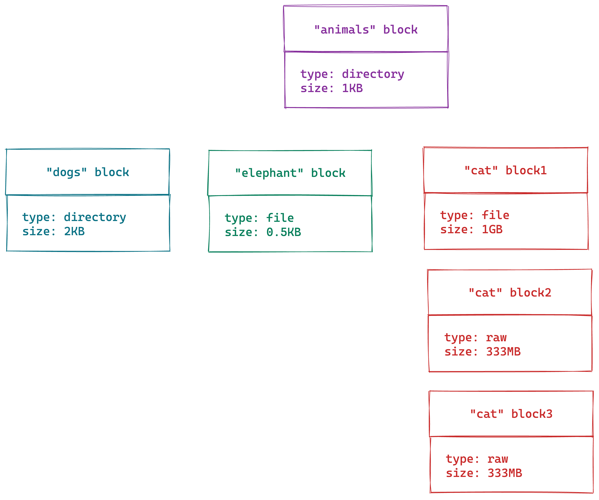

## Introducing UnixFS
By now, you already know that files and directories in IPFS are represented as Merkle DAGs. This means that the data of large files are split across several blocks. Every block needs to have some metadata that identifies what kind of data it holds. For example, consider the following directory.


Usually, directories and small files fit into just one block. However, large files are split across several blocks, which are linked.



The two directories, and the `elephant.png` file, are small enough to fit into their own block. However, the `cat.jpg` file requires three blocks. When you read the blocks, it is necessary to have some information about every block, such as type (directory, file,...), size or data. IPFS uses [UnixFS](https://docs.ipfs.tech/concepts/file-systems/#unix-file-system-unixfs) to provide information for every block.



The first block of the `cat.jpg` file is marked as `type: file`, because it is the starting block of the file. The remaining blocks are marked as `type: raw`, because they only contain data.

## Technical Implementation
In technical terms, UnixFS is a [protobuf-based](https://developers.google.com/protocol-buffers) format, which is represented by the following protobuf:

```go
message Data {
    enum DataType {
        Raw = 0;
        Directory = 1;
        File = 2;
        Metadata = 3;
        Symlink = 4;
        HAMTShard = 5;
    }

    required DataType Type = 1;
    optional bytes Data = 2;
    optional uint64 filesize = 3;
    repeated uint64 blocksizes = 4;
    optional uint64 hashType = 5;
    optional uint64 fanout = 6;
    optional uint32 mode = 7;
    optional UnixTime mtime = 8;
}

message Metadata {
    optional string MimeType = 1;
}

message UnixTime {
    required int64 Seconds = 1;
    optional fixed32 FractionalNanoseconds = 2;
}
```

* Files with a single block:
    - `DataType` is set to `File`
    - `Data` holds the content of the file
    - `filesize` contains the total number of bytes of the file

* Files with several blocks:
    - `DataType` is set to `File` in the first block, and `Raw` in he remaining blocks
    - `filesize` contains the total number of bytes of the file
    - `blocksizes` list of sizes of every child node

Later in the curriculum, you will learn how UnixFS is related to IPLD. You can also get more information in the [official specification](https://github.com/ipfs/specs/blob/main/UNIXFS.md).
