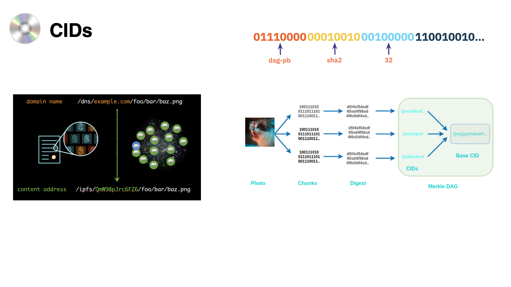
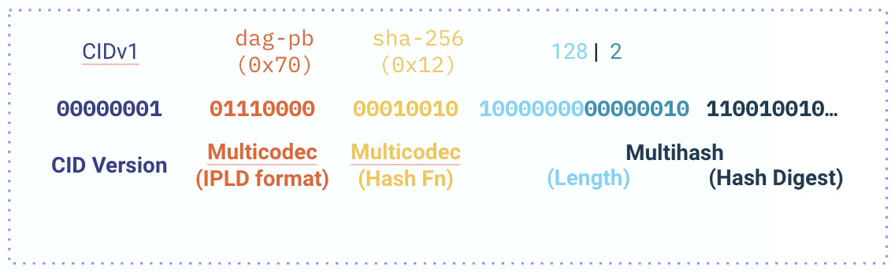

## Background Information
In order to understand the pieces that make up a CID, you will need to understand the following fundamental concepts:

* [**Binary vs Bits vs Bytes**]() - When we refer to something as **Binary** (**binary format** or **binary data**) it is easily identified by consisting of only ones or zeros. **Bits**, in a computer, are ones or zeros. **Bytes**, in a computer, are groups of 8 *bits*.
* [**Hashing**](https://www.sentinelone.com/cybersecurity-101/hashing/) – When we refer to a 'hash', we are refering to the output of a mathematical process called 'hashing' (interchangeable with 'hash function'). This hashing process converts one value to another of a fixed length and is unique. This hash is generally in a binary format.
* [**Base Encodings/Codec**](https://skorks.com/2009/08/different-types-of-encoding-schemes-a-primer/) – This is basically the process of converting binary numbers into a compressed set of characters. For example, Base 10 encoding says that 0001 1010 = 26, but that same number in base64 = MDAwMSAxMDEw. [Play around with different encoding here](https://cryptii.com/pipes/binary-to-base64)
* [**Varints**](https://carlmastrangelo.com/blog/lets-make-a-varint) – Variable length integers, or Varints, are numbers optimized for saving space. The idea is to use the smallest amount of bytes needed to represent a number. For example, small numbers don't need as many bytes to represent them (0000 0010 == 2), so we would only use one byte as opposed to traditionally using 4 bytes.

For a more in depth look at these topics, refer to the [Content Addressing in the IPFS](/curriculum/ipfs/content-addressing) section. 

## Content Identifiers (CIDs)

CIDs are _the most fundamental ingredient of the IPFS architecture_. They are used for finding any content in a content addressed system. They consist of a **hash** followed by some **metadata**. The hash and metadata are in binary format, but for user-readbility they are base encoded to turn the binary into a shorter alphanumeric string. This metadata tells the user various details about the hash itself, thus creating a **self describing** property. CIDs are used to name every piece of data in IPFS. Generally, in practice, you will never see a CID in binary format.



Currently in IPFS, there are only two CID verions. Here is an example of how they both look like:

* **CIDv0**: [**`Qm`**`S4ustL54uo8FzR9455qaxZwuMiUhyvMcX9Ba8nUH4uVv`](https://ipfs.io/ipfs/QmS4ustL54uo8FzR9455qaxZwuMiUhyvMcX9Ba8nUH4uVv)
* **CIDv1**: [**`bafybei`**`bxm2nsadl3fnxv2sxcxmxaco2jl53wpeorjdzidjwf5aqdg7wa6u`](https://ipfs.io/ipfs/bafybeibxm2nsadl3fnxv2sxcxmxaco2jl53wpeorjdzidjwf5aqdg7wa6u)

_(These point to the same content, but use two different versions of the CID specification)._

CIDs are self-describing content addresses. The binary format of a CID, consists of a hash with descriptions of what & how they came to be. They tell you the hash function used as well as the codec that can be used to interpret the binary data being linked to.

CIDs give us a complete self-describing package, they tell us:

* The hash function that was used
* The amount of bytes of output we have
* The kind of data that is being addressed and how we might interpret it when we find it

### CIDs are Immutable Links

CIDs give us many properties in content addressed systems:

* **Self-certification**: Content is authenticated by its address, not by a Certificate Authority, thus enabling decentralisation in IPFS.
* **Deduplication**: Because identical data can be verified by its address, this saves resources and provides faster access to content, by not creating multiple copies of the same data.
* **Immutability**: If the content changes, its address also changes, thus providing the means to differentiate files whose content is similar.
* **Security/Integrity**: Thanks to the immutability property, maliscious files can be avoided because it can be identified, by the CID, when a requested file has been tampered with.

Also: Change Tracking, Cacheability, Efficient Syncability, Scalability, Offline-first Architectures, Resilience, and more!

## Anatomy of a CID



CIDs build on some basic technologies for self-describing data, they use varints to provide information about the hash. In CIDv1s, we have three varints:

* **Multihash**: A self-describing hash digest, using a pre-set number to identify the hash function used, comprises the main content of a CID.
* **Multicodec**: A pre-set number to uniquely identify a format, or protocol. Used in CIDs for the IPLD format that tells you how to decode the data when you locate it and load its bytes.
* **Multibase**: A self-describing base-encoded string, used for the string form of a CID.

Multihash, Multicodec, Multibase and CIDs are part of the "Multiformats" system for self-describing values.

A CID can be said to be built as a concatenation of these technologies: 

```
<multibase>(<cid-version><multicodec><multihash>)
```

### Multiformats

[Multiformats](https://multiformats.io/) were created to make formats, protocols, hash digests and other small values self-describing. They are useful in IPFS (and [any other system that implements IPLD](https://multiformats.io/#projects-using-multiformats)) for communicating encoding formats (codecs) and hash functions. Their self-describing nature is a form of future-proofing which prevents breaking changes and allows for interoperability between a wide variety hash functions and encoding formats, including those from other content-addressed systems.

In the content addressed system called Git, a Git commit hash is _only_ the output of a SHA1 hashing function (no metadata prefixes), by default, and that's all Git has ever used. But now that Git wants to start using SHA2-256 hashes, the assumptions built in about SHA1 are quite painful and they need a way to distinguish between the two. If Git was built using CIDs instead, it wouldn't matter what hash function was used and upgrading would be trivial, because they could use the self-describing properties of CIDs.

### Multiformat Protocols

* **Multihash**: Self-describing hashes
* **Multibase**: Self-describing base encodings
* **Multicodec**: Self-describing serialization
* **Multiaddr**: Self-describing network addresses
* **Multigram**: Self-describing packet network protocols

### CID Multiformats

##### Multicodec 
Is a pre-set number to uniquely identify a data format or protocol. See the Multicodec registry of the different formats: [https://github.com/multiformats/multicodec](https://github.com/multiformats/multicodec). Commonly used Multicodec data formats are: DAG-PB, DAG-JSON, DAG-CBOR. More details on these in a later lesson.

Generally, Multicodec numbers are used as prefixes to the values they identify. When represented in binary, these are typically encoded as "varints", or variable-length integers.

##### Multihash
Is a self-describing hash digest. The hash digest is prefixed with a number, or code, that identifies the hash function used to convert some data into said hash. This makes it much easier for systems that depend on hash functions for security to upgrade if there is a cryptographic break. After the code prefix, a Multihash also includes the length of the hash digest to follow.

The different hash functions can be seen in the [multicodec table](https://github.com/multiformats/multicodec). For example, the SHA3-384 hash function has the code `0x15`, while a BLAKE2b hash function with 384-bit output is `0xb230`. So a Multihash can be said to be:

```
<hash-function-code><digest-length><digest-bytes>
```

##### Multibase
Is a protocol that allows for text data to self-describe which base encoding is used. Multibase uses a prefix _character_ which describes the base used to encode the bytes that follow. For example:

* `b` - base32
* `z` - base58
* `f` - base16
* `🚀` - base256emoji

The full list of bases and their mappings can be found in the Multibase registry at [github.com/multiformats/multibase](https://github.com/multiformats/multibase).

While not the most compact string representation, _base32_ (b) is the preferred base encoding for CIDv1 because it only uses lower-case ASCII characters so is safe to use in DNS entries (and therefore URLs).

After [Kubo release 0.14](https://github.com/ipfs/kubo/blob/master/docs/changelogs/v0.14.md#-emoji-support-in-multibase), emoji support [(base256emoji)](https://github.com/multiformats/multibase/blob/master/rfcs/Base256Emoji.md) was included for testing Unicode support, as visual aid while explaining Multiformats, or just for fun.  
```bash
# Encode "test" in base256emoji
$ echo -n "test" | ipfs multibase encode -b base256emoji -
🚀😈✋🌈😈

# Decode the emoji
$ echo -n "🚀😈✋🌈😈" | ipfs multibase decode -
test

# Transform the base32 CIDv1 to base256emoji CIDv1
$ ipfs cid format -v 1 -b base256emoji bafybeigdyrzt5sfp7udm7hu76uh7y26nf3efuylqabf3oclgtqy55fbzdi
🚀🪐⭐💻😅❓💎🌈🌸🌚💰💍🌒😵🐶💁🤐🌎👼🙃🙅☺🌚😞🤤⭐🚀😃✈🌕😚🍻💜🐷⚽✌😊
```
This Multibase character (🚀) says that all the following characters can be passed through a base256 decoder to retrieve the raw hash.

### Interpreting a CID

A raw byte form of a CID is the concatenation of multiformat values:
```
<cid-version><multicodec><multihash>
``` 
When represented as a string (e.g. `bafyrei....`), the Multibase character is prefixed, so it becomes: 
```
<multibase>(<cid-version><multicodec><multihash>)
```

**CIDv0 is a special case** because it predates the Multiformats specifications. It's simply the Multihash of the content and as a string is represented using the Bitcoin variant of base58. 
```
<algorithm><length><hash-digest>
```
CIDv0 exclusively uses the SHA2-256 hash function, and because the digest length is 256 bits (32 bytes), we end up with the Multibase prefix being represented as `Qm` in string form.

Beyond CIDv0, there is only one currently valid CID version 1, but a CIDv1 in string form can use any base encoding in the Multibase table and represent the same CID:

* Base32: `bafybeibxm2nsadl3fnxv2sxcxmxaco2jl53wpeorjdzidjwf5aqdg7wa6u`
* Base58 (BTC): `zdj7WZAAFKPvYPPzyJLso2hhxo8a7ZACFQ4DvvfrNXTHidofr`
* Base8:`7002700221003354646620015366255572724534256627001166445373566362164244362403233057202006337540365`
* Base2: `0000000010111000000010010001000000011011101100110100110110010000000001101...` (you get the idea...)

## CID Inspector
As an hands-on example, you can take any CID, insert it below, and see how it breaks down to its Multiformat values.
{{% embed class="website" src="https://cid.ipfs.io" width="100%" height="500px" %}}

## Further Reading

* [**Content addressing and CIDs**](https://docs.ipfs.io/concepts/content-addressing/) in the IPFS documentation.
* [**Anatomy of a CID**](https://proto.school/anatomy-of-a-cid/) on Proto.school, a guided, interactive tutorial.