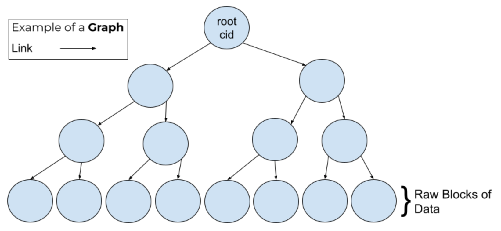

## Background Information

In order to understand the pieces that tie IPFS and IPLD together, you will need to understand the following fundamental concepts:

* [**Content Addressed Systems**](https://www.techtarget.com/searchstorage/definition/content-addressed-storage) - These are generally peer to peer networks, like IPFS, where users find content by its [CID or hash](/curriculum/ipfs/content-addressing). Other popular Content Addressed networks are: **Git, BitTorrent, and even blockchains**.
* [**Hash**](https://www.sentinelone.com/cybersecurity-101/hashing/) – The output of a mathematical process called **hashing**. This hashing process converts some arbitrary content to a unique binary number of fixed length.
* [**Data Structures**](https://www.geeksforgeeks.org/data-structures/) - Are core computer science paradigms used heavily in IPLD. **Data structures** are used to provide the reader (and computers) with nicely formatted and organized data points. Common structures are: graphs, trees, blocks, and other "classes" of grouping techniques. We will talk more on these structures later in this module.
* **Data Layer** - This is the part of IPFS (or any _content addressed system_) that breaks down files and other content to be stored in an optimal way. With a focus on _the specifics of how to address that content_.

## Why IPLD?

IPLD answers the question: Can we extract a re-usable data layer from IPFS that can be used to build other types of content-addressed data systems?

Every content addressed system reinvents the data layer, typically in non-reusable ways.  IPLD aims to be an off-the-shelf content addressed data layer, with associated libraries, documentation and tooling that makes it easy to build system like Git in a short period of time.

## How can we use IPLD?

Treating the data layer as a discrete system provides developers working on content addressed systems with a powerful tool out-of-the-box with IPLD. IPLD can help us answer these questions:

1. How can we scale the size and complexity of the data that we share peer to peer?
2. Can we unify disparate content addressed formats and link between them? Git, blockchains, IPFS, etc.
3. Can we build distributed data structures that we can interact with like we do with hosted databases, while taking advantage of the benefits of content addressing?

### [**ResNetLab: Course Module - InterPlanetary Linked Data (IPLD)**](https://research.protocol.ai/tutorials/resnetlab-on-tour/ipld/)



## IPLD and File Data

At its most fundamental, **IPFS** is a collection of:

1. Binary blobs of data - "blocks"
2. Their associated content identifiers - CIDs

Those blocks make up every piece of content added to IPFS. And every block gets its own CID. Only the smallest files in IPFS are stored as a single block. Otherwise, files are split up into chunks and spread across multiple blocks and linked together into a single graph.

These are both the core concerns of IPLD. IPFS builds on these primitives to provide a sophisticated peer to peer content addressing system, with a mature suite of tooling to deal with files.

Directories are graphs of links that are named; the links point to the blocks of the files within the directory. This forms graphs that address other graphs.

## Prequel to IPLD

The CID that is returned to you when you add a file to IPFS is the entry point to these graph structures. **Graphs** are data structures to organize all the blocks of data pertaining to the respective file. This organization is handled by **"links"**; links help create a logical order of blocks for IPLD to address every subsequent block of data. There will be more on graphs in a later lesson.

### Further Introductory Reading:

* [**A Terse, Quick IPLD Primer for the Engineer**](https://ipld.io/docs/intro/primer/)
* [**IPLD in the InterPlanetary Ecosystem**](https://ipld.io/docs/intro/ecosystem/)

#### Links

**IPFS** | [Docs](https://docs.ipfs.io) | [GitHub](https://github.com/ipfs) - **IPLD** | [Docs](https://ipld.io/docs/) | [GitHub](https://github.com/ipld) - **libp2p** | [Docs](https://docs.libp2p.io) | [GitHub](https://github.com/libp2p) - **Filecoin** | [Docs](https://docs.filecoin.io) | [GitHub](https://github.com/filecoin-project)
