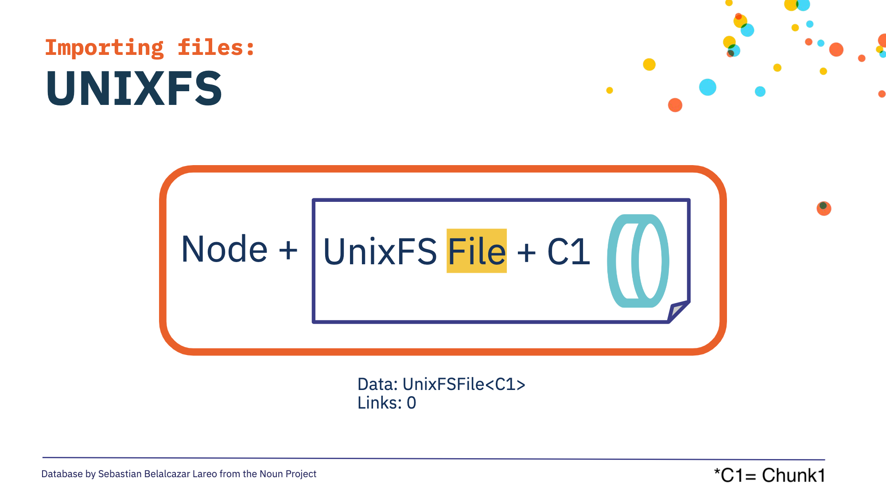

## Background Information
In order to understand the pieces that tie IPFS and IPLD together, you will need to understand the following fundamental concepts:
* [**JSON**](https://www.w3schools.com/whatis/whatis_json.asp) - An acronym for "JavaScript Object Notation". This is an industry standard for formatting different types of data in a human-readable way.
* [**Protobuf**](https://developers.google.com/protocol-buffers/docs/overview) - Is an industry standard for declaring just one way on how to format data that will be streamed over the internet for storage or processing. This uses a JSON formatting.
* [**Merkle DAGs**](/curriculum/ipld/merkle-dags) - Built from the bottom up, impossible to have circular references, and parents’ hashes are built from the hashes of its children nodes.

### The Core of IPFS
At its core, IPFS is best viewed as a suite of standards for storing, sharing, navigating and manipulating IPLD data. IPFS is particularly skilled at leading with structured file data, and is particularly good at performing peer to peer data sharing.

#### How IPFS Deals With Files | IPFS Camp 2019 Workshop – Alan Shaw

In the following talk, Alan Shaw goes over theory and live examples of what happens with files added to IPFS. He highlights different variations to the underlying data structure created with a file added to IPFS and how it affects the CID.



At a high level, the talk covered the following concepts:

* Files are broken down into smaller blobs (chunks) of data
* Chunks of a file are strung together into DAGs by UnixFS processes
* Customizing the DAG in any way, shape, or form, yields a different CID
* Every chunk is wrapped in UnixFS metadata. This helps IPFS distinguish directories from files. As well as, help link chunks together.

You can access and experiment with the same DAG builder from the video at [https://dag.ipfs.tech/](https://dag.ipfs.tech/)

## The DAG-PB Format

The majority of data that passes through kubo (go-ipfs), js-ipfs, the IPFS gateways and various other IPFS nodes in existence, will be file data. This data uses the [**DAG-PB**](https://ipld.io/specs/codecs/dag-pb/) encoding to transform binary file data into human-readable structures (see below) that helps IPLD form Merkle DAGs.

DAG-PB is a [protobuf based format](https://developers.google.com/protocol-buffers/docs/overview) that can only contain two things: a Byte array, and a list of named and sized links to other blocks. Those links are almost always to other DAG-PB blocks or raw leaf blocks.

A typical DAG-PB block, represented as JSON, might look something like this:

```
{
    "Data": "... binary data",
    "Links": [
        {
            "Name": "named link of file or directory",
            "Tsize": <number>, "(size of graph from this link, down to leaves)"
            "Hash": CID
        },
        {
            ...
        }
    ]
}
```
Things to note:
* Both the `"Data"` and `"Links"` fields are optional, as are `"Name"` and `"Tsize"`, but they are generally all present.
* `"Tsize"` - We don't have assurances of this value so we treat it as _hint_.
* The `"Name"` field is particularly important because when you request file data from IPFS, the path is usually interpreted by looking for that name in the `"Name"` field.
* The `"Data"` field can be used to store arbitrary bytes, _but_ it's typically used for **UnixFS** metadata.

Read more about the DAG-PB codec in the [**specification**](https://ipld.io/specs/codecs/dag-pb/).

## Links – The Heart of IPLD

CIDs are the native link format for IPLD that distinguishes it from a simple data representation system. They are how we can connect graphs of data in flexible ways.

* Most data serialization formats, such as JSON and CBOR, don’t have a native way of representing links to content addressed data, so they don’t have a built-in way to form graphs of linked data.
* IPLD brings its own formats that represent CIDs natively in the encoded bytes.
* IPLD can also be used as a lens through which to view other content addressed formats, such as Git, or Bitcoin from which we can derive CIDs by assumption.

## UnixFS

[UnixFS](https://docs.ipfs.tech/concepts/file-systems/#unix-file-system-unixfs) is a data format for creating directory & file hierarchies and Merkle DAGs. UnixFS does this by adding an encoding layer _above_ the DAG-PB codec that takes the file metadata, such as timestamps, permissions, and labels for types of data (mime types), and converts it into bytes that make it easier to transfer data to other files, databases, or memory storage.

This means that a single block may be encoded twice into Protobuf format and therefore decoded twice after the bytes are sent over the wire, for the other database or filesystem to retrieve complete information about the filesystem.



UnixFS data also includes additional information about the form of the graph as it maps to filesystem data. For particularly large numbers of files, or a large number of chunks for files that are very big, the graphs must be organized in a way that scales.

### Sharding
To achieve this you will need a **sharding** system that will break the data up into blocks that balances block size, graph height, and graph density with block transfer latency (the time it takes to send all the blocks of data about a UnixFS file). If you break up and place too many links in a single block, the blocks can become unmanageably large, so we want to try to keep block sizes below 1Mb in size.

More information about UnixFS can be found in the [**IPFS docs**](https://docs.ipfs.io/concepts/file-systems/#unix-file-system-unixfs) or in the UnixFS [**specification**](https://github.com/ipfs/specs/blob/master/UNIXFS.md).

## IPLD Data Types and Formats

## Visualizing DAGs with IPLD | Marco Salinas - Fierro Labs
{}
### Intro to IPLD Data Model
The IPLD Data Model exists to give structure to how data is structured, organized, and moved through the various states it can be accessed and manipulated in. This includes:
* In-memory data, for short or long term
* In states where programs and applications can access and manipulate the data
* The serialization (breaking down into bytes) that can be used for data storage or transfers.

It also defines the different **Kinds** of data fundamentals; these fundamentals include the typical Integers, Booleans, and Strings data types, as well as other common data fundamentals similar to the JSON data model. THe IPLD Data model also adds **Bytes** and **Links**.

### Limitations of File Data

Files are a great abstraction, but can have limitations. Often, users store structured file data with IPFS, such as JSON files. These file types don't scale well and it also prevents the use of IPLD's sophisticated graph tooling from working on the data itself. They also rely on smart file chunking algorithms to de-duplicate files as they are modified and re-stored over time, which can be a hit-or-miss process.

### Intro to Codecs
IPLD is ambitious in its aims to be able to represent many, varied types of content addressed data. IPLD-native codecs that support the full IPLD Data Model, in particular [**DAG-CBOR**](https://ipld.io/specs/codecs/dag-cbor/), _allow for the storage of structured data within IPLD blocks_ in a way that the _data itself forms nodes within the full graph._ Commonly used codecs are Protobuf, JSON, and JOSE. They have different use cases because of the way they organize their data. But IPLD will build on those codecs to include the Data Model's Bytes, Links, and data Kinds, thus converting it to an IPLD-native Codec.

_Codecs are how IPLD moves data between the raw byte representation and their equivalent Data Model form._

### Codecs in Production
The Filecoin chain is probably the most sophisticated example of DAG-CBOR IPLD blocks used to represent a very large and scalable graph of structured data. Instead of having to load complete files, decode their contents and find individual pieces of data; an IPLD graph like the Filecoin chain can be navigated, transferred and reasoned about using IPLD [paths or selectors](paths-selectors.md).

## Intro to Schemas
Schemas are an important tool for extending IPLD’s scope into the application layer where coherent and useful data structures are important; without Schemas, IPLD's primary focus is the storage and transmission of data, making working with IPLD that much harder. Schemas introduce additional Kinds to the Data Model to support application developers' reasoning about the shape of data that we expect to flow through an IPLD based system.

## Further Reading
* [**IPLD Data Model**](https://ipld.io/docs/data-model/)
* [**IPLD Codecs**](https://ipld.io/docs/codecs/)
* [**IPLD Schemas**](https://ipld.io/docs/schemas/)
