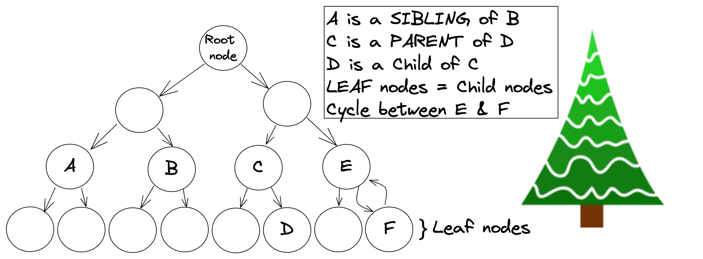
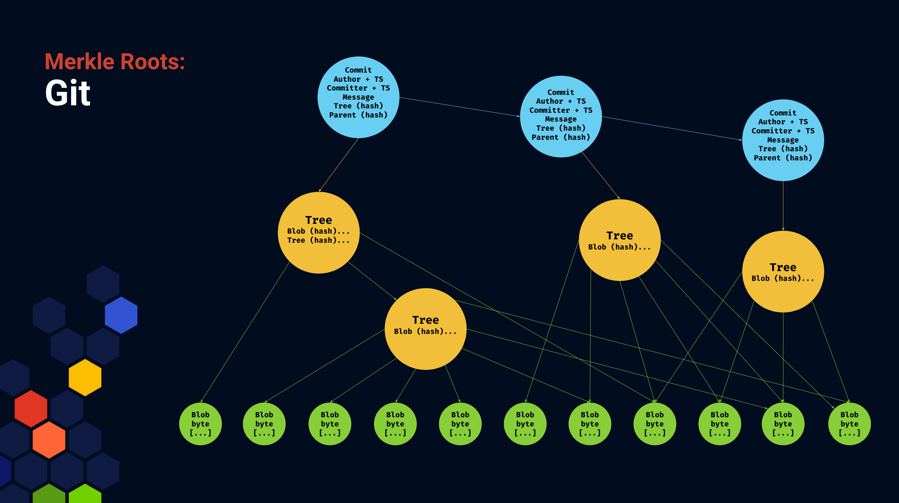
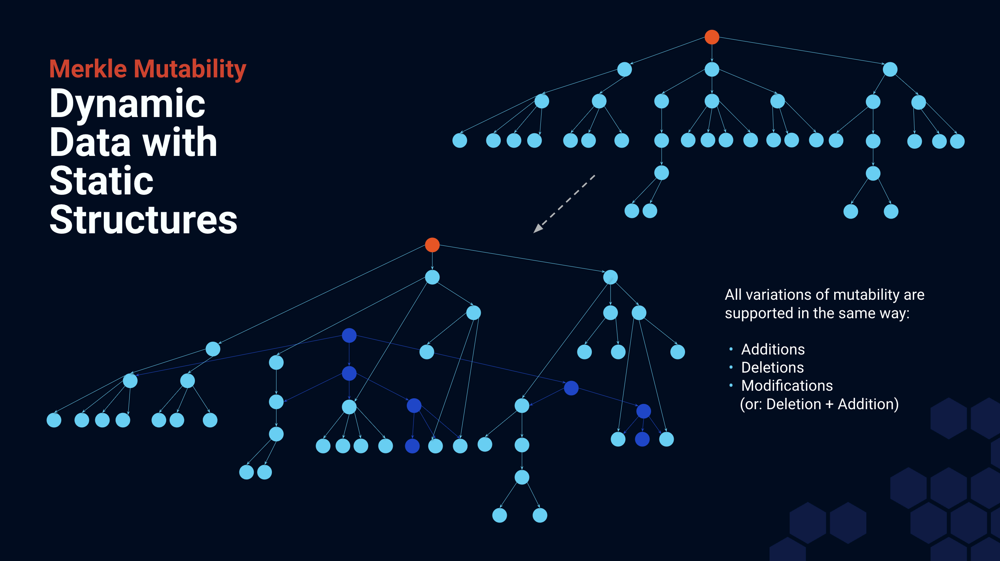

## Background Information
In order to understand the pieces that tie IPFS and IPLD together, you will need to understand the following fundamental concepts:
- [**Trees vs Graphs**](https://towardsdatascience.com/graph-theory-introduction-to-trees-a34ab267fc28) - Trees are a type of Graph data structure to help organize data in a logical format. Graphs and trees are, in essence, synonymous; they look similar, but differ in the ways they are used. Graphs also have stricter presence ordering than trees (visually identified by arrows). Therefore, all trees are graphs, but not all graphs are trees. A common example of a Tree structure that may also be a Graph, is one's own family tree.
- [**Nodes**](https://stackoverflow.com/questions/28762037/what-is-node-in-a-tree) - Are data points in a tree or graph. Visually represented as a block or circle when drawing a tree. In IPFS, it is common to hear a 'block' be referred to as a 'node' or vise versa. 
- [**Family and Nature References**](https://en.wikipedia.org/wiki/Tree_%28data_structure%29#Terminology) - Family references are often used in explanations of tree and graph structures. Common terms are: child node, parent node, or sibling node. Additionally, leaf nodes (in reference to the leafs of a tree), are the nodes all the way at the bottom of a graph. And a root node is the single node all the way at the top.
- **Cycles** - Are specific to graphs; this refers to when there is a set of arrows that start and end at the same node. Note: w.r.t the image below, a cycle does not have to occur solely between a parent and child node.

## Transform a DAG to a Merkle DAG
**DAG** is an acronym for **Directed Acyclic Graph**. This is a specific type of graph where any connected set of data is connected in only one direction (hence "Directed"). Additionally, the graph does not contain any cycles (hence "Acyclic"). Ralph Merkle, formalized the "hash tree" pattern in 1979 which is a special form of DAG (hence **Merkle DAGs**). A "hash tree" pattern is one where every node in the tree is essentially assigned a unique identifier. 

A **Merkle DAG** is a graph where any given node in the tree may contain hashes of content below that node along with any other content that may be useful at that node. This content can include things like author name, timestamp, hash of previous node, among other things. This means in Merkle DAGs, a parent node is not established until all child nodes' data has been hashed. After which, parent nodes can be assigned a hash, and so on and so forth until the root node gets created.

Checkout the video below for a more detailed explanation on how Merkle DAGs are created and how they're used in the context of IPFS. If you haven't worked with Merkle Trees before, [check out the tutorial in Protoschool to get a better understanding](https://proto.school/merkle-dags/01).

#### Merkle DAGs | IPFS Camp 2019 - Mikeal Rogers

This section on DAGs from IPFS Camp 2019 goes over how Merkle DAGs are created, read, and used in IPFS. Mikeal Rogers tells us what are the tradeoffs between different block sizes.



At a high level, the talk covered the following topics:

* Merkle DAGs - Built from the bottom up, impossible to have circular references, and parents’ hashes are built from the hashes of its children nodes. More on this down below.

* Block sizes - Blocks that are too big cause verification problems, transport problems, and less deduplication. Too small and hashing takes longer, more requests for blocks, more hops to a piece of data. 

* Just right - Depends on your use case, this will optimize for reading and writing in your scenario

## Different Components of Merkle DAGs
### Merkle Roots

The tip of any Merkle DAG is called its "root". The hash of that root can be said to authenticate (and "link to") all of the other content below it in the graph simply because each point in that graph includes hashes of content below it (i.e. hashes of hashes, all the way down).

Merkle DAGs are not specific to IPLD or IPFS. In the content addressed system called Git, a **Git commit** is the hash digest of the root of a large graph. This root "block" is a concatenation of various pieces of data, including:

* the author of the commit
* the timestamp
* the _previous_ commit hash digest
* the hash digest of the filesystem "tree"

The filesystem tree, in Git, is built by hashing files, then concatenating the hashes of files within a directory. This forms a directory node which is then hashed and included in the parent of that directory, etc. 

For example, a Git commit hash digest only hashes a small piece of data, but that data includes hashes of other data, forming a large tree spanning the files in that commit and all previous commits in the history of the Git repository.

A **Bitcoin block** is the hash of only 80 bytes of data! But that small packet of data includes the hashes of the previous block as well as the tip of a very large tree containing the transactions contained within that block. Bitcoin and other blockchains use the immutability and directionality of DAGs for authentication and inclusion of the entire history of the chain.

We can use the **root** of a Merkle DAG to address arbitrarily large amounts of data.

### Merkle Mutability

A graph of immutable data can said to be "mutable" if we accept that the hashes will need to change to match the changed data, and these changed hashes will propagate all the way up through the graph to a new root.

Mutating content addressed data in this way provides some interesting properties, we can add, remove or modify data at any point in the graph and generate a new root each time.

Mutating a graph will give us a new root. We call these new roots **snapshots**, because they _capture_ the differences between two graphs. Different snapshots (roots) may address much of the same data, since only small parts of the graph may have changed, this gives us deduplication.

**Deduplication** is the process of reusing common chunks of data between two versions of the same file. Going back to Git, one of the ways that Git is efficient is that only the changes need to be stored, and only those changed parts of a tree need be re-hashed to generate a new root (a commit hash).

## Merkle DAGs in IPFS

IPFS benefits from these same Merkle DAG properties, which gives us: self-certification, security, immutability, and [many more properties](/curriculum/ipld/content-addressing-cids/#cids-are-immutable-links). Merkle DAGs allow us to have deduplication in IPFS. This makes it possible for only file differences to be shared. 

A copy of Wikipedia on IPFS may take up many GBs, but changing a single page only requires changes to that page and its parents (up to the new "root"!). Having a CID for the old and new lets us move back and forward in time through the **snapshots**, while not needing to download the whole thing from scratch.

We will learn more about how IPFS creates DAGs out of files in the [IPLD & IPFS section](/curriculum/ipld/ipld-and-ipfs/).

## Further Reading

* [**Merkle DAGs: Structuring Data for the Distributed Web**](https://proto.school/merkle-dags) on Proto.school, a guided, interactive tutorial
* [**Merkle Proofs Explained**](https://medium.com/crypto-0-nite/merkle-proofs-explained-6dd429623dc5)