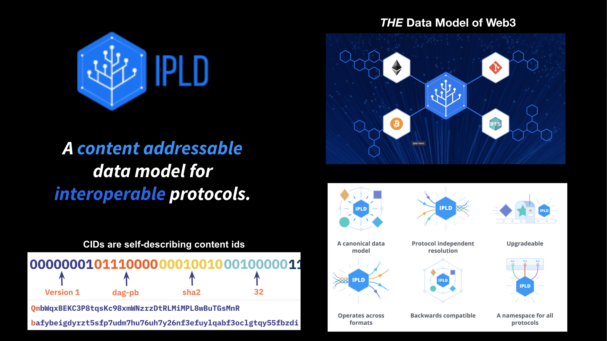

[IPLD (InterPlanetary Linked Data) is **The Data Layer for content-addressed systems**](https://blog.ipfs.io/what-is-ipld/). It deals with all the heavy lifting in IPFS; it represents data as Merkle-DAGs with roots identified by content IDs called **CIDs**.

## How is IPLD related to IPFS?

IPLD is the data layer of IPFS. But the reverse is also true because IPFS is _a_ block store for IPLD.

IPLD deals with data consistency, data addressing, data relationships (graphs), content addressed data structures, data navigation and more.

IPLD is generally not concerned about data storage or transports (with some caveats).

IPLD does not limit itself to peer to peer systems (Amazon S3 can be a perfectly reasonable IPLD block storage system!), but in general we think peer to peer is preferable!

<!-- ### Shallow Dive Goals
* **1.0 -** Understand how and why IPLD was created, and which data types and structures it provides interoperability for
* **1.1 -** Understands the advantages of content addressing, how they are achieved with CIDs, and how CIDs are constructed with codecs and multiformats
* **1.2 -** Understand the fundamentals of a Merkle Tree, including Merkle roots, blocks, paths, mutability, and snapshots.
* **1.3 -** Understands how content addressed data can form linked graphs (Merkle DAGs)

### Deep Dive Goals
* **1.4 -** Understand the data model and schemas used by IPLD, codecs, UnixFS and data types used with IPLD
* **1.5 -** Learn about the CAR format used for IPLD blocks, and how it is key for the packaging and distribution of data in a distributed network
* **1.6 -** Gain a basic conceptual understanding of how we can combine algorithms with Merkle DAGs to build distributed and scalable data structures -->