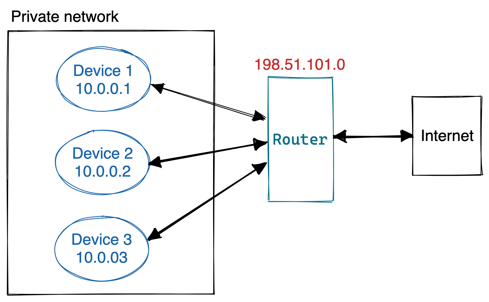

## Concepts

libp2p is a framework that allows you to create peer to peer networks in a modular way by choosing the protocols that your application needs.
This section presents the main _building blocks_ of the libp2p architecture, which will be covered in detail later in the Launchpad curriculum.

### Transport

A key part of a network is the transport layer (consider the TCP/IP or OSI model). Most communications on the Internet happen by using the TCP transport protocol, although UDP is also widely used.
libp2p allows you to choose the transport protocol that best fits your application.

At the transport network level, libp2p offers TCP or QUIC (a new transport protocol built on top of UDP). When we open a connection with other peers in the network, we use a transport protocol.

You can read more in the [libp2p docs](https://docs.libp2p.io/concepts/transports/) or later in the Launchpad curriculum.

### Stream Multiplexing

Once we have opened a connection by using a transport protocol, libp2p offers multiplexing out of the box.
Opening new connections is _expensive_ from a resources point of view, so libp2p uses _stream multiplexing_ to exchange different types of data within the same connection.
Basically, libp2p splits the connection into several logical _streams_. Every stream holds a different type of data.

You can read more in the [libp2p docs](https://docs.libp2p.io/concepts/multiplex/) or later in the Launchpad curriculum.

### NAT Traversal

Consider the Internet router that you have at home. You probably have several devices connected to it (laptops, mobile phones, or even the fridge).
When you join the Internet, you are given an address identifier, called an _IP Address_.
However, the number of IPs in the Internet is limited, so every device does not get a public IP address.
Instead, your router creates a private network in your home and assigns a private IP to every device. Then, the router is responsible for managing the incoming and outgoing connections from the Internet.
This is called **NAT (Network Address Traversal)**. For example, consider the following diagram:

The router is connected to the Internet, and is assigned a public IP address. Three devices are connected to the router, which manages the incoming and outgoing data.

Although this is a great way of avoiding the waste of IP address, it brings a problem, especially in peer to peer networks.
The only public part of our network is the router, so what happens if a computer from the Internet wants to connect to a specific device in our private network?
libp2p offers several NAT traversal methods to avoid this issue, such as **[hole-punching](https://docs.libp2p.io/concepts/nat/hole-punching/) or [circuit relays](https://docs.libp2p.io/concepts/nat/circuit-relay/)**.

You can read more in the [libp2p docs](https://docs.libp2p.io/concepts/nat/) or later in the Launchpad curriculum.

### Protocols

As we mentioned before, libp2p provides stream multiplexing (i.e. reusing a connection to exchange different types of data through logical streams).
Every stream is identified by the _protocol_ that it handles. In libp2p, a _protocol_ is simply a string that represents what kind of data is flowing through the stream.

Consider that your have two peers, _Peer A_ and _Peer B_. _Peer A_ wants to send random words to _Peer B_, so it opens a stream attached to the protocol `random-words`.
To get the random words, Peer B creates a _handler_, which receives and manages the random words.

You can read more in the [libp2p docs](https://docs.libp2p.io/concepts/protocols/#what-is-a-libp2p-protocol) or later in the Launchpad curriculum.

### Peer Identity

In a peer to peer network, it is necessary to identify every peer uniquely.
libp2p identifies every peer by using a _peer id_, which is a multihash identifier derived from the peer's private key.

You can read more in the [libp2p docs](https://docs.libp2p.io/concepts/peer-id/) or later in the Launchpad curriculum.

### Addressing

In order to establish connections with a peer, it is necessary to know its location.
For example, when you access `https://127.0.0.1:8080/my-image.png`, you are requesting access to the `127.0.0.1` IP address, at the `8080` port by using the HTTPs protocol.

Although this is a valid system, you have to infer some data: what protocol is behind `127.0.0.1`? or what protocol is behind `8080`?
Of course, you know that `127.0.0.1` is an IPv4 address, and you know that `8080` is a TCP port because HTTP is used.

libp2p uses a different addressing system, which is called [multiaddresses](https://github.com/multiformats/multiaddr). Multiaddresses are self-describing:

`/ip4/127.0.0.1/tcp/8080/http/my-image.png`

In the previous example, you do not have to guess any data. Every parameter is preceded by its protocol, which removes ambiguity.

You can read more in the [libp2p docs](https://docs.libp2p.io/concepts/addressing/) or later in the Launchpad curriculum.

### Security

A libp2p connection is encrypted by default. At the same time, the peer id is derived from the peer's private cryptographic key.
This allows you to _authenticate_ the peer and make sure you are connected to the correct peer.

More complex systems will also require authorization (i.e. whether the peer is allowed to do a specific task). libp2p does not provide authorization out of the box.

You can read more in the [libp2p docs](https://docs.libp2p.io/concepts/security/security-considerations/) or later in the Launchpad curriculum.

### Publish/Subscribe

libp2p also offers publish/subscribe capabilities by using the _topic_ abstraction.
You can consider that a _topic_ is a bucket where messages for a specific use case are sent.
For example, in a chat, you can create a "animals" topic, where only messages related to animals are sent.

To receive messages, peers subscribe to topics they are interested in. Peer only receive messages from topics they are subscribed to.

You can read more in the [libp2p docs](https://docs.libp2p.io/concepts/publish-subscribe/) or later in the Launchpad curriculum.
