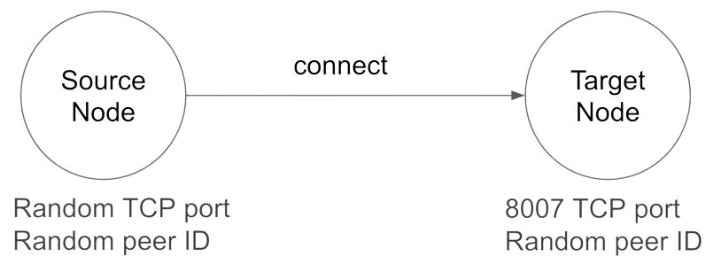

In this tutorial, you will create two libp2p nodes and connect them.

By the end of the exercise, you should be able to:

* Create a new libp2p node
* Print the node's ID and multiaddresses
* Configure the node at a basic level
* Connect to another node



## Prerequisites

* You must have Go installed. In this exercise, version 1.18 is used.
If you do not have Go installed, refer to [this page](https://go.dev/doc/install).
If you want to install multiple versions of Go, refer to [this page](https://go.dev/doc/manage-install#installing-multiple).
* Clone the `https://github.com/protocol/launchpad-tutorials` Git repository, which contains all the sample applications used in the Launchpad program.

## Instructions

* Open the `libp2p-go-simple-code` folder of the `launchpad-tutorials` repository in an IDE of your preference. The `app` subfolder contains the template that you will complete.

### Review the "main" Function

* In the `main.go` file, review the code.
There are several functions that you will implement in this tutorial.
The `main()` function manages the flow of the program by calling different helper functions.

### Create the Source Node

* In the `createSourceNode` function, create a libp2p node by using the `libp2p.New()` function.
This method returns a [host.Host](https://github.com/libp2p/go-libp2p/blob/master/core/host/host.go#L25) interface, which you can use to manage the node.

```go
func createSourceNode() host.Host {
	node, err := libp2p.New()
	if err != nil {
		panic(err)
	}

	return node
}
```

By default, the node gets an ID and listens at a random TCP port.

### Create the Target Node

* Now, in the `createTargetNode` function, create a new node that listens at the `8007` TCP port. We can configure a node by passing several [Option](https://github.com/libp2p/go-libp2p/blob/master/libp2p.go#L13) structs to the `New(...)` method.

```go
func createTargetNode() host.Host {
	node, err := libp2p.New(
		libp2p.ListenAddrStrings(
			"/ip4/0.0.0.0/tcp/8007",
		),
	)
	if err != nil {
		panic(err)
	}

	return node
}
```

### Connect the Nodes

* So far, you have created two nodes; now, let's connect `sourceNode` to `targetNode`.
The `host.Host` interface contains a `Connect` method that you can use.
The `Connect` method expects a `peer.AddrInfo` struct, which is an abstraction that represents the _location_ of a peer.
To create a `peer.AddrInfo` struct with the data of the node, you can use the [host.InfoFromHost](https://github.com/libp2p/go-libp2p/blob/master/core/host/helpers.go#L6) function.

```go
func connectToTargetNode(sourceNode host.Host, targetNode host.Host) {
	targetNodeAddressInfo := host.InfoFromHost(targetNode)

	err := sourceNode.Connect(context.Background(), *targetNodeAddressInfo)
	if err != nil {
		panic(err)
	}
}
```

### Count the Number of Peers of the Source Node

* To verify that the connection works, you can list the peers connected to the node.

```go
func countSourceNodePeers(sourceNode host.Host) int {
	return len(sourceNode.Network().Peers())
}
```

### Run the Program

* Now, test that the two nodes are connected by running the application.

```bash
> go run .
-- SOURCE NODE INFORMATION --
ID: 12D3KooWCGcgrrrfDwzLmNeZ25543kYcewKxXzgDkGJGNXw1ZUf3
Multiaddresses: /ip4/192.168.0.10/tcp/63678, /ip4/127.0.0.1/tcp/63678, /ip6/::1/tcp/63681
-- TARGET NODE INFORMATION --
ID: 12D3KooWLkzhtJxcSnasfzkXGQzgKGqxGtUDpACZSXt3HM4Rn3op
Multiaddresses: /ip4/192.168.0.10/tcp/8007, /ip4/127.0.0.1/tcp/8007
Source node peers: 1
```