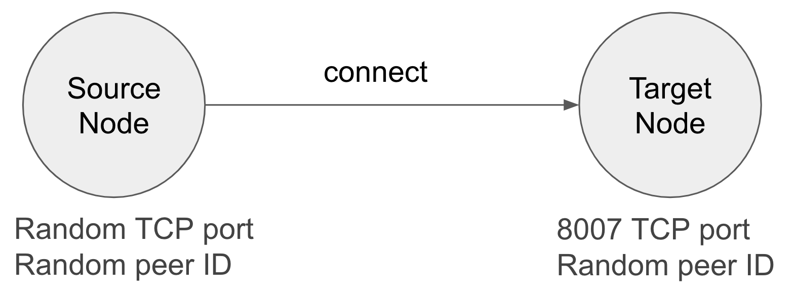

## Background

In this tutorial, you will use a [go-libp2p](https://github.com/libp2p/go-libp2p) 
boilerplate project to set up and connect two libp2p nodes.

### What you'll learn

You will gain a basic understanding of the different capabilities of libp2p, such as data 
transmission and peer identification.

> Note, node, and peer are used interchangably in this tutorial.

### What you'll do

Using the boilerplate code, you will:

1. Spin up two libp2p nodes: one source node and one target node.
2. Configure the source and target nodes.
3. Connect the source and target nodes.
4. Print the source and target node's Peer ID and multiaddr.



### Video tutorial

This video will demonstrate how you can create a simple libp2p node using 
[go-libp2p](https://github.com/libp2p/go-libp2p).



## Prerequisites

* You must have [Go installed](https://go.dev/doc/install). In this exercise, version 1.18 is used.
> You can also install [multiple versions of Go](https://go.dev/doc/manage-install#installing-multiple).

* Clone or fork the `https://github.com/protocol/launchpad-tutorials` 
  [Git repository](https://github.com/protocol/launchpad-tutorials), which contains all the sample 
  applications used in the Launchpad program.

## Instructions

Start by navigating to the 
[libp2p-go-simple-code](https://github.com/protocol/launchpad-tutorials/tree/main/libp2p-go-simple-node) 
directory of the `launchpad-tutorials` repository and opening an IDE or text editor of your preference. 
The `app` subdirectory contains the template that you will complete.

### Review the "main" function

Navigate to the `main.go` file and review the code at about line 40.
Several functions are called upon, which you will implement 
in this tutorial. 

The `main()` function manages the flow of the program by calling different helper functions.

### Create the source node

In the `createSourceNode` function, create a libp2p node by using the `libp2p.New()` method.
This method returns a [host.Host](https://github.com/libp2p/go-libp2p/blob/master/core/host/host.go#L25) 
interface, which you can use to manage the node.

```go
func createSourceNode() host.Host {
	node, err := libp2p.New()
	if err != nil {
		panic(err)
	}

	return node
}
```

By default, the node gets an ID and listens at a random TCP port.

### Create the target node

Now, in the `createTargetNode` function, create a new node that listens at the 
`8007` TCP port. You can configure a node by passing several 
[Option](https://github.com/libp2p/go-libp2p/blob/master/libp2p.go#L13) structs to 
the `New(...)` method.

```go
func createTargetNode() host.Host {
	node, err := libp2p.New(
		libp2p.ListenAddrStrings(
			"/ip4/0.0.0.0/tcp/8007",
		),
	)
	if err != nil {
		panic(err)
	}

	return node
}
```

### Connect the nodes

So far, you have created two nodes, one source node and one target node. 
Now, let's connect `sourceNode` to `targetNode` using a `Connect` method 
that is part of the `host.Host` interface.

The `Connect` method expects a `peer.AddrInfo` struct, which is an abstraction 
that represents the _location_ of a peer. To create a `peer.AddrInfo` struct with 
the data of the node, you can use the 
[host.InfoFromHost](https://github.com/libp2p/go-libp2p/blob/master/core/host/helpers.go#L6) 
function.

```go
func connectToTargetNode(sourceNode host.Host, targetNode host.Host) {
	targetNodeAddressInfo := host.InfoFromHost(targetNode)

	err := sourceNode.Connect(context.Background(), *targetNodeAddressInfo)
	if err != nil {
		panic(err)
	}
}
```

### Count the number of peers of the source node

Because you are the one who spun up both the source and target nodes and have not
broadcasted them to a greater network to be discoverable, you can check the list of connected 
peers of the target node and verify that the connection was established by expecting a value of 
`1` to return. Populate the `countSourceNodePeers` method to return the count of connected nodes, 
as shown below.

```go
func countSourceNodePeers(sourceNode host.Host) int {
	return len(sourceNode.Network().Peers())
}
```

### Run the program

In your terminal, `cd` to the `/libp2p-go-simple-node/app` directory and run `go run .`
You should see a similar output that includes the number of connected source node peers:

```bash
> go run .
-- SOURCE NODE INFORMATION --
ID: 12D3KooWCGcgrrrfDwzLmNeZ25543kYcewKxXzgDkGJGNXw1ZUf3
Multiaddresses: /ip4/192.168.0.10/tcp/63678, /ip4/127.0.0.1/tcp/63678, /ip6/::1/tcp/63681
-- TARGET NODE INFORMATION --
ID: 12D3KooWLkzhtJxcSnasfzkXGQzgKGqxGtUDpACZSXt3HM4Rn3op
Multiaddresses: /ip4/192.168.0.10/tcp/8007, /ip4/127.0.0.1/tcp/8007
Source node peers: 1
```

The completed boilerplate code is available
[here](https://github.com/protocol/launchpad-tutorials/blob/main/libp2p-go-simple-node/solution/main.go).

Now that you have two nodes connected and are communicating, you can start to implement the 
many [features available with libp2p](https://libp2p.io/). 
In a later tutorial, you will learn how to start a libp2p stream, stay tuned!
