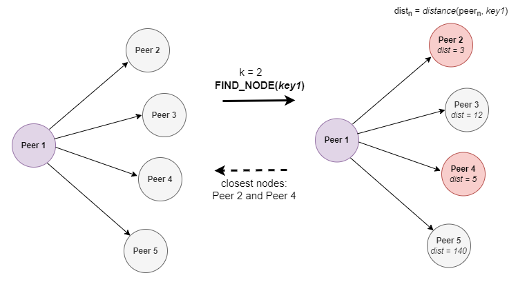

## Introduction

The Kademlia Distributed Hash Table is used in libp2p to provide _peer discovery_ and _content routing_.
In simple terms, a hash table is a set of records in which every record holds a `key -> value` mapping.
In a distributed hash table, the **records are spread across the network**, which means that every node holds a subset of records.

When searching for a specific record, we do not have a centralized registry; therefore, we must ask peers in the network until the record is found. This search is not random however, but guided by the DHT distance metric.

## The Distance Metric

The main operation provided by a hash table is retrieving a value by its key. In order to decide who stores which keys, keys are hashed and compared against PeerIDs (which are already hashes), which allows the DHT to compute a _distance_ metric. The **distance metric represents the distance between two IDs**; therefore, it is a _logical distance_, not a _physical distance_. The DHT distance allows peers to classify how "close" a key is and accepting to store only **keys that are _close_ to them**. Thus, storing something on the DHT involves finding a node in it that is close enough to the key.

The closeness of a key to a peer is computed by a _distance function_ (i.e. `distance(key_id, peer_id)`), which applies an XOR operation to the IDs. The XOR result is converted into an integer to _quantify_ the distance between the IDs. For example, `distance(key1, peer9) = 4` means that the distance between the `peer9` peer and the `key1` key is `4`.

The mathematical explanation about the distance function is not trivial, and it is beyond the outcomes of this lecture; however, you can find more information on the topic [here](https://en.wikipedia.org/wiki/Kademlia#Academic_significance).

## The Routing Table

The distance metrics can be calculated not only between keys and peer IDs, but also between peer IDs themselves. In order to facilitate the discovery of peers in the network (i.e. be able to answer `FIND_NODES` operation), a peer keeps a list of peers divided into buckets depending on the distance to them. Buckets for close distances are bigger.
Thus, a node may not be storing certain key, but it is usually able to provide a list of known nodes that are closer to the key than itself, thus helping in the lookup for the closest nodes.

The internals of the routing table are beyond the outcomes of this lecture, but you can read more on the topic [here](https://en.wikipedia.org/wiki/Kademlia#Fixed-size_routing_tables). You can also take a look at the [Go implementation](https://github.com/libp2p/go-libp2p-kbucket/blob/f0be035294ac4f5e939af13ddc1dd24273b7d881/table.go#L25) of the routing table.

## DHT Operations

The libp2p DHT is based on the Kademlia DHT, so it incorporates most of its core concepts with some extra functionalities. Nodes communicate using libp2p streams. The operations provided by the protocol are:

- `FIND_NODE`: given a key, find the closest nodes to the key.
- `PUT_VALUE`: add a `key -> value` mapping to the DHT.
- `GET_VALUE`: given a key, find the corresponding value.
- `ADD_PROVIDERS`: advertising in the network that a peer is providing a given key.
- `GET_PROVIDERS`: finding out what peers provide the value for the given key.

### Find the Closest Nodes

The `FIND_NODE` operation returns the _k_ closest nodes of a peer to a given key.

The close nodes of a peer are kept in the routing table. To find the _closest_ nodes of a peer to a specific key, we first compute the distance of every close node to the key (i.e., `distance(close_peer, key)`). Then, we take the nodes with the lowest distance.

Because a peer might have many close nodes, a parameter, `k`, is used to limit the number of nodes that we should consider. For example, if `k = 4`, we should only consider the four nodes with the lowest distance to the key. To understand it better, consider the following diagram:

1. `Peer 1` has four _close_ peers, which are stored in its routing table.
2. The `FIND_NODE(key1)` operation returns the _k_ closest nodes to the `key1` key.
The distance between every close peer and the key is computed (i.e. `distance(close_peer, key1)`). Then, the _k_ nodes with the lowest distance are selected (in the example, `k = 2`).

### Value Storage

To store a value, a mapping of the form `key -> value` is created in the DHT. For every key, an ID is generated by using the same format as peer IDs. Remember that having an ID for every key in the same format as peer IDs means that we can calculate _distances_ between key IDs and peer IDs.

When storing a value, we get the _k_ closest nodes of a peer to a specific key (i.e. `FIND_NODE(key)`) until we find a node that does not have closer nodes to key than itself. To get a better understanding, consider that we want to store a `key` key in following network diagram:

1. `Peer 1` wants to store a new key; therefore, it finds the _k_ closest nodes to the key (in this example, `k = 2`). `Peer 2` and `Peer 3` are selected.
2. `Peer 2` finds its _k_ closest nodes to the key.
Because it does not have a node that is closer to the key than itself, it stores the key.
3. `Peer 3` finds its _k_ closest nodes too: `Peer 6` and `Peer 7` are selected.
4. `Peer 6` and `Peer 7` do not have nodes closer to the key than themselves; therefore, they store the key.

Because the record is stored in the closest peers, there will be **several nodes storing the same record**, which can lead to inconsistencies at some point. Validation strategies are required. You can read about validation in the [official specifications](https://github.com/libp2p/specs/tree/master/kad-dht#entry-validation).

Although both peers and keys share the same ID format, peer IDs are not part of the keys. Instead, a peer, with a given peer ID, holds a set of keys.

### Value Retrieval

To find a value for a given key, we iteratively find the _k_ closest nodes of a peer. Consider the following network diagram:

Every peer has a parameter, _dist_, which represents the distance from the peer to the target key (`key1`). For example, `Peer 5` with `dist = 10` means that `distance(peer5, key1) = 5`.
The arrows represent the close nodes of every peer.
For simplicity, only one node (`Peer 10`) contains the key.

Consider the following diagram, where we select the _k_ closest node on every iteration (`k = 2`).

You are in `Peer 1`, and you want to find `key1`. The traversal of nodes will be:
1. `Peer 1` has three close nodes. The `FIND_NODE(key1)` operation selects `Peer 2` and `Peer 3` as the closest nodes because they have the lowest distance to the key.
2. From `Peer 1`, a `FINDE_NODE(key1)` request is sent to the close nodes of `Peer 2` and `Peer 3` (i.e. `Peer 5`, `Peer 6`, `Peer 7`, `Peer 8`).
The nodes with the lowest distance to the key are selected: `Peer 6` and `Peer 7`.
3. From `Peer 1`, a `FIND_NODE(key1)` request is sent to `Peer 9` and `Peer 10`.
`Peer 10` holds the key, so the value is returned.

Note that the previous example is just a very **high-level** explanation of the algorithm. For a deeper look, refer to the [specification](https://github.com/libp2p/specs/tree/master/kad-dht#value-retrieval). For example, a validation strategy is needed because several peers might return different values for the same key.

In storage systems (e.g., IPFS), a DHT key might represent a specific file's CID. Therefore, searching for a particular key means finding what peers hold a specific file.

### Advertising Content

Although you can use the `GET_VALUE` operation to retrieve a specific key, the DHT also provides the `GET_PROVIDERS` and `ADD_PROVIDER` operations to advertise content. While the `GET_VALUE` operation takes the bytes of a key as a parameter, `GET_PROVIDERS` takes a CID string. In other words, `GET_PROVIDERS` is specific to IPFS, while `GET_VALUE` is a generic operation from the Kademlia specification.

`ADD_PROVIDER` creates a _provider record_ announcing to the network that a node is providing a specific CID. By default, the record expires after 24 hours. `GET_PROVIDERS` returns the peers storing the CID (i.e., the key).

There is a [proposal](https://github.com/libp2p/go-libp2p-kad-dht/issues/584) to remove the specific `ADD_PROVIDER` and `GET_PROVIDERS` operations.

## Expand Your Knowledge

The DHT is a complex topic that involves understanding several concepts. The following video provides more information.



If you want to get more information, refer to the following links:

- libp2p DHT Go Implementation ([GitHub](https://github.com/libp2p/go-libp2p-kad-dht/blob/4371650e37662cdfd9f5777240c67b861af26092/dht.go#L78))
- libp2p DHT Specification ([GitHub](https://github.com/libp2p/specs/blob/master/kad-dht/README.md))
