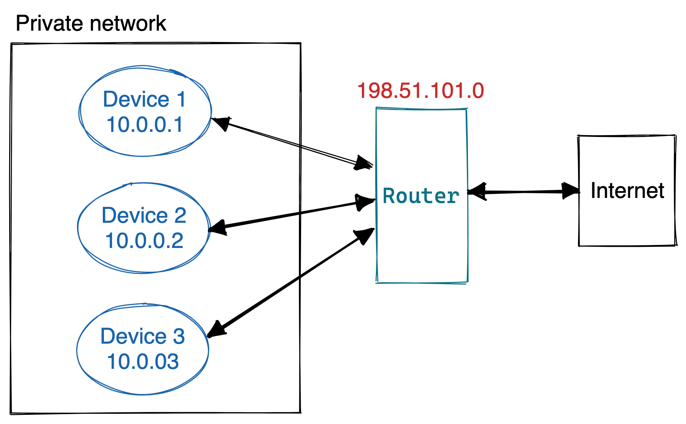
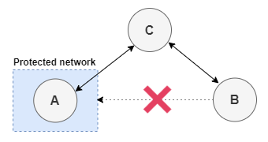

Consider the Internet router that you have at home. You probably have several devices connected to it (laptops, mobile phones, or even the fridge).
When you join the Internet, you are given an address identifier, called an _IP Address_.
However, the number of IPs in the Internet is limited, so every device does not get a public IP address.
Instead, your router creates a private network in your home and assigns a private IP to every device. Then, the router is responsible for managing the incoming and outgoing connections from the Internet.
This is called **NAT (Network Address Traversal)**. For example, consider the following diagram:



The router is connected to the Internet, and is assigned a public IP address. Three devices are connected to the router, which manages the incoming and outgoing data.

Although this is a great way of avoiding the waste of IP address, it brings a problem, especially in peer to peer networks.
The only public part of our network is the router, so what happens if a computer from the Internet wants to connect to a specific device in our private network?
libp2p offers several NAT traversal methods to avoid this issue, such as **[hole-punching](https://docs.libp2p.io/concepts/nat/hole-punching/) or [circuit relays](https://docs.libp2p.io/concepts/nat/circuit-relay/)**.

## Circuit Relay

In some cases, peers might not be publicly reachable. For example, consider that peer `A` wants to connect to `B`, but peer `B` is behind a firewall that does not allow incoming connections.

To solve this issue, libp2p provides a protocol called [Circuit Relay v2](https://github.com/libp2p/specs/blob/master/relay/circuit-v2.md). When a peer is not reachable by other peers, another machine can relay messages for that peer. Consider the following diagram:



1. `A` is not reachable, so it asks `C` to listen on its behalf.
2. `B` establishes a connection to `C` in an attempt to communicate with `A`.
3. `C` relays messages from `B` to `A`.

Note that `A` starts the connection to `C` because `A` is not publicly accessible.

### Multiaddresses

When sending messages over a circuit relay, we must know how to reach the _relay machine_ (i.e., the machine that is acting as a bridge). In the previous example, `B` has to find out how to reach `C`.

[Multiaddresses](https://github.com/multiformats/multiaddr) identify circuit relays by using the IDs of the peers involved. The following is a sample circuit relay multiaddress.

```
/ip4/127.0.0.1/tcp/2330/p2p/PEER_ID_OF_C/p2p-circuit/p2p/PEER_ID_OF_A
```

You can read the previous address like: "Make a connection to `127.0.0.1` at TCP port `2330`, which is the address of the peer `C`. Then, perform a circuit relay to peer `A`".

You can get more information about circuit relays in the [libp2p documentation](https://docs.libp2p.io/concepts/circuit-relay/) and the [Circuit Relay v2 specs](https://github.com/libp2p/specs/blob/master/relay/circuit-v2.md).

## Hole Punching

[Hole Punching](https://blog.ipfs.io/2022-01-20-libp2p-hole-punching/) is a problem that arises when you are working with p2p connections and you encounter issues with dialing non-public computers. [Read more in the blog](https://blog.ipfs.io/2022-01-20-libp2p-hole-punching/)

Hole Punching is the process of establishing direct connections between two libp2p nodes if one or both are behind firewalls and/or NATs (Network Address Translations).

<!-- Hole punching blog http://bafybeigd25fcawofxm2jkjvnnk4z45d3ikolysdv7q4rzqlx2t5oj5v4ra.ipfs.localhost:8080/2022-01-20-libp2p-hole-punching/ -->

This includes two types of hosts: publicly reachable and non-publicly reachable hosts. Addresses of the former type can be directly dialed on the public internet. Addresses of the latter type can only be dialed through a relay protocol, or through some means of hole punching. The document refers to publicly reachable hosts as public and non-publicly reachable hosts as private.

**See the entirety of the [hole punching documentation](https://github.com/libp2p/specs/blob/master/connections/hole-punching.md)**

#### Project Flare

_See_ [_the full proposal here_](https://github.com/protocol/web3-dev-team/pull/21/files#diff-b137dc3a933796d3ce264eeb6a31386d72a7a1c925c01e62c3ab026f46c417c2)

Given the pervasiveness of IPv4 peers that are behind NATs on the internet, NAT traversal is an essential requirement for a peer to peer application. The inability to traverse NATs means that such NATT’d peers are NOT reachable on the network and are thus unable to provide any meaningful service to the network. Nor can they interact with network participants under protocol patterns that require inbound connections (e.g. dialbacks).

libp2p currently executes NAT traversal using[ Circuit Relays](https://docs.libp2p.io/concepts/circuit-relay/) wherein publicly dialable Relay servers relay the entirety of user traffic to peers that are NATT’d. This approach does NOT scale because:

1. It costs bandwidth on the Relay server.
2. There is NO real incentive to be a Relay server.
3. Introduces communication latency between the two peers that are interfacing via the Relay server.

A more scalable approach to NAT traversal is to enable direct communication between the peers via a technique called [Hole Punching](https://en.wikipedia.org/wiki/Hole_punching_(networking)). Hole punching removes the need to relay _all_ traffic between two peers via a Relay server.

### Issues & Project Tracking

* [NAT traversal tracking issue](https://github.com/libp2p/specs/issues/312#issuecomment-880762775)
