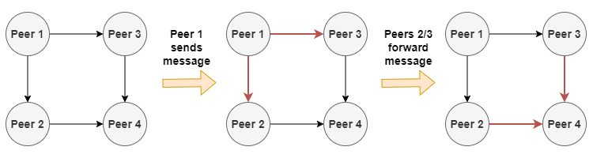

A PubSub (Publish/Subscribe) system allows peers to only receive messages of a specific type. A _publisher_ sends messages of a specific type to _subscribers_ of that type. For example, consider a chat application with a chat group called `music`. Users interested subscribe to the group; when someone sends a message to the group, only those subscribed receive the message.

In libp2p, peers subscribe and send messages to _topics_. The concept is pretty similar to messaging systems (e.g., Kafka), but libp2p allows this behavior in a decentralized way. The main implementations of the protocol are Floodsub and Gossipsub.

## FloodSub

In Floodsub, the first implementation of the pub/sub protocol, messages are delivered to all the connected nodes of a peer. For example, consider the following diagram.

1. `Peer 1` is connected to `Peer 2` and `Peer 3`; `Peer 2` and `Peer 3` are connected to `Peer 4`.
2. `Peer 1` publishes a message, which is sent to `Peer 2` and `Peer 3`.
3. Both `Peer 2` and `Peer 3` forward the message to `Peer 4`.

FloodSub is simple, reliable, and highly resistant to malicious actors and censors, but the main problem of FloodSub is that it duplicates messages, thus using a lot of bandwidth. In the previous example, `Peer 4` receives the message twice.

[Gossipsub](https://arxiv.org/pdf/2007.02754.pdf), the protocol developed after FloodSub, tries to reduce the number of duplicate messages (i.e., bandwidth) by taking a different approach. Gossipsub is covered later in the Launchpad curriculum.

## Gossipsub

The main goal of Gossipsub is to reduce the bandwidth used in delivering messages.
In the Gossipsub, peers can connect by setting up a _full-message connection_ or a _metadata-only connection_.
Full-message peers exchange all the information about the message; metadata-only peers exchange only data identifying the message, but not the full message itself.

With this approach, Gossipsub tries to reduce the number duplicates that a peer receives.
When a _metadata-only_ peer receives information (remember, not the full message) about a message that would like to fully receive, the connection type is changed.

**Grafting:** a _medata-only_ peer converts to a _full-message_ peer. This happens when a peer is interested in receiving full messages from a peer (mainly because the peer holds messages that are relevant).
**Pruning:** a _full-message_ peer converts to a _medata-only_ peer. This happens when a peer is receiving too many full messages that are not relevant.

The number of _full-message_ peers that a node is connected to, depends on a parameter, _network peering degree_, `D`, which is customizable.

You can get more information about PubSub in the [libp2p documentation](https://docs.libp2p.io/concepts/publish-subscribe/) and the in the following videos, which extensively cover the Gossipsub protocol.

## Tutorial: Publish Subscribe (Pubsub) with IPFS & libp2p
In this tutorial video, you will see how you can use the publish-subscribe functionality (using the libp2p Gossipsub routing algorithm) with an IPFS node.  Follow along to start an IPFS node with pubsub enabled, and send and receive messages.



**Resources:**
* [Blog with Pubsub instructions](https://bitly.protocol.ai/pubsub-blog)
* [Other Pubsub Options](https://bitly.protocol.ai/pusub-flags)
* [libp2p Docs – Publish/Subscribe](https://docs.libp2p.io/concepts/publish-subscribe/)

## Expand Your Knowledge

#### Demystifying libp2p Gossipsub | Ethereum Foundation - Raúl Kripalani



#### Gossipsub 1.1 | David Dias

A scalable, extensible & hardened P2P PubSub Router protocol | Ready Layer One - David Dias


