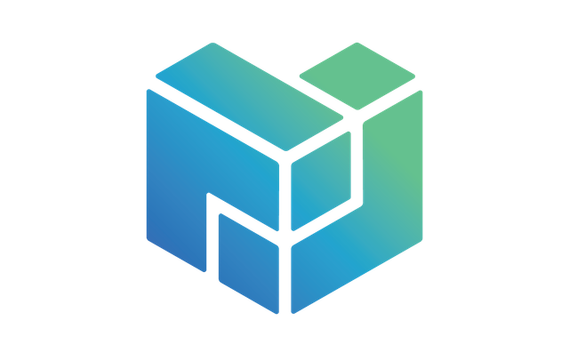

This section of the curriculum is focused on who and what Protocol Labs is, how it operates, how the culture is defined, and the different pieces that make up the Protocol Labs Network.

Here you will find resources to learn about the goals, mission, and philosophies that unite us across the organization. You will find the directories of the many teams within the organization and how they contribute to the web3 ecosystem.

### Protocol Labs Vision & Mission

*Protocol Labs drives breakthroughs in computing to push humanity forward.*

**How?**

* Generating ideas to ideations to super-power **pipelines**.
* A **network** that is capable of repeated iterations and innovations.
* World-class **teams** & **networks** from all over the world and different sectors of working professionals.
* Asynchronous and decentralized work **enables** teams to be effective and collaborative across the network.
* Tremendous opportunities to create, support, and grow **projects & protocols**.
* **Open source** everything.

### After completing this section, you will also

## Understand

* The culture of Protocol Labs and how its mission and goals brought about IPFS, libp2p, Filecoin, etc., have evolved and continue to evolve.
* The projects, tools, and resources are being created in the Protocol Labs Network ecosystem.

## Be Able To

* Find where communication about different open source projects is carried out and how to collaborate with those teams.
* Communicate the core goals of Protocol Labs as a whole and the projects' goals in the process.
* Demonstrate the use of asynchronous and open-source communication of Protocol Labs.
* Understand how to share the outputs of your work, documentation, and progress with other members of Protocol Labs.

## Links

**IPFS** | [Docs](https://docs.ipfs.io) | [GitHub](https://github.com/ipfs) - **IPLD** | [Docs](https://ipld.io/docs/) | [GitHub](https://github.com/ipld) - **libp2p** | [Docs](https://docs.libp2p.io) | [GitHub](https://github.com/libp2p) - **Filecoin** | [Docs](https://docs.filecoin.io) | [GitHub](https://github.com/filecoin-project)
