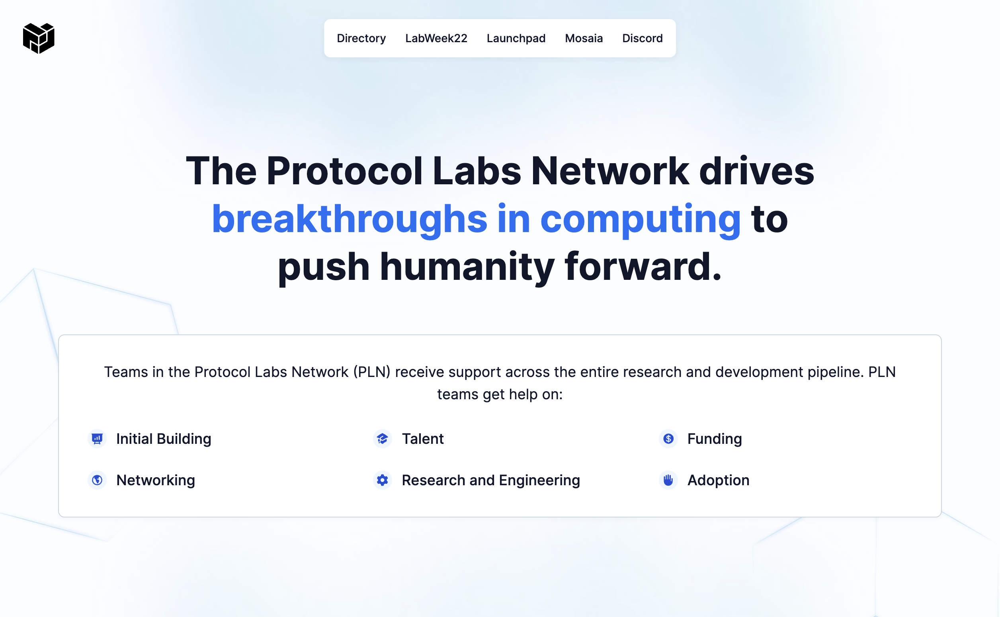
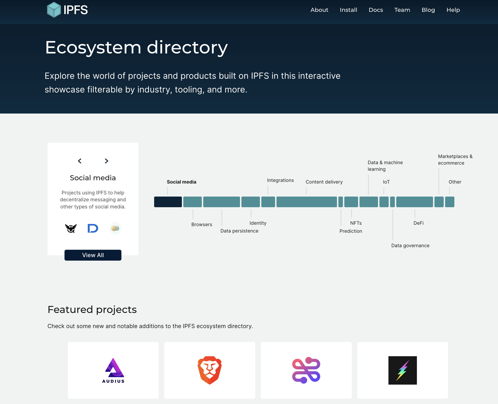

Protocol Labs is a constantly evolving network is made up of 450+ projects, companies, and organizations. Understanding the landscape of organization, projects, and teams can be complex, and this section presents tools that can help you understand and navigate these systems and organizations.

### Protocol Labs Portal
This portal is the central point of reference for all the resources available to PLN members. This portal includes information about Network Services from Mosaia, the network directory, communication channesl as well.

**[Protocol Labs Portal](https://www.plnetwork.io/)**

### Directories and Key Resources

* [Spaceport](https://coda.io/d/Protocol-Labs-Spaceport_dDpJBnYeqJb/What-is-Spaceport_suSQ9#_luhKz) is a network-wide directory and guide for those navigating the Protocol Labs web3 space with many links to resources for PL Network members, including:
* The [PLN Member Directory](https://www.plnetwork.io/directory/teams) is a listing of all the companies, projects, and teams in the wider PLN
* The [PLN Code of Conduct](https://protocol.almanac.io/docs/pln-code-of-conduct-ymBUYyonmhfvizGu6yOpXH1qkuWYce96) outlines the expectations and code of conduct for all members of our network
* The [Glossary](https://protocol.almanac.io/docs/glossary-ycx3uRbXUM3d7uf1EBz89msUmb1UjzR7) provides a comprehensive list of terms to help you navigate web3

### Protocol Labs Ecosystem Directories
To explore the various projects and tools building in the IPFS & Filecoin ecosystems, use the explorable ecosystem directories:
* IPFS Ecosystem Explorer [https://ecosystem.ipfs.io/](https://ecosystem.ipfs.io)
* Filecoin Ecosystem Explorer [https://ecosystem.filecoin.io/](https://ecosystem.filecoin.io)

Use the filters on the ecosystem directory page to explore projects by what they do, the industry, and which tooling (such as IPFS, Filecoin, kubo) to better understand what makes up the ecosystem.

## Network Tooling
In order to support the growth of the projects and tooling build on and around Protocol Labs, there are various organizations that play different supporting roles.
- Builders Funnel
- Talent Funnel
- Network Member Services

