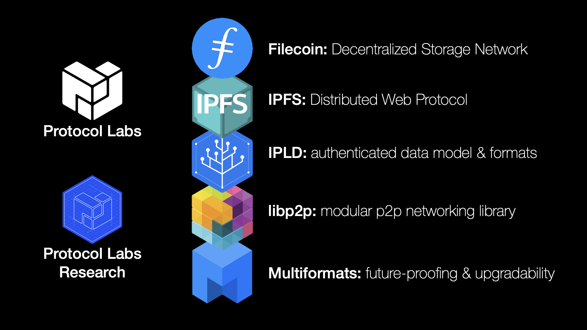
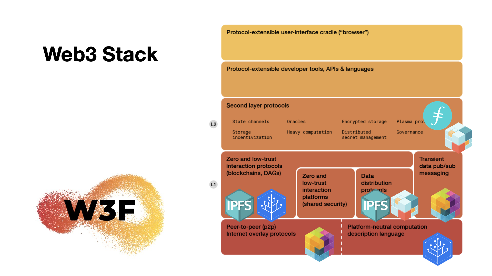

Protocol Labs exists to enable a network of projects, tools, startups, research, communities (and more) that are springing up and evolving around the protocols being developed. As this ecosystem grows, these projects invest in the network itself, and the network grows along with it, which in turn benefits and incentivizes this ongoing evolution.

## The Protocol Labs OSS Projects

### IPFS, IPLD, libp2p, and Filecoin

The four main projects we will be focusing on in this curriculum are IPFS, IPLD, Libp2p, and Filecoin. Most of the information and interaction can be found on docs and GitHub organizations:

* **IPFS** | [Docs](https://docs.ipfs.io) | [GitHub](https://github.com/ipfs)

* **IPLD** | [Docs](https://ipld.io/docs/) | [GitHub](https://github.com/ipld)

* **Libp2p** | [Docs](https://docs.libp2p.io) | [GitHub](https://github.com/libp2p)

* **Filecoin** | [Docs](https://docs.filecoin.io) | [GitHub](https://github.com/filecoin-project)

Note that these are not the only projects in the core Protocol Labs stack, and there are many more, such as [Multiformats](https://multiformats.io/), [Drand](https://drand.love/), [Bacalhau](https://github.com/filecoin-project/bacalhau), and more that are continually being added and updated to contribute to the PLN.

#### The Project Stack

## Protocol Labs
_Teams, Network Services, and Working Groups_

Protocol Labs at its core consists of an organization (also referred to as Starfleet) that supports open source projects, as well as the network of organizations that builds upon and expands the capabilities of the core technologies.

### Protocol Labs Teams

There are several core organization that make up the nucleus of the Protocol Labs organization. [EngRes](https://www.notion.so/pl-strflt/PL-EngRes-Public-b5086aea86ed4f81bc7d0721c6935e1e) has a constantly shifting portfolio of projects and efforts, which are arranged into working groups.

There is also the Talent Funnel which includes recruiting, people ops, and Launchpad, as well as the Ecosystem which has a wide variety of organizations and efforts that expand the reach of Protocol Labs. [Network Services](https://airtable.com/shrMaFq3hWY4KZnka/tbliESOTOmIM1l0rt) sources and provides resources and high-quality services such as design, website development, security, financial, legal, and much more for the different organizations across Protocol Labs.

**Working Groups (WGs)**
Working groups are cross-team projects that each have a captain, responsible for driving forward and organizing the work in the projects, including writing specs, plans, and guides the project & its members, as well as publishing progress and OKRs.
- Ecosystem WG
- PL EngRes WG

**Network Tooling**
In order to support the growth of the projects and tooling build on and around Protocol Labs, there are various organizations that play different supporting roles.
- Builders Funnel
- Talent Funnel
- Network Member Services

## The Protocol Labs Network

The PL Network is made up of 300+ projects, companies, and organizations. You can explore a number of those organizations, and the people that work on them, in the WIP [PL Network Directory](https://www.plnetwork.io/).

The [PL Spaceport](https://protocol.almanac.io/docs/protocol-labs-spaceport-sFKNLxQKYdQOZfLTL4kL9uVha4TdGlYh) has many links to resources for PL Network members, including:

* [PLN Member Directory](https://protocol.almanac.io/docs/pln-member-directory-84TYCGFm9s07JuPfNqpvCXWDLgK1EAhU)
  * [Teams & Labbers](https://airtable.com/shrjVQx04qtYUwvgZ/tblpTKZo66tbYIxH4)
* [PLN Code of Conduct](https://protocol.almanac.io/docs/pln-code-of-conduct-ymBUYyonmhfvizGu6yOpXH1qkuWYce96)
* [Glossary](https://protocol.almanac.io/docs/glossary-ycx3uRbXUM3d7uf1EBz89msUmb1UjzR7)

To explore the various projects and tools building in the IPFS & Filecoin ecosystems, use the explorable ecosystem directories at [https://ecosystem.ipfs.io/](https://ecosystem.ipfs.io) & [https://ecosystem.filecoin.io/](https://ecosystem.filecoin.io)

## Built and Building On

You can see projects and tools that have been developed to make creating in web3 with Protocol Labs projects easier under [Protocol Labs Toolkits and SDKs](https://protocol-labs.gitbook.io/launchpad-curriculum/other-resources/protocol-labs-toolkits-sdks)

Learn about the cool projects, apps, and tooling that is being built using the Protocol Labs technologies in the [Built on IPFS and Filecoin section](https://protocol-labs.gitbook.io/launchpad-curriculum/other-resources/built-on-ipfs-filecoin).

### Working Groups, Teams, and Organizations

There are a number of Working Groups within the Protocol Labs Network that organize the work of multiple teams and align them with a central vision/mission. A Working Group (WG) like Ecosystem WG or EngRes WG is made up of multiple teams, which focus each on a specific topic (hackathons, IPFS<>Filecoin interoperations, etc) within the wider WG mission.

In some cases, those WGs might span multiple organizations, or companies. For example Ecosystem WG spans the Filecoin Foundation, the PL Outercore team, the PL Starfleet team, and a number of other companies. We often use "organization" and "team" interchangably when we mean "top level team of teams".

Teams are the reporting organization structure established by Protocol Labs. Though they establish Labbers' general focus of work, the nature of PL's collborative organization means that Labbers may end up working with many individuals outside their team, and often with those outside of Protocol Labs itself.