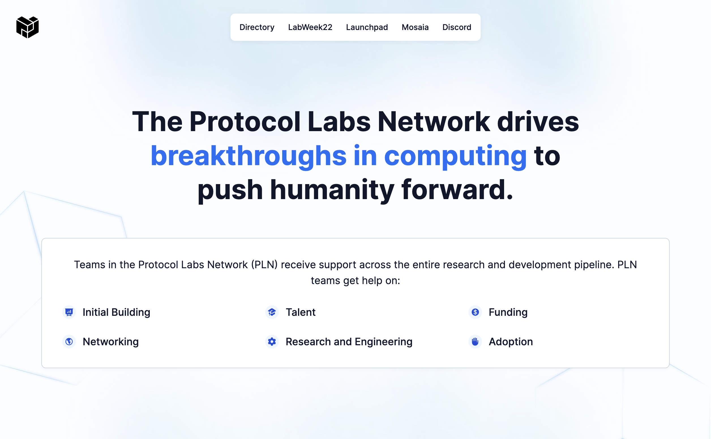
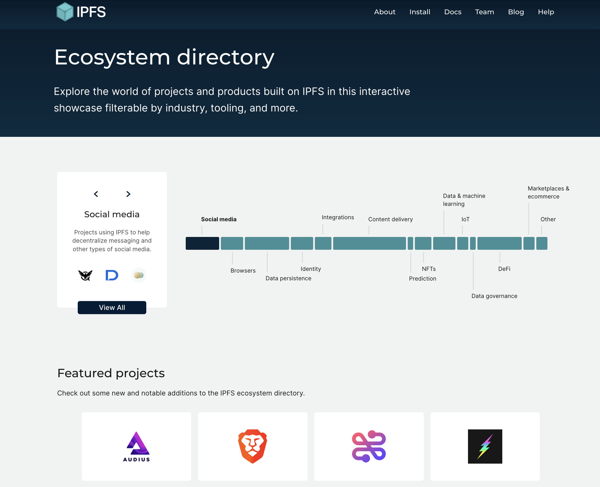

Protocol Labs is a constantly evolving network is made up of 450+ projects, companies, and organizations. Understanding the landscape of organization, projects, and teams can be complex, and this section presents tools that can help you understand and navigate these systems and organizations.

### Protocol Labs Portal
This portal is the central point of reference for all the resources available to PLN members. This portal includes information about Network Services from Mosaia, the network directory, communication channesl as well.

**[Protocol Labs Portal](https://www.plnetwork.io/)**

### Directories and Key Resources

* [Spaceport](https://coda.io/d/Protocol-Labs-Spaceport_dDpJBnYeqJb/What-is-Spaceport_suSQ9#_luhKz) is a network-wide directory and guide for those navigating the Protocol Labs web3 space with many links to resources for PL Network members, including:
* The [PLN Member Directory](https://www.plnetwork.io/directory/teams) is a listing of all the companies, projects, and teams in the wider PLN
* The [PLN Code of Conduct](https://protocol.almanac.io/docs/pln-code-of-conduct-ymBUYyonmhfvizGu6yOpXH1qkuWYce96) outlines the expectations and code of conduct for all members of our network
* The [Glossary](https://protocol.almanac.io/docs/glossary-ycx3uRbXUM3d7uf1EBz89msUmb1UjzR7) provides a comprehensive list of terms to help you navigate web3
* [Mosia](https://www.mosaia.io/) our very own web3 service provider marketplace where you kind find web3 native companies to service all of your business needs from tokenomics to marketing. 

### Protocol Labs Ecosystem Directories
To explore the various projects and tools building in the IPFS & Filecoin ecosystems, use the explorable ecosystem directories:
* IPFS Ecosystem Explorer [https://ecosystem.ipfs.io/](https://ecosystem.ipfs.io)
* Filecoin Ecosystem Explorer [https://ecosystem.filecoin.io/](https://ecosystem.filecoin.io)

Use the filters on the ecosystem directory page to explore projects by what they do, the industry, and which tooling (such as IPFS, Filecoin, kubo) to better understand what makes up the ecosystem.

## Protocol Labs Teams
_Teams, OSS Projects, Network Companies, and Working Groups_

There are several core organizations that make up the nucleus of the Protocol Labs organization. [EngRes](https://www.notion.so/pl-strflt/PL-EngRes-Public-b5086aea86ed4f81bc7d0721c6935e1e) has a constantly shifting portfolio of projects and efforts, which are arranged into working groups.

There is also the Talent Funnel which includes recruiting, people ops, and Launchpad, as well as the Ecosystem which has a wide variety of organizations and efforts that expand the reach of Protocol Labs. [Network Services](https://airtable.com/shrMaFq3hWY4KZnka/tbliESOTOmIM1l0rt) sources and provides resources and high-quality services such as design, website development, security, financial, legal, and much more for the different organizations across Protocol Labs.

**Working Groups (WGs)**
Working groups are cross-team projects that each have a captain, responsible for driving forward and organizing the work in the projects, including writing specs, plans, and guides the project & its members, as well as publishing progress and OKRs.
- Ecosystem WG
- PL EngRes WG

**Network Tooling**
In order to support the growth of the projects and tooling build on and around Protocol Labs, there are various organizations that play different supporting roles.
- Builders Funnel
- Talent Funnel
- Network Member Services

### Built and Building On

You can see projects and tools that have been developed to make creating in web3 with Protocol Labs projects easier under [Protocol Labs Toolkits and SDKs](https://protocol-labs.gitbook.io/launchpad-curriculum/other-resources/protocol-labs-toolkits-sdks)

Learn about the cool projects, apps, and tooling that is being built using the Protocol Labs technologies in the [Built on IPFS and Filecoin section](https://protocol-labs.gitbook.io/launchpad-curriculum/other-resources/built-on-ipfs-filecoin).

### Working Groups, Teams, and Organizations

There are a number of Working Groups within the Protocol Labs Network that organize the work of multiple teams and align them with a central vision/mission. A Working Group (WG) like Ecosystem WG or EngRes WG is made up of multiple teams, which focus each on a specific topic (hackathons, IPFS<>Filecoin interoperations, etc) within the wider WG mission.

In some cases, those WGs might span multiple organizations, or companies. For example Ecosystem WG spans the Filecoin Foundation, the PL Outercore team, the PL Starfleet team, and a number of other companies. We often use "organization" and "team" interchangeably when we mean "top level team of teams".

Teams are the reporting organization structure established by Protocol Labs. Though they establish Labbers' general focus of work, the nature of PL's collaborative organization means that Labbers may end up working with many individuals outside their team, and often with those outside of Protocol Labs itself.
