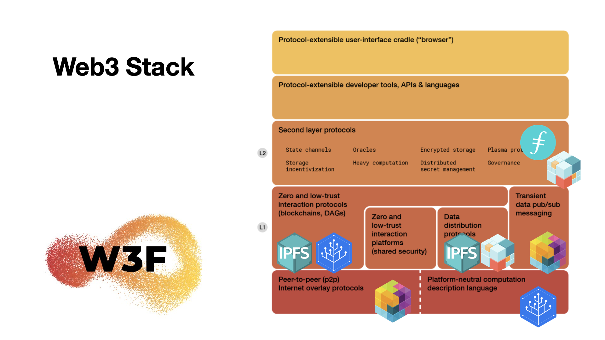

Protocol Labs enables a network of projects, tools, startups, research, communities (and more) that are springing up and evolving around new protocols and web3 technologies. As this ecosystem grows, these projects invest in the network itself, and the network grows along with it, which in turn benefits and incentivizes this ongoing evolution.

Protocol Labs is building the next generation of the internet. We are an open-source network that spans the research-to-development pipeline to create new protocols, tools, and services to improve the internet radically. Our products serve thousands of organizations and millions of people.

## **PLN History and Evolution**

Protocol Labs was founded in 2014 by Juan Benet, the inventor of IPFS and Filecoin. Protocol Labs released IPFS to the world in January 2015.

By 2016, IPFS became one of the most used and relied-on technologies in the Blockchain industry, hailed by the community as the “Future of the Web.” In addition, Protocol Labs also created libp2p, IPLD, multi formats, and many other projects.

By 2016, IPFS became one of the most used and relied-on technologies in the Blockchain industry, hailed by the community as the “Future of the Web.” Many other Open Source Software (OSS) libraries have emerged from this original project, such as libp2p and IPLD, in different languages and implementations. 

## **An Innovation Network**

We also believe in connecting and bringing people together to inspire innovation. That’s why we have yearly PL Network “Lab Weeks” to gather our community of “labbers” (contributors and members of PL Network teams) together and align on the following year’s opportunities and challenges.

A part of PL’s evolution is its ability to have smaller groups within, go through nucleation (think of it as an internal incubator) and become its team and company. Aligned with the philosophy of Bell Labs, PL is very much about supporting numerous groups with research.

#### PL Summit | October 2022

The Protocol Labs Summit was a great recap of the Impact that the PL Network created in 2022 and how the PL Network is structured today: as an Innovation Network that drives breakthroughs in computing to push humanity forward.



Check out the recording [starting at 2:35:58](https://youtu.be/b6tnt24cIIw?t=9358) for an overview of the core offerings that make up the PL Network as a product:

* Network
* Starting
* Capital
* Talent
* Knowledge
* Services

## **Protocol Labs Projects**

* [IPFS](https://ipfs.io/) is One of the original core OSS projects, from which other projects in Protocol Labs have grown and nucleated, creating a network of Open Source technologies, developer tooling, DApps, and more.
* [Filecoin](https://filecoin.io/) is the other original core organization that supports the builders and storage providers that use Protocol Labs & Filecoin technologies. Filecoin is a utility token (cryptocurrency) that supports and incentivizes the growth of our network of web3 technologies.
* [libp2p](https://libp2p.io/) is a set of modular tools for networking and peer-to-peer communications.
* [IPLD](https://ipld.io/) is the data model that is used for the content-addressable web.
* [Multiformats](https://multiformats.io/) is a project that makes it possible to create self-describing data, which allows protocols and projects to be interoperable and future-proof.
* [Testground](https://docs.testground.ai/) is a platform for testing, benchmarking, and simulating distributed and peer-to-peer systems at a scale that can scale from 2k-10k instances.
* [Drand](https://drand.love/) is a revolutionary public, distributed, verifiable randomness generator that can be used in protocols and cryptocurrencies that require public randomness.
* [Filecoin Virtual Machine (FVM)](https://filecoin.io/blog/posts/introducing-the-filecoin-virtual-machine/) is a layer 1 protocol that will enable developers to create and execute smart contracts on data stored in the Filecoin network.
* [Lotus](https://lotus.filecoin.io/) is the primary Filecoin network implementation, supported by Filecoin, written in Go & maintained by the PL team.

_In Protocol Labs, new projects and technologies are being invented every day. Remember that this may not be a comprehensive list of all important projects growing in our network._

#### The Project Stack

