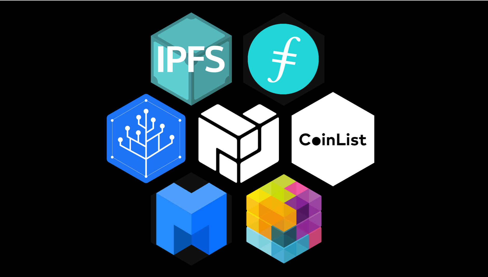
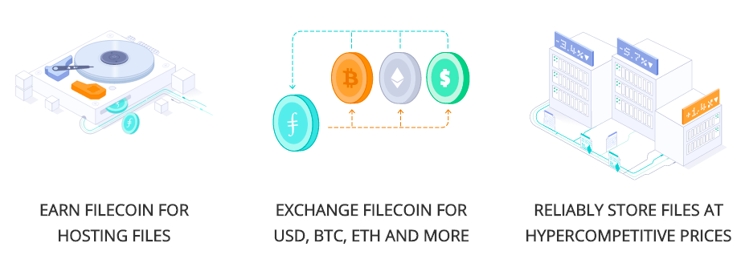

## The Future of Web3

At the end of 2022, Protocol Labs consists of 450+ companies and projects building in our network. As the web3 space accelerates, now is a great time for high-growth researchers & developers inside and outside web3 to ramp up their “InterPlanetary” knowledge and contribute to these cutting-edge technologies.

From core OSS contribution, to Radius grants distributed systems engineers, to network researchers, to community managers, to startup operators, there are a vast number of exciting opportunities across PLN teams and companies.

#### The next Internet Revolution | Juan Benet | TEDxSanFrancisco



_Learn about how important a distributed system like IPFS is in preserving documents, and how we are moving towards a web of the future. Every day hundreds of developers are putting together more of these pieces, and many applications have already been created leveraging this technology. Understand the possibilities that exist for a decentralized, free internet._

## Background, Work, & Business Model

_This is an_ [_annotated version of a blog_](https://protocol.ai/blog/protocol-labs-creating-new-networks/)

**The Protocol Labs Network** is community of teams, projects, and organizations focused on the research, development, and deployment of network protocols. We believe the internet is humanity’s most important technology. Our mission is to improve the internet and computing, generally. We are doing so by creating groundbreaking protocols, and speeding up the pipeline from ideas on paper to users’ hands.

### Our Background: The Challenges of Our Time

The advent of computing radically transformed humanity, and so has the flourishing of our global nervous system: the Internet. This still-nascent medium of communication, of digital existence, will connect us and empower us in ways we've only begun to understand. In just a few short decades we've acquired tremendous, almost magical superpowers: we can speak to half the planet, at any time and from almost anywhere; we can explore and search the most complete compendium of human knowledge in seconds; we can reason about and solve tremendously difficult problems; we can work, play, and be together at a distance; we can conjure systems of digital and mechanical agents to do our bidding; we can change the world, we can save lives, we can wield all the powers of our species, for good and bad, with a sequence of keystrokes.

Long term, universal computation will transform us more than language has, which is indeed saying something. But it is important to realize we will see radical changes in the short term too: computing and the internet will grant us even greater superpowers, as we fuse ever tighter with our technology.

The horizon of computing is exciting and turbulent. We face optimistic progress, significant challenges, and a host of existential threats. We navigate this complex landscape by grounding ourselves in two important goals. I will speak more about these in future communications. (For a longer treatment of this background, [see this talk](https://www.youtube.com/watch?v=jONZtXMu03w\&t=554s)

### Principles

* **We should improve the internet and computing generally.** Secure and robust access to information, to communication, and to computing has become a critical part of what it means to be a modern human. The internet has become the main vehicle for human interactions worldwide, and it will only become more so as our devices and interfaces improve. Brain-machine interfaces will cement this, and those are not so far away. Therefore, [**fixing problems with the internet**](https://www.youtube.com/watch?v=2RCwZDRwk48\&t=568s) and upgrading our computational fabric will have tremendous impact for humanity, now and in the future. This is the **Why**.

* **We should accelerate the ideas-to-superpowers pipeline**. At the heart of computing progress lies a simple process: the research, development, and deployment cycle. Ideas are conceived and refined, encoded into mathematical rules, programmed into software, and deployed into computers, which grants super-powers to humans world-wide. The better and faster we are at sifting ideas through this pipeline, the better and faster our superpowers will come. This is the **How**.

Breakthroughs from labs that are exclusively or mostly focused on research tend to stay buried as papers. Sometimes the lag is natural, the research is far ahead of its broad applicability. But we find that there are hundreds of breakthroughs useful long before they reach users. It can take many years, even decades, before breakthroughs are realized in products that improve people's lives. This is massively inefficient! Research has to be coupled closely with development and deployment, so that we can iterate through the cycle quickly, and build good products that actually solve problems for people.

### IPFS, Filecoin, and the Distributed Web

Even though we are young, we have already created a large ecosystem of interrelated projects and products. These have all spawned from the first, IPFS, and naturally have much to do with decentralized data distribution. Our approach is to carefully modularize projects so that they can serve as many people as possible. Once it is clear a sub-project should be independent, we spin it into its own effort. I will leave the descriptions here short, click through to find out more about each.

<!--
* [The InterPlanetary File System](https://ipfs.io) (IPFS) is a new protocol to decentralize the web. IPFS enables the creation of completely decentralized and distributed applications, using content addressing and digital signatures. IPFS makes the web faster, safer, and more open.
* [Filecoin](https://filecoin.io) is a cryptocurrency powered storage network. Miners earn Filecoin by providing open hard-drive space to the network, while users spend Filecoin to store their files encrypted in the decentralized network.
* [libp2p](https://libp2p.io) is a modular networking stack. libp2p brings together a variety of transports and peer-to-peer protocols, making it easy for developers to build large, robust p2p networks.
* [IPLD](https://ipld.io) is the data model for the Decentralized Web. It connects all data through cryptographic hashes, and makes it easy to traverse and link to.
* The [Multiformats Project](https://multiformats.io) is a collection of protocols to future-proof systems, today. Self-describing formats make your systems interoperable and upgradable.
* [CoinList](https://coinlist.co) is a protocol token fundraising platform. AngelList meets Kickstarter meets Protocol Tokens.
* [SAFT](https://coinlist.co/saft) is a legal framework for protocol token fundraising. -->

### A Network Built around Market Protocols

A cryptocurrency can address a portion of the value created by the protocol, and it can be allocated to fund protocol creators and maintainers.

This is an unprecedented way to capture a fraction of the value created and feed it back into development. The IPFS protocol benefits, its ecosystem, and the creation of more protocols. What's more, the value capture is coming at the protocol layer and not solely based on applications or services above. The attention and interests of the protocol developers remain aligned with successful outcomes for the protocol, and the projects building around it.

The cryptocurrency can be used to incentivize individuals, and other groups outside the original organization, to improve and work on the protocol. It can also be used to fund the entire development of the currency, by pre-selling it as Ethereum did in 2014.
<!--
The PL Network is funded by, and derives funding from, **Market Protocol assets**. A Market Protocol is a system that mediates some economic activity, and settles value exchanges using a cryptographic asset. This structure solves economic problems in asymmetric peer-to-peer resource sharing, scaling, services, maintenance, and development. In the case of the PL Network, a portion of that network-aligning asset is funneled back into [protocol public goods funding](https://fundingthecommons.io) to reward research, development, and product teams across the network. -->

#### Welcome to Web 3 | David Diaz | ResNetLab
_See the full set of resources [on the ResNetLab Tutorials page](https://research.protocol.ai/tutorials/resnetlab-on-tour)_

[_From ResNetLab On Tour_](https://research.protocol.ai/tutorials/resnetlab-on-tour/welcome-to-web-3/)



_Understand the basics of the Protocol Labs network & ecosystem, Web 3.0 blockchains, the semantic web, and the reasons that Protocol Labs is building the backbone for a distributed web. In this module, you’ll hear about issues facing Web 2.0 and motivation for Web 3.0, IPFS and its role in Web 3.0 with location addressing, and exciting projects in the IPFS ecosystem._

<!-- ## Optional Content -- this was moved to pre-reqs

#### Juan Benet Presents Building Web3 at Web3 Summit 2019



_In this video you can learn more about the ecosystem of gateways, pinning services, browsers solutions, messaging, client tools for IPFS, other IPFS projects, and more being build with the Protocol Labs architecture. In this talk, we look forward to the problems we will have to solve and how we can try to think ahead to truly make a better system._ -->
