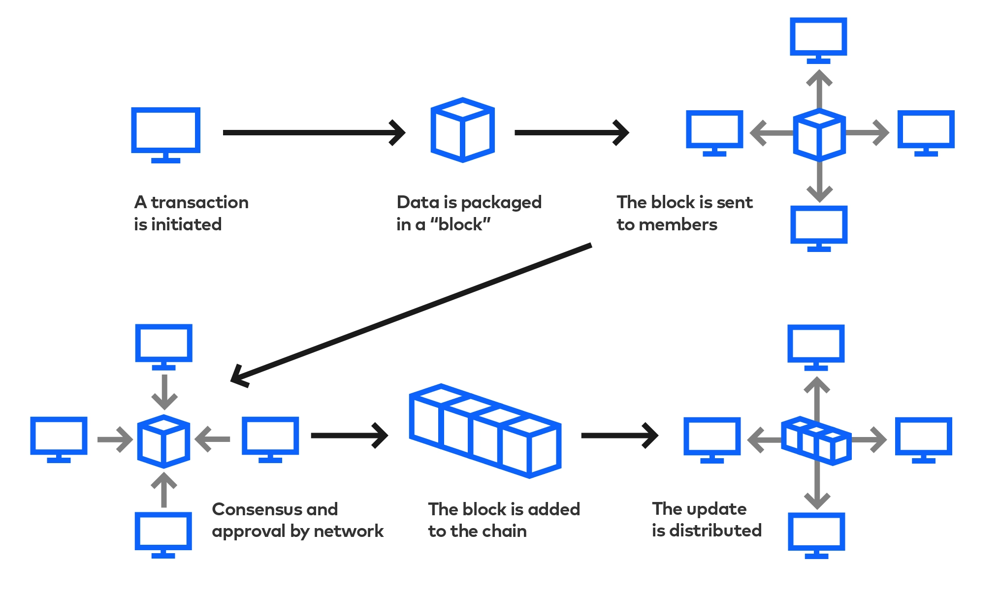
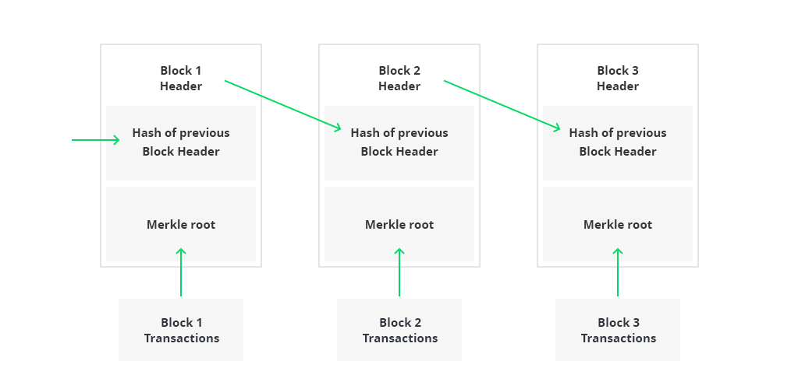

## Overview

Blockchain is a digital, immutable ledger that connects a decentralized network.
It is used to prove verification of an asset.

## How does a blockchain work?

Transactions that occur on the blockchain are rolled up and recorded as a block
of data. Each block is connected to the ones before and after it, forming a
chronological chain of data as an asset moves or ownership of an asset changes.
The blocks timestamp the transactions and link securely together to prevent any
block from being altered. Each additional block strengthens the verification of
the entire blockchain, making the blockchain immutable.

## Blockchain defined

- Immutable. A transaction can never be altered or erased once it happens. This
  allows you to see the complete history of an asset.
- Distributed: Transactions on the blockchain is stored by, and updates are
  broadcasted to, everyone.
- Decentralized: Communal consensus, rather than one party’s decision, dictates
  who gets to access or update the blockchain. Smart Contracts: Smart contracts
  are coded agreements. Once the predetermined conditions of the contract are
  met, the transaction is automatically completed and recorded on the
  blockchain, and the contract is immutable.

## Visualization

## Consensus

Decentralized control: Communal consensus, rather than one party’s decision,
dictates who gets to access or update the blockchain. A consensus algorithm is a
mechanism that allows users or machines to coordinate in a distributed setting.

Bitcoin uses Proof of Work (Ethereum used to use Proof of Work until Sept 2022):
Miners compete to solve cryptographic problems in order to earn the right to add
a new block onto the blockchain. The fastest miner adds the newest block to the
blockchain and is awarded with tokens. This practice requires immense processing
power, meant to discourage attackers.

Ethereum uses Proof of Stake: Users "stake" tokens to earn the right to become a
validator of the blockchain. Users are chosen to become validators
pseudo-randomly, depending on a set of factors (size of stake, age of stake).
Users that are chosen are responsible for checking if the transactions in the
block are valid, signing the block, and adding it to the blockchain. As a
reward, the user receives the transaction fees that are associated with the
transactions in the block. The stake works as a financial motivator for users
not to validate or create fraudulent transactions.

Solana (and Polkadot, ish) use Proof of History: Proof of History (PoH) aims to
lighten the load of the network nodes in processing blocks by providing a means
of encoding time itself into the blockchain. In a regular blockchain, reaching
consensus over the time a particular block was mined is as much a requirement as
reaching consensus over the existence of the transactions in that block.
Timestamping is critical because it tells the network (and any observer) that
transactions took place in a particular sequence.
