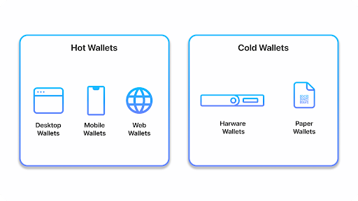
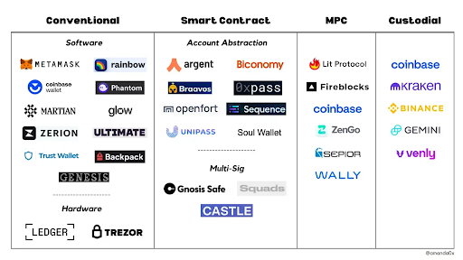

The fundamental difference between Ethereum and Bitcoin is their use cases. The
main purpose of Bitcoin is for peer-to-peer payments, whereas Ethereum aims to
be a distributed world computer.

Ethereum is a blockchain with a built-in Turing-complete programming language,
allowing anyone to write smart contracts and decentralized applications (dApps)
where they can create their own arbitrary rules for ownership, transaction
formats and state transition functions.

Ether (ETH) is the currency of the Ethereum network. Every time you send ETH or
use an Ethereum application, you pay a small ETH fee ("gas fee"). By requiring a
fee for every computation executed on the network, bad actors are prevented from
spamming the network. Currently, ETH is mined using the proof of stake consensus
mechanism.

Let’s use Uber as a real-world example. You can think of ETH as the fuel needed
to power the car (Ethereum) to make the trip (complete the transaction), and the
Uber driver is incentivized by the driver fee (gas fee) to make the trip.

## Wallets

Ethereum wallets are applications that let you interact with your Ethereum
account. Your wallet(s) allows you to do the following: manage not only your
funds, but also your collectibles (NFTs) and membership to DAOs. There are
several wallet providers designed to suit different needs.

## Wallet Types

Non-custodial wallet: allows users to hold and own their private key while
having full control of their funds.

Hardware Wallets: similar to a flash drive that is offline
([Ledger](https://www.ledger.com/), [Trezor](https://trezor.io/)) Web-Based
Wallets & Mobile Wallets: can be accessed from any device with a private key
login ([MetaMask](https://metamask.io/),
[WalletConnect](https://walletconnect.org/), [Coinbase
Wallet](https://wallet.coinbase.com/)).

Desktop Wallet: a software you download and execute locally on your computer
([Exodus](https://www.exodus.com/)) Custodial wallet: It’s very likely that the
first time you purchase crypto, it will end up in a custodial exchange crypto
wallet. In this case, the exchange is your custodian, which holds your keys and
is tasked with securely storing your funds
([Coinbase](https://www.coinbase.com/), [Binance](https://www.binance.com/en)).

## What can you do with a wallet?

Once you set up your Ethereum wallet, you can use decentralized applications
(DApps). dapps are decentralized apps that are built on a decentralized network
that combines a smart contract + a frontend user interface.

Key features of dapps:

- Open-source
- Public data and records
- Uses a cryptographic token to help keep the network secure

Common categories of dApps:

- Finance
- Art and collectibles
- Gaming
- Technology

