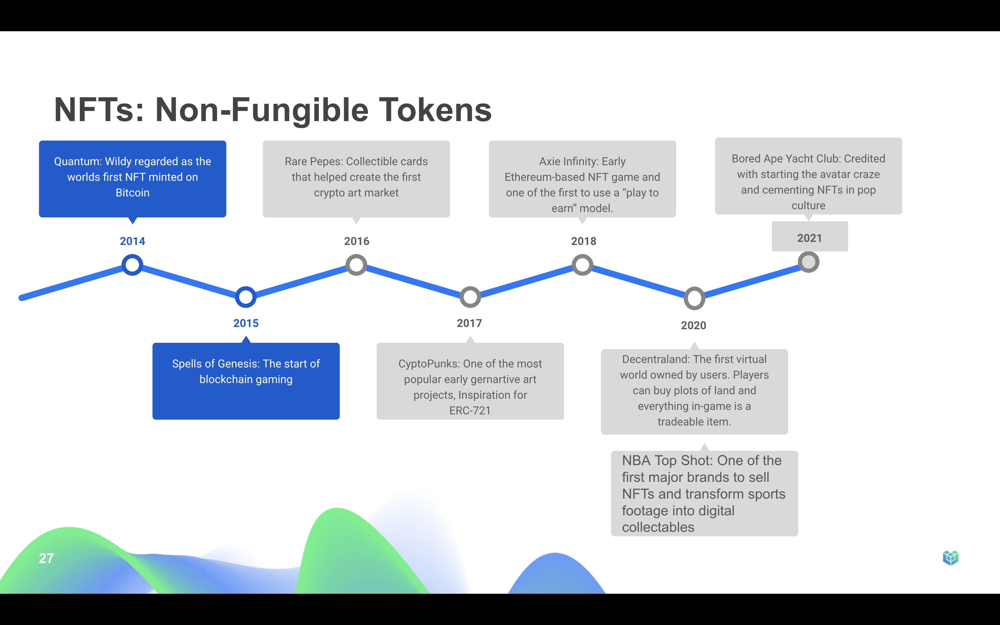
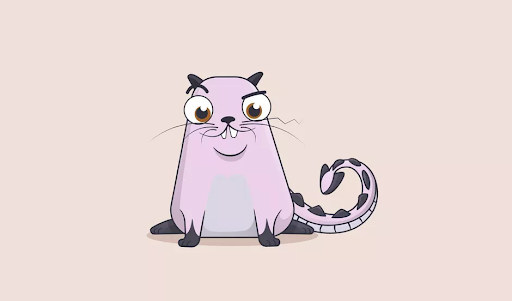
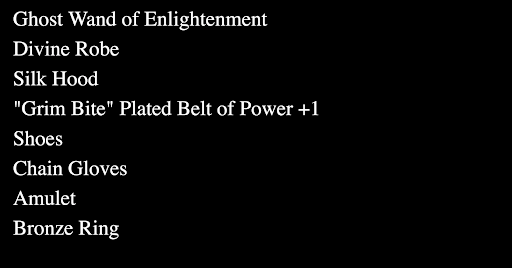
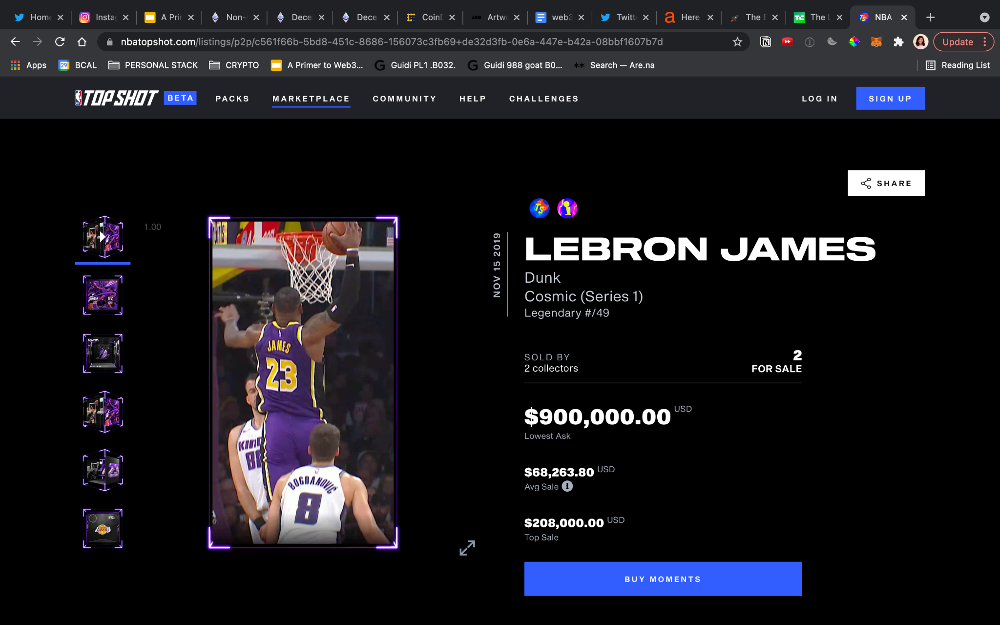
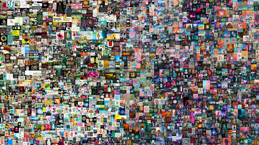
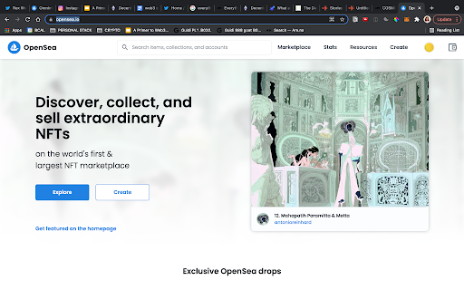
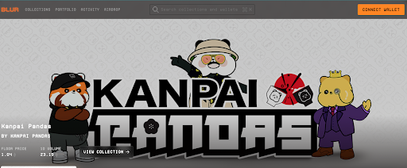

The best way to think of an NFT is a Digitally Owned Thing or a DOT (this was
the second choice for what to name NFTs)

NFT stands for non-fungible token, meaning unique and not interchangeable. They
can only have one official owner at a time and they're secured by the Ethereum
blockchain – no one can modify the record of ownership or copy/paste a new NFT
into existence. NFTs are tokens that we can use to represent ownership of unique
items––art, collectibles, real estate, etc. As everything becomes more digital,
NFTs replicate the properties of physical items like scarcity, uniqueness, and
proof of ownership.

The first NFT: minted in 2014, when bitcoin had a value of about $630, Kevin
McCoy created an animation, made entirely out of code, it was originally
published to Namecoin blockchain but has since been transferred to the ethereum
blockchain Fun Fact: the token url points to a json stored on IPFS check out how
that works in this [short
video](https://www.sothebys.com/en/buy/auction/2021/natively-digital-a-curated-nft-sale-2/quantum).

## ERCs

Most NFTs use something called
[ERC-721](https://ethereum.org/en/developers/docs/standards/tokens/erc-721/), An
ERC is an Ethereum Request for comment and it basically gives a standard set of
rules for creating tokens on Ethereum. he instructions in the ERC tokens outline
the sales, purchases, unit limits, and existence of tokens.

In 2017 CryptoKitties were the first NFTs minted using ERC-721.

## Use Cases

NFTs can represent both digital assets (GIFs, collectibles, music, videos, etc.)
and non-digital assets (legal documents, signature, invoice, deeds, etc.)
including all of the following:

Digital Content: NFTs enable content creators to own their work. When creators
sell their content, funds go directly to them. If the new owner then sells the
NFT, the original creator can even automatically receive royalties, baked into
and ensured by the metadata.

Gaming: NFTs can provide records of ownership for in-game items, fueling in-game
economies. In regular games you can buy items for in-game use. With NFTs, you
can recoup your money by selling game items as stand-alone products.

Domains: ENS domains are also NFTs, allowing a unique and easy way to remember
IP addresses.

Physical Items: NFTs could eventually act as deeds to physical items such as
your house or car. one day you could buy a car or home using ETH and receive the
deed as an NFT in return (in the same transaction).

Fractional Ownership: NFT creators can also create "shares" for their NFT,
allowing people to own a part of an NFT without having to buy the whole thing.
It's very likely that one day soon owning a fraction of an NFT will enter you
into a decentralized autonomous organization (DAO) for managing that asset.

## Notable NFT Projects

    

## NFT Market Places

 
