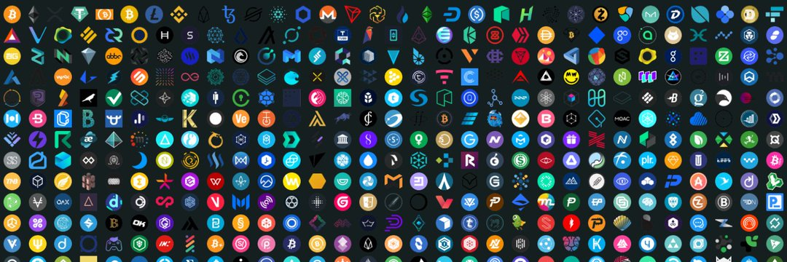

## Overview

The internet is a result of humanity's drive to develop more efficient ways of
communicating with each other. What started as a group of universities and
governmental agencies experimenting with digital communication, is now a
cambrian explosion of different use cases. The internet is many things. It's a
tool for sharing information; it's a marketplace for commerce; it's a bastion
for artistic and scientific exploration; and in some cases, a den of villainy.
Above all, it is has become an indelible part of the human experience.

The development of the internet can be loosely categorized into phases known as
Web1, Web2, and Web3. This course will breeze through Web1 and Web2, and take a
bit longer to stroll through some of the aspects of Web3.

As the internet has grown into this all-encompassing machine, we see it used as
a particularly effective tool for political manipulation and control. Web3 is an
attempt to push back against this to some extent; it is an attempt to increase
individual sovereignty in an environment of increasingly centralized control.

We call the direction of this movement: "decentralization"; where power is
transferred from centralized authorities back to narrower, more localized
authorities, ideally back to the individual users themselves.

Although a hopeful goal of some of its early creators, the internet has never
been very decentralized. Because it misses some important properties at the root
level, it has always been vulnerable to commercial and political exploitation.
Centralized providers (like certificate authorities, like ISPs, like social
media conglomerates) have stepped in to offer these, and thereby created a very
centralized internet.

## Web1

In the era of Web 1.0, most users were passive consumers of content. It was
about the ability to discover and read. Content was static (fixed, unchanging)
and fairly difficult to create. It spans roughly 1980s to early 2000s.

Here are a few characteristics found in Web1:

- Pages are static linked via hyperlinks and make heavy use of HTML elements
  like frames and tables
- Email is primary means of communication
- Server stores content in its filesystem
- Media features GIF buttons and graphics
- Limited search engine capability
- Infrastructure runs directly computers in small data centers.

Here is a delightful example of a still-existing Web1 webpage. It is clickable,
but static, only displaying information for reading consumption. There is no way
for users to contribute to the site.

Web1 -- [Space Jam Website](https://www.spacejam.com/1996/) 

## Web2

In the current era of Web 2.0, creating content gets a lot easier, and the
capabilities of websites enhances significantly. Average users create much of
the content, making the internet interactive and social. Blogging, photos, and
video production all become accessible and the social media scene explodes.
Dominant service providers emerge like Google and Meta. It spans from early
2000s until now.

Here are a few characteristics found in Web1:

- Pages uses javascript to make sites interactive
- Communication happens directly in web applications
- Back-ends provide APIs and stores dynamic content in databases
- Media is richly enhance through SVG, Canvas, WASM and other
  hardware-accelerated technologies
- Search engines and social media sites emerge as the dominant gateway to
  discovery and monetization
- Infrastructure is provided through virtualized cloud services

Web2 -- An example social media page 

## Web3

Web 3 refers to the invention and adoption of technologies which allow for the
decentralization of the internet. This started with the use of file sharing
protocols such as Bit torrent and anonymizers such as TOR, but has expanded into
whole self-governing and self-funding ecosystems such as Bitcoin and Ethereum.
It includes the use of peer-to-peer communications, decentralized compute and
storage, cryptocurrencies, and the concepts of sovereign identity, which are
still being worked out. The key innovation of these technologies is the creation
of networks that no single entity controls, anyone can join, and yet everyone
can still trust.

In order for a system to be truly decentralized, it must provide these
properties that are not subject to control by any one authority:

- Discovery: users must be simple to discover and connect with other users
  freely
- Authentication: users must be able to self-authenticate themselves and verify
  their communications
- Coordination: users must be able to communicate with each other and form
  groups
- Openness: must provide useful services with equal access to any user
- Stateful: must be able to retain information and configuration
- Privacy: must be capable of preserving the privacy of its users

In Web3, developers will no longer build and deploy applications that run on a
single server or that store their data in a single database (hosted and managed
by a single cloud service provider). Web3 applications, aka decentralized apps
(dApps), will run on decentralized networks of many peer-to-peer nodes, like
blockchains, using a different set of protocols, including crypto-economic
models like decentralized finance (DeFi) and governance through decentralized
autonomous organizations (DAOs).

There is not a good way to represent the look of web3, because it is mostly
about transforming the infrastructure to be more decentralized. It's not just
about cryptocurrencies either, but comprises any effort to provide internet
services in a decentralized manner, whether money, storage, computation, etc.
All of these logos represents groups who are building in the space.

## Further Information



- [Wikipedia – Web3](https://en.wikipedia.org/wiki/Web3)
- [Web2 vs. Web3 –
  Ethereum.org](https://ethereum.org/en/developers/docs/web2-vs-web3/)
- [Decentralization: the next big step for the world wide web - The
  Guardian](https://www.theguardian.com/technology/2018/sep/08/decentralisation-next-big-step-for-the-world-wide-web-dweb-data-internet-censorship-brewster-kahle)
- [The New York Times - What is
  web3?](https://www.nytimes.com/interactive/2022/03/18/technology/web3-definition-internet.html)
