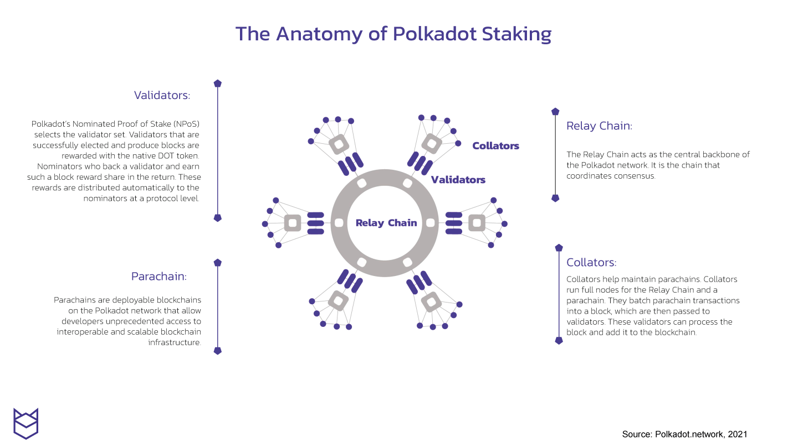
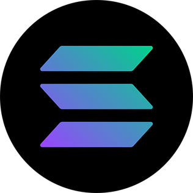
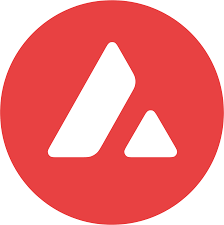

## Overview

Blockchains with smart contracts have proven to be extremely popular and useful.
This has revealed the next challenge to overcome: scaling. When too many people
uses these systems, the costs go up and performance can suffer. During its
busiest times, transactions on Bitcoin and Ethereum can cost tens to hundreds of
USD$. This isn't a problem for high value transactions, but prevents average
users from using these systems. Blockchains need to develop techniques to be
able to scale to significantly more users. There are a wide variety of
approaches that are being taken.

- State channels
- Sharding
- Rollups
- Improved consensus algorithms (new L1s)

## State channels

State channels allow two-way communication between participants of the
blockchain to take place (by locking up a part of the blockchain state).
Bitcoin's primary scaling solution is a state-channel based system called the
Lightning network.

## Sharding

A blockchain can scale without adding extra processing layers by a technique
called "sharding". Currently every node in a network stores the same data as
every other node. Sharding is the process of reassigning data to be stored
between only a sub-section of nodes. This reduces the total amount of data
needed to be stored by any single node, but still allows all of the data to be
available in the network. The tradeoff to this technique is the added
complexity to manage the distribution of the data. It must be distributed
evenly, so everyone has fair access, and it must be distributed robustly, so
that even if many nodes go down, the data will still be available.

### Rollups

Another scaling technique is to add layers on top of a blockchain's base layer. The upper layers can take over much of the computation burden, reserving only the most important snapshot of data to be stored on the main chain. In this situation, the base chain is referred to as the layer 1 (L1) and the outer layers referred to as layer 2 (L2).

Rollups are a blockchain layering technique. An L2 rollup performs transaction
execution outside the L1, then posts the transaction data on the L1. As
transaction data is on the main chain, rollups enjoy the full security
properties of the L1. Rollups are capable of handling hundreds to thousands of
transactions per second.

There are two types of rollups:

- Optimistic Rollups: assumes transactions are valid by default and only runs
  computation, via a fraud proof, in the event of a challenge
- Zero-knowledge (Zk) Rollups: runs computation off-chain and submits a validity
  proof to the chain

“In general, my own view is that in the short term, optimistic rollups are
likely to win out for general-purpose EVM computation and ZK rollups are likely
to win out for simple payments, exchange and other application-specific use
cases, but in the medium to long term ZK rollups will win out in all use cases
as ZK-SNARK technology improves.”

Vitalik Buterin, An Incomplete Guide to Rollups

How do Optimistic Rollups work?

1. Transactions sent to the rollup contracts are received on layer 2 by
   Sequencers Sequencers respond with a signed receipt pledging to accurately
   execute and order the received transaction, and are rewarded; Sequencers are
   also required to stake funds that will be slashed if they act maliciously.
2. If someone suspects fraud, they can prove it by alerting an adjudicator
   contract on the Ethereum mainnet, which is able to verify the validity of the
   results produced by the Sequencer using the OVM
3. The offending sequencer will be slashed, and some of the slashed funds will
   be rewarded to the whistleblower.
4. Examples of Optimistic Rollups: [Optimism](https://www.optimism.io/),
   [Arbitrum](https://offchainlabs.com/)

How do ZK-rollups work?

A ZK-rollup consists of two types of users: transactors and relayers.
Transactors create their transfer and broadcast the transfer to the network.
Relayers collect a large amount of transfers to create a rollup. It is the
relayer’s job to generate the SNARK proof. Anyone can become a relayer so long
as they have staked the required bond in the smart contract. This incentivizes
the relayer not to tamper with or withhold a rollup.

SNARK proof: The SNARK proof is a hash that represents the change of the
blockchain state. It compares a snapshot of the blockchain beforehand to a
snapshot of the blockchain afterwards and reports only the changes as a
verifiable hash to the mainnet.

Examples of ZK-Rollups: [StarkWare](https://starkware.co/),
[Filecoin](https://filecoin.io/)

## New L1s

Some developers choose to start new L1s entirely. They see the bottleneck
occurring in the consensus itself and have ideas to improve the performance.
Individual projects can only handle so many core contributors and decision
makers, and can only try one series of ideas at a time. This, in addition to
the draw of the being on a ground floor for a brand new token ecosystem, have
spawned a proliferation of new blockchains with unique approaches to scaling.
We will outline a few here.

### Near

"An OS for an open web"

Token: NEAR

[Near website](https://near.org/)

Near is an Ethereum-compatible chain with a focus on sharding. Rather than wait
for the Ethereum development community to complete their vast scaling roadmap,
the Near development team sought to quickly release a sharded-L1. Their team has
been prolific and rapid in their deployment of production-ready features and has
a quickly growing ecosystem.

### Cosmos

"The internet of blockchains"

Token: ATOM

[Cosmos website](https://cosmos.network/)

Cosmos is a layer-1 toolkit. It allows developers to quickly create their own
layer-1, with the unique property that all cosmos-toolkit L1s can talk to each
other and exchange tokens directly with each other. Cosmos-derived chains get
all the benefits of a native L1, without the difficulty of re-inventing the
wheel. Scaling comes through a proliferation of networks, rather than having any
one network solve all problems. Cosmos has pioneered proof-of-stake consensus,
and it's Tendermint consensus algorithm is one of the most popular.

The tradeoff with a cosmos-derived chain is that each has to provide its
security independently from all other chains. One chain that has only 100 nodes
may therefore be less secure than a more popular chain that has thousands of
nodes.

The Cosmos-sponsored reference chain provides the ATOM token. It's purpose is to
act as a reference and to provide services that the other chains can use. It's
latest feature is the ability to share security resources. The ATOM chain can
therefore use its vast node infrastructure to benefit all of the other chains in
its ecosystem.

### Polkadot

"Web3 interoperability"

Token: DOT

[Polkadot website](https://www.polkadot.network/)

Polkadot takes an approach similar to Cosmos, with another twist. Developers use
its toolkit to create their own derived-chains, called para-chains. Para-chains
are also able to communicate with other para-chains. The difference is that
para-chains interact directly with , but these automatically derive their
security

The Relay Chain: central chain of Polkadot. All validators of Polkadot are
staked on the Relay Chain in DOT and validate for the Relay Chain. The main
responsibility is to coordinate the system as a whole, including parachains.
Other specific work is delegated to the parachains, which have different
implementations and features.

Parachains: custom, sovereign blockchains that use the relay chain’s computing
resources to confirm that transactions are accurate. Polkadot has 100 parachain
slots. Parachains in Polkadot operate under a “shared security” model.

Parathreads: similar to parachains but with a pay-as-you-go model

Polkadot’s cousin chain is Kusama, which has nearly the same codebase as
Polkadot. The network is an experimental development environment for teams who
want to move fast and innovate/use as a testnet for Polkadot

### Solana

"Web3 infrastructure for everyone"

Token: SOL

[Solana website](https://solana.com/)

Solana aims to have extremely high performance: transactions per-second in the
hundreds-of-thousands. Using techniques inspired by the architecture of
cell-phone radios, Solana's consensus algorithm is able to agree on the ordering
of events without having to reach consensus on every single one (which is the
normal bottleneck) . Every transaction is stamped with a timestamp that is
derived from a timing algorithm that every node can run independently. This
consensus is called Proof of History and is one of the [“8 innovations that make
Solana the first web-scale
blockchain”](https://medium.com/solana-labs/7-innovations-that-make-solana-the-first-web-scale-blockchain-ddc50b1defda)
all eight of which are:

- Proof of History (POH)— a clock before consensus;
- Tower BFT — a PoH-optimized version of PBFT;
- Turbine — a block propagation protocol;
- Gulf Stream— Mempool-less transaction forwarding protocol;
- Sealevel — Parallel smart contracts run-time;
- Pipelining — a Transaction Processing Unit for validation optimization
- Cloudbreak— Horizontally-Scaled Accounts Database; and
- Archivers — Distributed ledger storage

### Avalanche

"Create without limits"

Token: AVAX

[Avalanche website](https://www.avax.network/)

Avalanche takes an approach in-between Solana and Cosmos/Polkadot, developing a
higher-performance consensus algorithm known as “Avalanche consensus” and
utilizing separate purpose-built chains for each key service. It targets
thousands of transactions per second and finality below 2 seconds.

Avalanches reaches its performance goals by using statistical sampling
techniques to quickly establish consensus among a sub-set of nodes. Avalanche
uses three chains, one for transactions (X-chain), one for smart contracts
(C-chain), and one for side-chains (P-chain). This allows each chain to be
nimble and focused. It also means it has extremely low hardware requirements to
run a node, compared to other blockchains.

### Filecoin

"A decentralized storage network for humanity's most important information."

Token: FIL

[Filecoin website](https://filecoin.io/)

Filecoin's main purpose is to provide massive decentralized storage capabilities
for the whole web. It's main consensus algorithm is fairly slow, but it has a
secondary scaling architecture called Interplanetary Consensus (IPC). This
allows secondary chains to maintain a two-way communication channel with the
parent, child and cousin chains, without the need for the centralizing
sequencers of rollups, while allowing them to customize the consensus algorithm
based on performance requirements.

Filecoin will be discussed more in subsequent sections.
