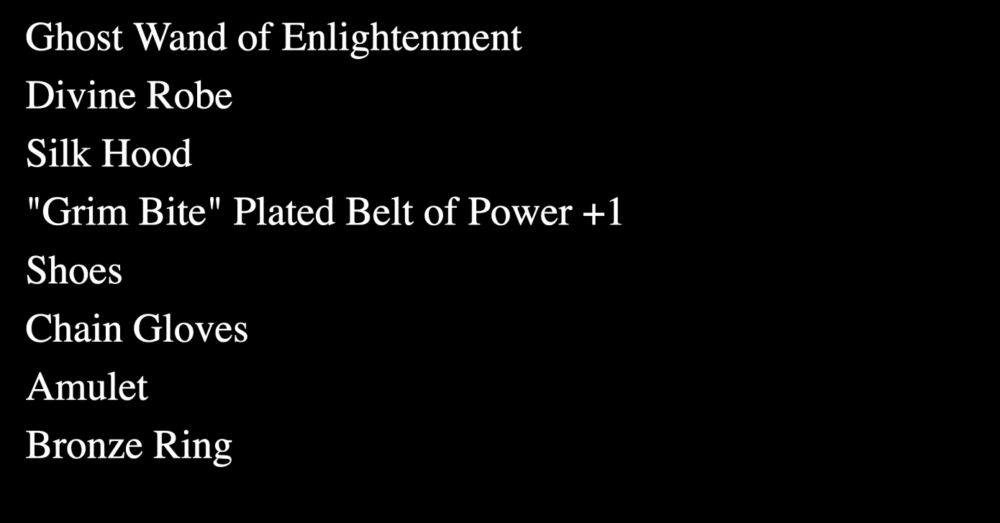
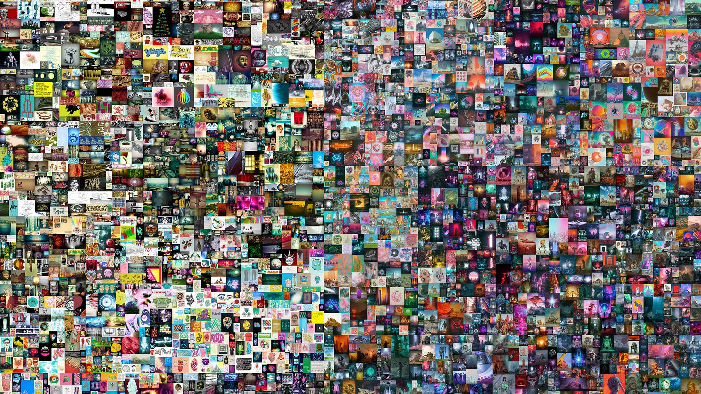
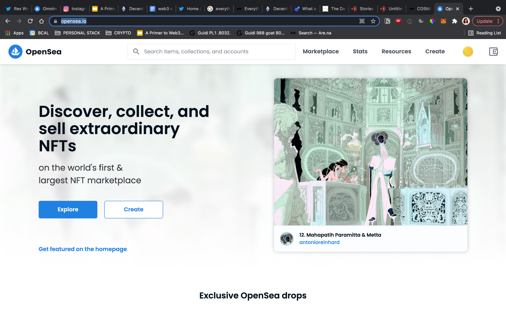
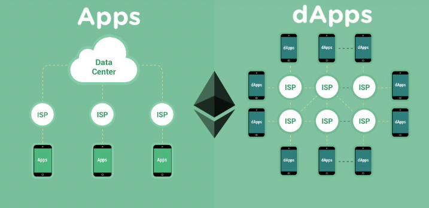
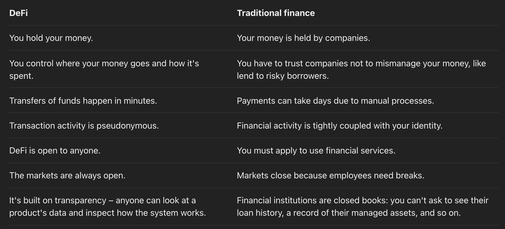

## Overview

Blockchains allow us to record information. Wallets allow us to control the
information. What if we want to add additional functionality to the information,
like the ability to configure a set of advanced rules to provide more
flexibility to its access, or the ability to interact with other chains or the
outside world?

Bitcoin added support for a basic scripting language that allows for uses cases
such as multi-party signers, atomic swaps, time-locked transactions and
tokenization. This scripting language is purposely limited in order to minimize
the potential for attacks against the network.

There are some who believed the language capabilities should be expanded. In
2014, Vitalik Buterin approached the Bitcoin maintainers about this. They
declined his request, so he created his own blockchain and called it Ethereum.

The fundamental difference between Ethereum and Bitcoin is in the capability of
their scripting languages. The main purpose of Bitcoin is for peer-to-peer
payments, whereas Ethereum aims to be a distributed world computer.

With Ethereum's turing-complete programming language, anyone can write
smart-contracts and decentralized applications (dApps), where they can create
their own arbitrary rules for ownership, transaction formats and state
transition functions.

One problem with having a powerful scripting language is that it only has access
to a finite amount of computation resources in the network. It is easy to
accidentally (or maliciously) over-consume these resource, effectively jamming
the system for everyone else.

The solution to this problem is to charge a fee proportional to the resources
being used. Ethereum uses Ether (ETH) as its the currency token. Every time you
make a transaction, you pay a small fee (the "gas fee") in ETH. By requiring a
fee for every computation executed on the network, bad actors are discouraged
from spamming the network. The fee does have the consequence that in times of
high demand, costs to transact can become prohibitively expensive. Dealing with
this problem will be addressed in the Scaling section later.

## Smart Contracts & Security

Smart contract is the term used for a program that is written and deployed onto
a blockchain. Once deployed, the contract cannot be altered (immutability),
except by narrow parameters allowed in the programming. This immutability,
especially when augmented with the open-source publication of its
implementation, allows the contract to develop a reputation of consistency and
trust that will encourage other users to interact with it.

Smart contracts that perform useful actions can charge fees of its users and
become a profit-center for its creators.

Smart contracts can do an increasingly number of things:

- Customizable tokens
- Decentralized finance (DeFi)
- Decentralized autonomous organizations (DAOs)
- User account-abstraction
- Cross-chain bridges
- Interaction with oracles
- and many more...

## Security Considerations

The biggest tradeoff to consider with smart contracts is security. As with all
human-programmed applications, mistakes are inevitable. Bugs in smart contracts
can be exploited and the consequences are more significant than in regular
applications because tokens with monetary value are often at stake. Hacks on
smart contracts have drained billions of USD$ in value from networks over the
past several years. Time and attention are the only remedies for security flaws.
As the industry matures, vetted building blocks will emerge that can be used to
build smart contracts with more security guarantees. These are beginning to
exist in some areas. Some best practices to be aware of can be found in the
following videos.

- [Best Practices
  Blog](https://consensys.github.io/smart-contract-best-practices/)
- [Webinar on Smart Contracts Security Best
  Practices](https://courses.consensys.net/courses/take/smart-contract-security/lessons/9798331-smart-contracts-security-best-practices)

## Tokens

We've discussed Bitcoin and Ether as built-in units of currency in their
respective networks. Another general word for them is "tokens". A token is
simply an exchangeable unit of value. It may carry with it some information.
Here is [an article from
Coinbase](https://www.coinbase.com/learn/crypto-basics/what-is-a-token) that
discusses the topic further.

These built-in tokens are not the only tokens allowed in blockchain networks.
Smart contracts gives users the ability to create their own tokens and attach
their own rules for use in their own custom services.

To define a new token within an existing network is generally much easier than
building a whole new network with a new base token. Once the developer chooses a
network with the desired security and performance properties, then they can use network-provided standards and tooling to streamline the creation of tokens.

Why create a new token?

Tokens represent niche communities; they represent brands. They encode a custom
set of rules, a unique ethos or spirit, that applies to the applications and
groups that they belong to. Any token built on a network increases the general
usage on that network and demand for that networks fundamental currency.

## Types of tokens

There are two classes of tokens: fungible and non-fungible.

### Fungible tokens

Up to this point we have only discussed fungible tokens. Fungible means that any
one token is the same as the other. Cash is fungible. It does not matter which
USD$1 bill you present at a store, they all have the same value as each other.

In order to make custom-designed tokens exchangeable, several fungible token
standards have been created. The most well know is the Ethereum ERC-20 standard.
Other networks tend also use the Ethereum standards, since those were the first,
in order to retain compatibility and leverage pre-existing expertise and
tooling.



### Non-fungible tokens (NFTs)

Non-fungible tokens (NFTs) are issued as families. Each token carries unique
information and capabilities, and each is valued independently. The family
grouping only serves to communicate a common creator or a common usage domain.

There are several standards for NFTs. The most common Ethereum standard is
[ERC-721](https://ethereum.org/en/developers/docs/standards/tokens/erc-721/).

NFTs are most popularly used to represent ownership of a given piece of digital
artwork. The first NFT: minted in 2014, when bitcoin had a value of about $630,
Kevin McCoy created an animation, made entirely out of code, it was originally
published to Namecoin blockchain, but has since been transferred to the ethereum
blockchain. Fun Fact: the token url points to a json stored on IPFS check out
how that works in this [short
video](https://www.sothebys.com/en/buy/auction/2021/natively-digital-a-curated-nft-sale-2/quantum).

In 2017 CryptoKitties were the first NFTs minted
using ERC-721.

NFTs can represent both digital assets (GIFs, collectibles, music, videos, etc.)
and non-digital assets (legal documents, signature, invoice, deeds, etc.)
including all of the following:

- Digital Content: NFTs enable content creators to own their work. When creators
  sell their content, funds go directly to them. If the new owner then sells the
  NFT, the original creator can even automatically receive royalties, baked into
  and ensured by the metadata.

- Gaming: NFTs can provide records of ownership for in-game items, fueling in-game
  economies. In regular games you can buy items for in-game use. With NFTs, you
  can recoup your money by selling game items as stand-alone products.

- Domain-names: ENS domains are also NFTs, allowing a unique and easy way to remember
  IP addresses.

- Physical Items: NFTs could eventually act as deeds to physical items such as
  your house or car. one day you could buy a car or home using ETH and receive the
  deed as an NFT in return (in the same transaction).

- Fractional Ownership: NFT creators can also create "shares" for their NFT,
  allowing people to own a part of an NFT without having to buy the whole thing.
  It's very likely that one day soon owning a fraction of an NFT will enter you
  into a decentralized autonomous organization (DAO) for managing that asset.

Notable NFT collections:

Crypto Kitties --

Crypto Punks --

Bored Apes --

Loot --

NBA Top Shots --

Beeple --

### Market Places

NFTs are typically traded in specialized marketplaces, like:

[OpenSea](https://opensea.io/) --

[Blur](https://blur.io/) --

## Dapps, DAOs, and DeFi

Smart contracts have sparked an explosion of services in every network.
Decentralized applications (dApps) are apps that communicate with a smart
contracts. Decentralized autonomous organizations (DAOs) take the application
one step further and use smart contracts to define membership and governance
rules. DAOs allow humans to adapt, govern, regulate, and act both on chain and
in the real world, in accordance with rules that are clearly defined and
perfectly enforceable through smart contracts. Decentralized finance (DeFi) is
is a growing ecosystem of financial services controlled by smart contracts.

## dApps

Key features of dapps:

- Open-source
- Public data and records
- Uses a cryptographic token to help keep the network secure

Common categories of dApps:

- Finance
- Art and collectibles
- Gaming
- Technology

## DAOs

The ethos behind DAOs is to enable collective decision-making, guard-railing
against unbalanced organization structures. A popular analogy is that DAOs are
modern-day, tech-enabled co-ops.

DAO members are not only participants in, but also owners of the DAO. Members
are given tokens which grant them equity ownership in the DAO, as well as voting
power in on-chain governance decisions.

Here are some components of DAO structure:

1. Mission. DAOs need a mission/purpose. This can be collecting NFTs, building a
   product, funding public goods, etc.
2. Group chat. DAOs usually start off with a small group of people in Telegram
   group or Discord server that share the same interest(s) or goal(s).
3. Treasury. The most common type of Community DAO collects NFTs and stores them
   in a multi-sig. Community DAOs can also bootstrap their treasury through a
   tokenized crowdfund.
4. Governance. Community DAOs with valuable treasuries and 100+ members need a
   way to make collective decisions. Usually, rough consensus is reached
   off-chain and the governance vote is just a formality. Also, most Community
   DAOs empower small, focused teams of 5-10 members to own specific
   work-streams instead of requiring a governance proposal for every decision.
5. On-chain cash flow. This is the most nascent component of Community DAOs but
   also the most interesting. On-chain cash flow turns a group chat into a
   sustainable business. So far, the most common way to generate on-chain cash
   flow has been through NFT drops.
6. Token. Community DAOs often issue an ERC-20 token as a way to gate
   membership. It can also serve as a funding mechanism.

Types of DAOs:

- Protocol DAO: Networks issue a token, allowing community members to govern the
  protocol
- Grant DAO: Communities donate funds and use a DAO to vote on how capital is
  allocated to various contributors
- Social DAO: exactly what it sounds like, good vibes only
- Investment DAO: Investment DAOs allow members to pool capital and invest in
  projects at their earliest stages

## Decentralized Finance (DeFi)

Smart contracts that facilitate financial transaction marketplaces are
classified as decentralized financed or (DeFi). DeFi projects can be DAOs, if
there is governance token involved, or they can just be stand-alone smart
contracts that perform a given function completely autonomously.

You can think of DeFi in layers:

1. The blockchain – Ethereum contains the transaction history and state of
   accounts
2. The assets – ETH and the other tokens
3. The protocols – smart contracts that provide the functionality
4. The applications – the user interface of the system

### Use Cases

Payments: DeFi makes sending/streaming money around the globe as fast as sending
an email.

Lending and Borrowing: You can earn interest on your crypto through lending.
Decentralized lending works without either party having to identify themselves.
Borrowing money from decentralized providers comes in two main varieties
(peer-to-peer, pool-based).

- [Aave](https://aave.com/)
- [Compound](https://compound.finance/)

Token Swaps: Decentralized exchanges (DEXs) let you trade different tokens 24/7.

- [Uniswap](https://uniswap.org/), [SushiSwap](https://sushi.com/),
- [Curve](https://curve.fi/).

Stable Currencies: Stablecoins are cryptocurrencies without the volatility. [How
stablecoins get their stability](https://ethereum.org/en/stablecoins/#how)

- [USDC](https://www.circle.com/en/usdc)
- [DAI](https://makerdao.com/en/)

### Advanced Use Cases

Advanced Trading and Prediction Markets:

- [Polymarket](https://polymarket.com/) (prediction)
- [Augur](https://augur.net/) (prediction)
- [dYdX](https://dydx.exchange/) (margin trading)

Investments/Asset Management:

- [Yearn](https://yearn.finance/)
- [Set Protocol](https://www.setprotocol.com/)

Crowdfunding: Quadratic funding is the mathematically optimal way to fund public
goods in a democratic community. [Gitcoin](https://www.gitcoin.co/) is one
example. How it works:

1. There is a matching pool of funds
2. A round of public funding starts
3. People can signal their demand for a project by donating some money
4. Once the round is over, the matching pool is distributed to projects; Those
   with the most unique demand get the highest amount from the matching pool

### Other terms to know

Liquidity Pools are one of the foundational technologies behind the current DeFi
ecosystem. A liquidity pool is a collection of funds locked in a smart contract.
Liquidity pools are used to facilitate decentralized trading, lending, etc.
Liquidity pools are also the backbone of many decentralized exchanges (DEX).
Users called liquidity providers (LP) add an equal value of two tokens in a pool
to create a market. In exchange for providing their funds, they earn trading
fees from the trades that happen in their pool, proportional to their share of
the total liquidity.

Yield Farming is a specific use case of liquidity pools. Yield farming, also
referred to as liquidity mining, is a way to generate rewards with
cryptocurrency holdings by investing and/or lending it.

Total Value Locked (TVL): TVL represents the number of assets that are currently
being staked in a specific protocol, the total amount of underlying supply that
is being secured by a specific application by DeFi completely. Total value
locked is a metric that is used to measure the overall health of the DeFi and
yielding market.

Rug Pull: A rug pull is where crypto developers abandon a project and run away
with investors’ funds, leaving them “rugged.”

Miner Extractable Value (MEV): the measure of the profit a miner can make
through their ability to arbitrarily include, exclude or re-order transactions
within the blocks they produce; miners can exploit and profit from
front-running, back-running and sandwiching transactions in any block they mine.
[(More on
MEV)](https://www.coindesk.com/markets/2021/07/27/how-to-fix-ethereums-mev-problem-and-give-traders-the-best-price/)
