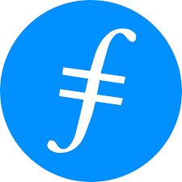

Where other chains focus on financial transaction or computation, there is
another huge use-case that needs to be served: storage. It costs hundreds to
thousands of dollars to store megabytes of data on standard blockchains. Several
purpose-built chains have emerged to fulfill this need, including:

- IPFS and Filecoin
- Arweave
- StorJ
- Sia

Given this program is sponsored by Protocol Labs, we will cover IPFS and
Filecoin extensively in later sections, but we will take a moment here to
mention some other storage providers

All decentralized storage providers strive to provide cheaper costs, more
control and better guarantees than centralized storage providers like Amazon or
Google. Each network is tuned for slightly different use-cases. All of these
networks provide robust storage options with different tradeoffs. But the
tradeoff that all still share is in read performance. Decentralized storage is
still working on solving the problem: how do you deliver content as quickly and
efficiently as edge CDN providers like Cloudflare?

## Arweave

"Permanent information storage"

Token: AR

[Arweave website]()

[Arweave statistics](https://viewblock.io/arweave/stats)

- Total network capacity: ?
- Total data stored: ~0.100 PB
- Storage cost: USD$3-4 per GB lifetime
  - (~USD$15 per TB-month, 20 years)
  - (~USD$6 per TB-month, 50 years)
  - (~USD$3 per TB-month, 100 years)
  - Formula: 4.27 USD$/AR x 0.87 AR/GiB x 1024 GiB/TiB / X-years / 12 months/year

Arweave strives for a simple and unified web2-like interface and a simple
pricing model: pay once for perpetual storage. This results in storage prices
that are somewhat higher in the short-term than other chains, but with the
promise that the user will not have to worry about renegotiating deals in the
future. Data is stored in a sharded sort of way, with each node storing only a
small portion of the networks data, but all data being backed up across hundreds
of other nodes. Statistical checks on data consistency are performed on a
continual basis. Nodes that cannot prove they have their portion of the data
will be punished through fines (loss of collateral) and missing data will be
restored from and reassigned to other nodes.

Arweave priorities ease of use over configurability, which makes it will suited
for simple use cases nad perhaps less well suited for larger or more complex
data sets that would prefer to optimize on costs, availability or other
parameters.

## Storj

"Globally distributed cloud object storage"

Token: STORJ

[Storj website](https://www.storj.io/)

[Storj statistics](https://storjstats.info/d/storj/storj-network-statistics?orgId=1)

- Total network capacity: ~60 PB
- Total data stored: ~20 PB
- Storage cost: $4 per TB-month

StorJ breaks up files into small components and distributes them across its
network. It aims to allow regular computer users to share their extra space.
Storj focuses on enterprise storage and compatibility with Amazon S3.

## Filecoin

Token: FIL

[Filecoin website](https://filecoin.io/store/#intro)

- Total network capacity: ~13,000 PB
- Total data stored: ~1,300 PB
- Storage cost: USD$0-0.19 per TB-month (varies per storage provider and file size)

Filecoin is the largest decentralized storage marketplace by several orders of magnitude. It is based off of the popular IPFS protocol, which is the voluntary storage network that stores many of the NFTs on Ethereum, but adds an incentivization layer that guarantees storage over the duration of a deal period. Instead of relying on statistical consistency checks, Filecoin uses a sophisticated cryptographic algorithm to prove that all data is being accurately stored across all storage providers on a daily basis. Such checks provide the most reliable guarantee that data has not gone stale. Filecoin is a protocol that strives to provide the maximum flexibility in terms of storage parameters. Users can configure the deal duration, redundancy, storage provider location, read-performance, and other parameters. Filecoin relies on an ecosystem of interface providers to offer users

---

Filecoin storage estimates from
[this](https://www.coingecko.com/research/publications/centralized-decentralized-storage-cost)
Coingecko report, updated May 2023.

The Arweave and Storj from each of their respective websites.
