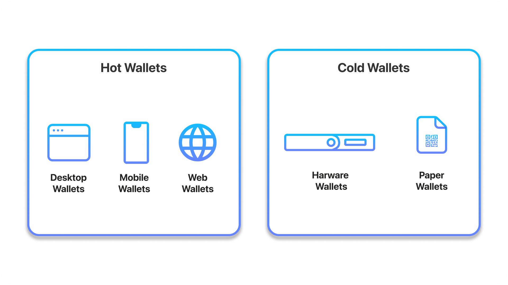
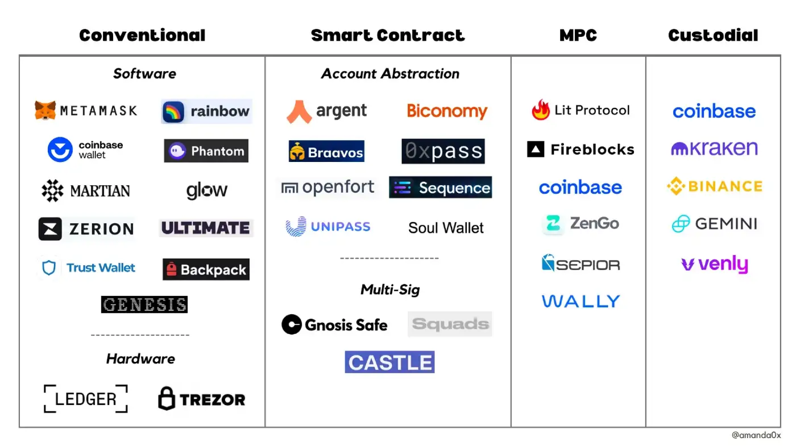

## Overview

How do users establish an identity with a blockchain and authorize transactions
to be made from their account?

Anyone can join a blockchain like Bitcoin. All it requires is to create an
identity and find someone to transact with. An identity is nothing more than a
large random number that each user picks for themself. As long as the user uses
a system that picks a truly random number, and never reveals it, no one will be
able to guess it. This is true because the field of possible numbers is so vast
-- more than the number of atoms in the universe -- that the possibility of
guessing another's number is effectively impossible.

Using cryptography, this secret number is used to create a family of new
numbers. A new related number is generated for each transaction. Each new number
is used to generate a public/private key-pair, so each transaction has a unique
authorization point. Done in this way, an entire transaction history can be
recreated from just the root number. The standards that define this are found in
[bip-32](https://github.com/bitcoin/bips/blob/master/bip-0032.mediawiki),
[bip-39](https://github.com/bitcoin/bips/blob/master/bip-0039.mediawiki),
[bip-43](https://github.com/bitcoin/bips/blob/master/bip-0043.mediawiki)

How does a user keep track of all of these numbers?

A "wallet" is used to keep track of these numbers for the user. Wallets are
software applications or hardware devices that abstract away the math and the
numbers, making it easier and more natural for the user to interact with each
blockchain network.

Wallets are your therefore gateway to blockchains. In addition to sending
tokens, you can do many other things. Wallets can manage collectibles,
coordinate membership in DAOs, stake, trade, farm, swap, and a myriad of other
use-cases, to be discussed later.

## Wallet Types

There are several ways to classify cryptocurrency wallets.

- custodial vs. non-custodial
- software vs. hardware
- browser vs. standalone
- single-signer vs. multi-signer
- direct vs. account-abstracted

Custody refers to who actually holds the keys.

In a custodial wallet, an entity like an exchange maintains the keys for the
user. The advantage is that the user does not have to worry about lose them.
The disadvantage is that the user must trust the security of the exchange.

All exchanges offer custodial wallets. (Some even offer non-custodial wallets
as well.)

In a non-custodial wallet, like a browser wallet or a hardware wallet, the user
maintains possession of the keys. The user is a smaller entity than an exchange
and therefore may not be targeted by hackers as directly. But safely custodying
one's keys is still a very significant responsibility. It is quite a technical
matter at this stage as well. If you lose your then, there is no way to ever get
them back.

In the category of non-custodial wallets, there are two types: software and hardware.

Software wallets are applications that run on your computer or phone. The most
popular software-based wallets are browser plugins like
[MetaMask](https://metamask.io/). Browser plugin wallets are convenient because
they can automatically interact with the websites that you visit, once you give
them permission. Browser plugins typically support one network family at a
time, like Ethereum or Solana. Desktop application wallets like [Exodus](https://www.exodus.com/)
typically support the majority of cryptocurrencies in one package and are
convenient for managing a whole portfolio. They provide a beautiful interface
with many useful features.

A hardware wallet is a separate hardware device, sort of like a flash drive. It has a screen and some buttons and it's sole purpose is to manage keys away from internet connected devices, where they are most easily stolen. The hardware wallet never shares the keys with the computer or phone that it interacts with. Instead it sends only the signatures that authorize transactions, which can only be generated on-device.

Some hardware wallets:

- [Ledger](https://www.ledger.com/)
- [Trezor](https://trezor.io/)
- [NGrave](https://www.ngrave.io/)
- [Keepkey](https://www.keepkey.com/)

There are other ways to self-custody as well. Services are emerging that are
trying to make this process safer and easier. A service like
[Casa](https://keys.casa/) help the user to create a multi-signature wallet,
where no one signer can run off with the funds, and having multiple signers
allows for key recovery in the case of loss.

MPC, or multi-party-compute, is a new technology that is improving the way
enterprise-grade multi-signer accounts work. With traditional multi-signer
paradigms, the keys have to be generated in one place and distributed to the
holders. Keys are most vulnerable when they have to be moved. MPC allows each
party to generate their own key in place. They can then interact with their
group of signers without transmitting any sensetive information. This
technology will help make both custodial and non-custodial wallets more secure.

["Account abstraction"](https://ethereum.org/en/roadmap/account-abstraction/)
(AA) is a new paradigm that is being actively researched. In this case, a smart
contract would maintain a set of rules that governs access to a wallet. With AA,
it is possible for new service providers to emerge that can provide key recovery
and other useful services, without the user having to give up control of their
keys. It has the potential to make wallets both user-friendly and safe for use
by technical and non-technical a like.

Any wallet can send tokens and messages to any other wallet, as long as they
support the same networks. The type of wallet you choose will depend on your use
case and security preferences. This most common practice among
security-conscious enthusiasts is to self-custody a majority of funds in a
hardware wallet, while keeping some funds in a browser wallet or exchange for
quicker access.

As with all things in this space, there are always important tradeoffs to
consider. The highly technical nature of the space precludes more people from
getting involved. But the technical barriers to entry will hopeful come down
over time.

## The most important thing about wallets...

If you lose your wallet, are all your assets lost?

Not necessarily. First of all, the wallet does not store any of your assets --
that information is all stored on the blockchain itself. Your wallet only stores
a copy of the keys that permit you to transact with them.

Wallets always provide a way to back themselves up. This usually involves
writing down a set of words that acts as a recovery phrase. Always take the
time to record your recovery phrases and store copies in one or more safe
locations.

## Additional Resources



[What are Crypto Wallets | Simply
Explained](https://www.youtube.com/watch?v=d8IBpfs9bf4)

[More info from Coinbase](https://www.coinbase.com/learn/crypto-basics/what-is-a-crypto-wallet)

[custodial and
non-custodial](https://www.gemini.com/cryptopedia/crypto-wallets-custodial-vs-noncustodial#section-custodial-crypto-wallets-pro-and-cons)
