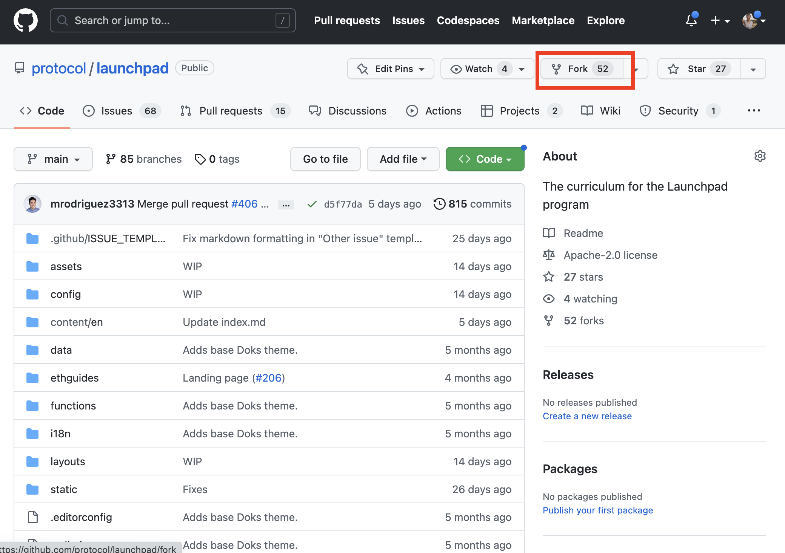


_[Github Deck Link](https://docs.google.com/presentation/d/11V_BA5A64lCY_wFsvuLO4je02zvzJwD5vf2kzONDWyc/edit?usp=sharing)_


## Tutorial – Contributing to OSS on Github
In this tutorial, you will learn how to use the GUI to open an issue, create a fork, and make a PR to any repo on Github.

### Part 1: Create an Issue
Issues are super easy ways for you to make a suggestion to an OSS team, without having to ping them personally. These issues are then housed in a place that makes it easy for them to organize, review, and assign to others.

* Open a repo. In this example, I will use the [Launchpad Repo at https://github.com/protocol/launchpad](https://github.com/protocol/launchpad).

* Click on the 'Issues' tab to go to the page to submit Issues:


* Click on the **New Issue** button, choose an issue template, and click the **Get started** button to open up a template.


* You can delete all of the writing underneath the bold headers. Bold headers have two stars `**sentence text**`, and you can write anywhere beneath those bold headings. Not all fields are mandatory!


* Click **Submit new Issue** and you can go back the the issues tab and see it on the list!

Now the team who maintains that repo can see any problems you want to report, assign, and track who can see it. You will also get e-mail notifications for any responses people have to you. Using `@username` in a comment, Issue, or PR will notify that particular person.

  

### Part 2: Make a PR in the GUI
If you want to take your changes to the next step, you can fork the repo and make a Pull Request (PR). This will make it as easy as the click of a button for repo maintainers to add in your suggestions.

### Modify an Existing File

#### Make a Fork

* First, go to the repo and choose the **Fork** button on the top right


* A new fork (version with the same history) of that repo will be created under your organization or username.


> Note that any time you go in and make changes, you will want to make sure that your repository is up to date with the original repo. You can do this from the main page of your repository fork with the **Sync fork** button.


#### Make an Edit

* Now you have to find which file you want to modify. In the repository used in this example, `launchpad`, all of the content is in the directory `content/en`.


* Compare the directory structure with the URL of the curriculum and find a page you would like to make a small edit on. Note that the file you need to edit will either have the same name as the file in the URL (e.g. how-filecoin-works.md), or be an `index.md` file inside of a directory with the same name as you see in the URL.


* Click the Pencil Icon at the top of the page preview. From here you can make the edits you would like to that page.


* Once you have completed your edits, you should click the **Commit changes** button, add a short description, and choose **Commit Directly to the main branch** then click the **Propose changes** button to merge the change into your remote repository.


When you go back to the home page for the repo, you should see your commit listed:


#### Make a PR

Now that you have these changes on _your_ remote Github repo 'packaged up', you are ready to make a Pull Request to the _original_ remote repo.

* You can propose those changes (make a pull request) to the original Launchpad curriculum repo that you forked from. Go back to the [original Launchpad repo](), and go to the Pull Requests tab.


* Now you can create a PR! In the Pull requests page, choose **New pull request**, then choose **compare across forks**
 
 

* In the Comparing Change page, choose your head repository (and `main` branch) on the right side of the comparison, the click **Create Pull Request**.

 

* On the next screen, you should see the same details show up for the commit you had made on your remote repo. Add more details if you wish, then click **Create Pull Request**.

* Now when you check the [Pull Request for the Launchpad repo](https://github.com/protocol/launchpad/pulls) you can see your new Pull request, and make it easy for maintainers to explore and commit the changes!
 

The maintainers of these repos only need to push a button to confirm the merge, making it much more likely (and easier for the maintainers) to get changes added.

### Add a new File
Adding a new file is simple in the Github CLI. You can test this out in the fork you created. Lets add a new Dev Tool (any project or company you know of in PLN) to the Dev Tools section!
 

* First, remember to sync with the original repo!
 

* Now, you can navigate into `/content/en/curriculum/dev-tools` and click **Add file**. From here you can add a new markdown file (like `spice.md`) about the Dev Tool you know about.


See the Markdown guide below for how to author. Remember you will have to follow the same workflow as above where you first push to your own fork, then open a PR in the [original Launchpad curriculum repo that you forked from](https://github.com/protocol/launchpad).

You can also take a look at the [tutorial-temp.md file](https://github.com/protocol/launchpad/blob/main/tutorial-temp.md). Click the **Raw** button to see a markdown template that you can copy-paste into a new file.


<!-- ### Part 3: Make a PR using the CLI -->

## Guides

### Markdown Guide

Every text input section in [GitHub uses Markdown](https://docs.github.com/en/get-started/writing-on-github/getting-started-with-writing-and-formatting-on-github/about-writing-and-formatting-on-github). Every Pull Request (PR), review, issue, and comment section supports markdown. Markdown is not specific to Github, but is it's own writing and formatting style. Github has added additional functionality to it that is only usable within Github like interacting with other users with @mentions, issue and PR references, and emoji's!

If you are contributing to open source repositories and organizations, here are some common uses seen in the wild:

<!-- This table was generate with https://www.tablesgenerator.com/markdown_tables -->

| Markdown                     | Command                  | Description                                                                                   |
|------------------------------|--------------------------|-----------------------------------------------------------------------------------------------|
| HEADER                       |             #            | Used for headings, add more symbols before the heading to change the size from 1 (biggest) to 6 (smallest).  |
| * unorderedList              |            */-           | Either a single `*` or `-` is used for _unordered lists_. Tabs create sub-lists.              |
| 1) numberedList              |         number)          | Used to create _numbered lists_. Tabs create sub-lists.                                       |
| > Quote                      |            >             | Used to quote other users responses.                                                          |
| \`code\` or \```codeblock\``` |       \`                | A single ` is used for just one line of code. A group of three ``` are used for multi-line code blocks.      |
| \[title\]\(www.example.com\) |       \[ ] ( )           |  Create URLs/Links in this format. With the text you want to display `[]` and the URL in `()`  |
| :thumbsup:                   |       :emoji name:       | Write the emoji name in between colons to create an emoji.                                     |
| :white_check_mark: Checklist |            []            | Github automatically creates a progression bar for checkboxes grouped together within Issues.  |
| @username                    |             @            | Github will create a link to the user and notify them (with respect to their preferences).     |
| #GHIssueNumber or PRNumber   |         # or GH-         | Github will automatically create a link to an Issue or PR, IF applicable. Else, it'll treat it like Heading. |

Source: [Github Writing Guide](https://docs.github.com/en/get-started/writing-on-github/getting-started-with-writing-and-formatting-on-github/basic-writing-and-formatting-syntax), [Markdown Guide](https://www.markdownguide.org/cheat-sheet/)

### Github Orgs & Repos
There are a number of different Open Source Software (OSS) organizations and projects that are used to manage the code that makes up what we maintain at Protocol Labs.

Everything created at PL is open source. To get to the organization or repo, just type in `github.com/<organization>/<repo>`.

Explore some of the most active repositories below to learn about the projects.

* **Protocol Labs** – /protocol: [https://github.com/protocol](https://github.com/protocol)
  * Repos: [specs](https://github.com/ipfs/specs), [CI Workflows](https://github.com/protocol/.github), [launchpad](https://github.com/protocol/launchpad), [Infrastructure](https://github.com/protocol/launchpad), [Research](https://github.com/filecoin-project/devgrants), [/bifrost-infra](https://github.com/protocol/bifrost-infra), [/monitoring-infra](https://github.com/protocol/monitoring-infra), [/netops](https://github.com/protocol/netops)
* **IPFS** – /ipfs: [https://github.com/ipfs](https://github.com/ipfs)
  * Repos: [/kubo](https://github.com/ipfs/kubo) , [/ipfs-desktop](https://github.com/ipfs/ipfs-desktop),[specs](https://github.com/ipfs/specs), [ipfs-companion](https://github.com/ipfs/ipfs-companion)
* **IPLD** – /ipld: [https://github.com/ipld](https://github.com/ipld)
* **libp2p** – /libp2p: [https://github.com/libp2p](https://github.com/libp2p)
  * Repos: [/specs](https://github.com/libp2p/specs), [/rust-libp2p](https://github.com/libp2p/rust-libp2p), [/js-libp2p](https://github.com/libp2p/js-libp2p)
* **Filecoin** – /filecoin-project: [https://github.com/filecoin-project](https://github.com/filecoin-project)
  * Repos: [/bacalhau](https://github.com/filecoin-project/bacalhau), [/FIPs](https://github.com/filecoin-project/FIPs), [/lotus](https://github.com/filecoin-project/lotus), [/devgrants](https://github.com/filecoin-project/devgrants), [/community](https://github.com/filecoin-project/community)
* **Other PLN Projects**
  * Testground -[https://github.com/testground](https://github.com/testground)
  * Saturn – [https://github.com/filecoin-saturn](https://github.com/filecoin-saturn)
  * Drand - [https://github.com/drand](https://github.com/drand)
  * Boost – [https://github.com/filecoin-project/boost](https://github.com/filecoin-project/boost)
  * CryptoNet Lab – [https://github.com/protocol/CryptoNetLab](https://github.com/protocol/CryptoNetLab)
  * CryptoEcon Lab – [https://github.com/protocol/CryptoEconLab](https://github.com/protocol/CryptoEconLab)
  * Bacalhau / COD – [https://github.com/filecoin-project/bacalhau](https://github.com/filecoin-project/bacalhau)
  * Network Indexer – [https://github.com/ipni/storetheindex](https://github.com/ipni/storetheindex)
