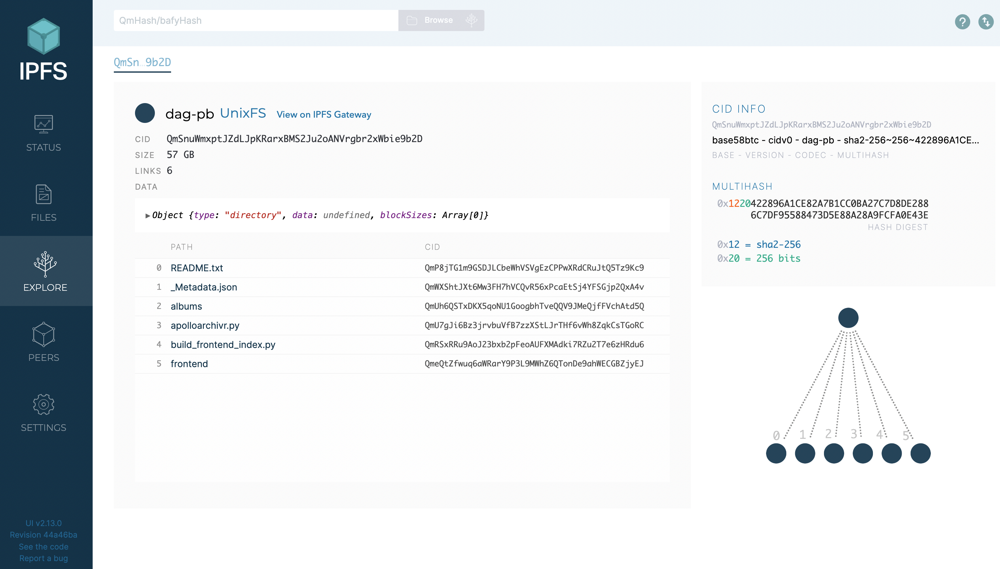

## Background
In this tutorial you can do some basic things with the public IPFS filesystem. This video tutorial provides instructions for how to install and run commands with the IPFS API using a Unix-type shell & operating system.

## Prerequisites
* The [latest version of Go (golang)](https://go.dev/doc/install)
* A shell where you can run Unix-type commands either on a Mac, or (Li)Unix machine, or Windows [Powershell](https://docs.microsoft.com/en-us/powershell/scripting/install/installing-powershell-on-windows?view=powershell-7.2)
* IPFS [installed on the OS](https://docs.ipfs.tech/install/ipfs-desktop/#install-instructions) you are using
* IPFS Docs' [kubo (go-ipfs) Command-line commands](https://docs.ipfs.tech/reference/kubo/cli/#ipfs)

> Use the ipfs-update package to easily update to the latest version of ipfs.
> * [Download and install ipfs-update](https://dist.ipfs.tech/#ipfs-update)
> * Run the command `ipfs-update install v<0.00.00>`.
> * See more in the [ipfs-update repo](https://github.com/ipfs/ipfs-update).

## Instructions

In this tutorial, you can follow along to understand the basics of how you, as a user, can access files in the public IPFS network. Follow along with the examples to learn about pinning and adding files, how files from IPFS can be previewed and inspected, and learn a bit about how that data is created and stored on IPFS.

### Video – IPFS CLI Basics: Accessing Files



### Start and Stop an IPFS Node
In the previous tutorial, you learned how to start and stop an IPFS node in the command line.

* Run `ipfs daemon` in the CLI to start your new node

>  When you run `ipfs daemon`, if you get the error: `lock <path>/.ipfs/repo.lock: someone else has the lock`, it means there is another instance running on your machine. Use the command `killall ipfs` and try again


* You can stop your node by pressing `cntrl + c` twice in a row in the same terminal it's running in, or typing `killall ipfs` in another window.

### See your IPFS Peers (Swarm)

You can see your direct peers with the IPFS CLI, but with a simple command. By default, your ipfs node is seeded with a default list of [trusted 'bootstrap' peers](https://docs.ipfs.tech/how-to/modify-bootstrap-list/), which can be changed.

* See your peers with the command `ipfs swarm peers`

You should see a list of peers:

```
➜  ~ ipfs swarm peers
/ip4/104.131.131.82/udp/4001/quic/p2p/QmaCpDMGvV2BGHeYERUEnRQAwe3N8SzbUtfsmvsqQLuvuJ
/ip4/115.231.82.177/tcp/4001/p2p/12D3KooWCpgcZkkRNd1FY7PwchxuLwo5dhkER8EVhzTjBgir49Gz
/ip4/119.193.8.109/udp/4001/quic/p2p/12D3KooWRdjT6WuQS1pcr6XmPeoGRH9XrxxayTV1bXFkv1WQnbd3
/ip4/149.102.159.78/udp/4001/quic/p2p/12D3KooWFKwrYNJC55UWYZqWr2Knrzwzky25LVn3BuUyaiaHwU3n

...
```

> you can examine peers by running `ipfs id <CID>`

### Read an IPFS File
You can explore files on IPFS with the CLI tool as well. You can do this by [installing IPFS Desktop](https://docs.ipfs.tech/install/ipfs-desktop/) or by using the URL for the web user interface (WebUI) at [http://127.0.0.1:5001/webui](http://127.0.0.1:5001/webui) which you should have seen when you ran `ipfs init`

```
➜  ~ ipfs daemon
Initializing daemon...
go-ipfs version: 0.11.0-67220edaa
Repo version: 11
System version: arm64/darwin
Golang version: go1.17.3
Swarm listening on /ip4/127.0.0.1/tcp/4001
Swarm listening on /ip4/127.0.0.1/udp/4001/quic
Swarm listening on /ip4/192.168.64.1/tcp/4001
Swarm listening on /ip4/192.168.64.1/udp/4001/quic

... output omitted

WebUI: http://127.0.0.1:5001/webui
Gateway (readonly) server listening on /ip4/127.0.0.1/tcp/8080
Daemon is ready
```

Grab the CID of a file on IPFS and use it to read that file in the CLI (ideally a text file).

* Run `ipfs cat <CID>` to read that file

### Download an IPFS File with a CID
To grab a file (you can find it on IPFS Desktop or the WebUI) from the public IPFS network and store it on your local machine:

* Use the command `ipfs get <CID>`. You should be able to find the file in whichever directory you are currently working in with your terminal.

* Use `ls` to list your files. You should see a CID starting with `Qm....` or `ba...` in your local directory.

Examine the file (ideally a text file) using vim:

```
➜  ~ vim QmbWqxBEKC3P8tqsKc98xmWNzrzDtRLMiMPL8wBuTGsMnR

...

```

> Take a minute to explore a file in IPFS Desktop, or the [WebUI](http://127.0.0.1:5001/webui) to see different files on IPFS, and their structure. 

### Add a File to your IPFS Node
You can also take files shared on your local machine to your IPFS node, which is known as **pinning**. Simply use the command `ipfs add directory/filename.extension`. Make sure you have the correct path to the file from where you are working in the terminal.

### List Pinned Files on your Node
Once you have started pinning files on your node, you can use the CLI to list them as well. You can [choose the type](https://docs.ipfs.tech/reference/kubo/cli/#ipfs-pin-ls) of files listed, as well as how it is output in the CLI.

* List the files on your node with `ipfs pin ls --type=all`

### Inspect a DAG
Now that you understand how the IPFS CLI works, take a minute to explore how data on IPFS is split up. Visit the [IPFS DAG Inspector at dag.ipfs.tech](https://dag.ipfs.tech/), and drop a file from your local machine (any folder, any file) and see how it is broken up into UnixFS leaves.

### Pin a File to your Node
You have already downloaded data from IPFS, added data to IPFS from your local machine, however, there is one more way you can share and store files. You can do this by **pinning** files from another node. What this does is make the file available to the public IPFS network, without having to download the file to your local directory/ system.

When you pin a file, it only exists as a part of your IPFS node, and is not a part of other filesystems on your computer. First, use the [WebUI](http://127.0.0.1:5001/webui) or IPFS Desktop to locate the CID of a file on the network.

* Pin a file from the IPFS network to your local node with the command `ipfs pin add <CID>`

Now if you run the command with `ipfs pin ls --type=all` you should see the CID of the file you just pinned in the list.

### List a Types of Pinned Files
When you pin files, this can be done in different ways. There are **direct pins**, which pin just a single block and no others in relation to it. **Recursive pins** pin a given block and all of its children. **Indirect pins** are the result of a given block's parent being pinned recursively.

You can [list the hashes of all the links an IPFS or IPNS object contains:](https://docs.ipfs.tech/reference/kubo/cli/#ipfs-refs)

* Use the command `ipfs refs -r <CID>` to see all the CIDs of objects that were recursively pinned from that object.

#### Resources
There are many additional tutorials and resources in the [IPFS Docs you can use to explore the IPFS CLI](https://docs.ipfs.tech/how-to/).

**Additional Resources**
* [Video Script](https://www.notion.so/protocollabs/Script-IPFS-Basics-Working-with-Files-in-IPFS-4102dc71f5dc4bf49b274bdfcee4c162)
* [Docs](https://docs.ipfs.io/how-to/command-line-quick-start/#take-your-node-online)
* Get a CID of a file by starting IPFS and visiting `localhost:5001/webui` in your browser, then checking out the _Explore_ section.
