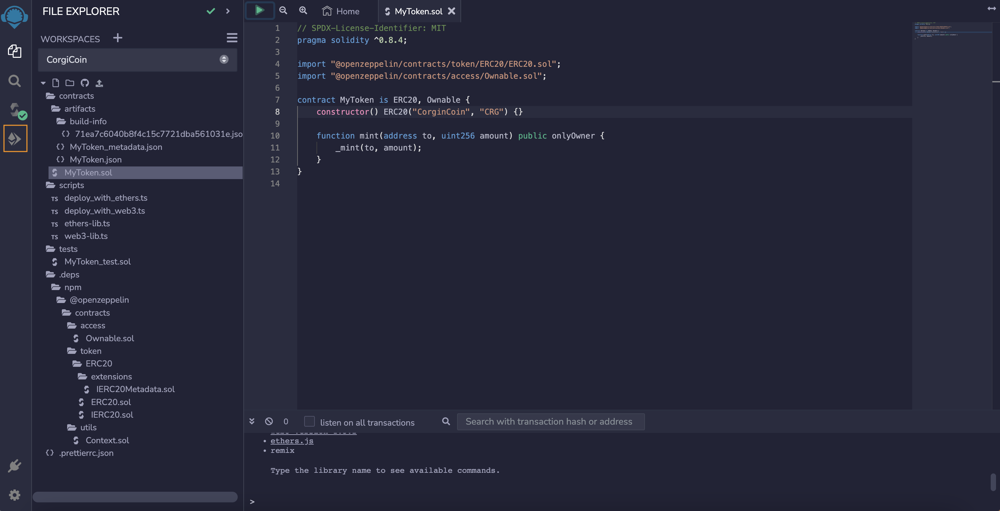


  
  


We're going to be creating an ERC-20 token in this quickstart. The ERC-20 contract is used a lot in representing a massive array of tokens across multiple blockchains, primarily the Ethereum blockchain.

## Prerequisites

* You must have a **Metamask wallet ready** to use in your browser.
Learn how [here](/tutorials/metamask-intro/create-wallet/).
* You must be connected to the **Filecoin Wallaby Testnet**.
Learn how [here](/tutorials/metamask-intro/switch-networks/).

## Instructions

### Get some funds

Before you can operate in the Filecoin test network, you need funds to pay for gas fees.

1. Open your browser and open MetaMask.
1. Click your account to copy the address to your clipboard:

   

1. Go to [wallaby.network](https://wallaby.network/#faucet) and scrolldown to the **Faucet** section.
1. Paste your address into the address field, complete the **I am human** captcha, and then click **Send**:

   

1. The faucet should give you a link to the transaction. Click it to view your transaction:

   

1. The block explorer will show you the transaction history for your address. After a couple of minutes, you should see 5000 `tFIL` transferred to your address.
1. Open MetaMask to confirm that you received the `tFIL`:

   

That's all there is to it! Getting `tFil` is easy!

### Contract creation

The development environment we're going to be using is called Remix, viewable at [remix.ethereum.org](https://remix.ethereum.org/). Remix is an incredibly sophisticated tool, and there's a lot you can play around with! In this tutorial however, we're going to stick to the very basics. If you want to learn more, check out [the Remix documentation](https://remix-ide.readthedocs.io/en/latest/).

#### Create a workspace

In Remix, workspaces are siloed environments where you can create a contract, or group of contracts, for each project. Let's create a new workspace to create our new ERC-20 token.

1. Open [remix.ethereum.org](https://remix.ethereum.org).
1. Click the `+` icon next to **Workspaces** to create a new workspace:

   

1. In the **Choose a template** dropdown, select **ERC 20**.
1. Select the **Mintable** checkbox.
1. Enter a fun name for your token in the **Workspace name** field. Something like `CorgiCoin` works fine.

   

1. Click **OK** to create your new workspace.

#### Customize the contract

The contract template we're using is pretty simple; we just need to modify a couple of variables.

1. Under the **contract** directory, click **MyToken.sol**.
1. In the editor panel, replace `MyToken` with whatever you'd like to name your token. In this example, we'll use `CorgiCoin`.
1. On the same line, replace the second string with whatever you want the symbol of your token to be. In this example, we'll use `CRG`.

   

That's all we need to change within this contract. You can see on line 4 that this contract is importing another contract from `@openzeppelin` for us, meaning that we can keep our custom token contract simple.

#### Compile

1. Click the green play symbol at the top of the workspace to compile your contract. You can also press `CMD` + `s` on MacOS or `CTRL` + `s` on Linux and Windows.
1. Remix automatically fetches the two `import` contracts from the top of our `.sol` contract. You can see these imported contracts under the `.deps` directory. You can browse the contracts there, but Remix will not save any changes you make.

#### Deploy

Now that we've successfully compiled our contract, we need to deploy it somewhere! This is where our previous MetaMask setup comes into play.

1. Click the **Deploy** tab from the left.

   

1. Under the **Environment** dropdown, select **Injected Provider - MetaMask**.

   

1. MetaMask will open a new window confirming that you want to connect your account to Remix.
1. Click **Next** and then **Connect** to connect your `tFIL` account to Remix.
1. Back in Remix, under the **Account** field, you'll see that it says something like `0x5A5... (5000 ether)`. This value is 5000 `tFIL`, but Remix doesn't natively support the Filecoin network and thus doesn't understand what `tFIL` is. This isn't a problem; it's just a little quirk of using Remix.

   

1. Under the **Contract** dropdown, ensure the contract you created is selected.

   

1. Click **Deploy**.

   

1. MetaMask will open a window and as you to confirm the transaction. Scroll down and click **Confirm** to have MetaMask deploy the contract.
1. Back in Remix, a message at the bottom of the screen shows that the creation of your token is pending.

   

1. Wait around 90 seconds for the deployment to complete.

On the Filecoin network, a new set of blocks, also called a tipset, is created every thirty seconds. When deploying a contract, the transaction needs to be received by the network, and then the network needs to confirm the contract. This process takes around one to two tipsets to process -- or around 60 to 90 seconds.

### Use your contract

Now that we've compiled and deployed the contract, it's time to actually interact with it!

#### Mint your tokens

Let's call a method within the deployed contract to mint some tokens.

1. Back in Remix, open the **Deployed Contracts** dropdown, within the **Deploy** sidebar tab.

   

1. Expand the `mint` method. You must fill in two fields here: `to` and `amount`.

   

1. The `to` field specifies what address you want these initial tokens sent to. Open MetaMask, copy your address, and paste it into this field.

   

1. This field expects an `attoFil` value. 1 `FIL` is equal to 1,000,000,000,000,000,000 `attoFil`. So if you wanted to mint 100 `FIL`, you would enter `100` followed by 18 zeros: `100000000000000000000`.

   

1. Click **Transact**.

   

1. MetaMask will open a window and ask you to confirm the transaction. Again, you must wait for the network to process the transaction, which should take about 90 seconds. You can move on to the next section while you're waiting.

   

#### Add to MetaMask

Currently, MetaMask has no idea what our token is or what it even does. We can fix this by explicitly telling MetaMask the address of our contract.

1. Go back to Remix and open the **Deploy** sidebar tab.
1. Under **Deployed Contracts**, you should see your contract address at the top. Click the copy icon to copy the address to your clipboard.

   

1. Open MetaMask, select **Assets**, and click **Import your tokens**:

   

1. In the **Token contract address** field, paste the contract address you just copied from Remix and then click **Add custom token**. MetaMask should autofill the rest of the information based on what it can find from the Filecoin network.

   

1. Click **Import token**.

   

1. You should now be able to see that you have 100 of your tokens within your MetaMask wallet!

   

#### Share your tokens

Having a bunch of tokens in your personal MetaMask is nice, but why not send some tokens to a friend? Your friend needs to create a wallet in MetaMask as we did in the [Create a wallet](/tutorials/metamask-intro/create-wallet/) and [Switch networks](/tutorials/metamask-intro/switch-networks) tutorials. They will also need to import your contract deployment address like you did in the [Add your tokens to MetaMask](#add-to-metamask) section. Remember, you need to pay gas for every transaction that you make! If your friend tries to send some of your tokens to someone else but can't, it might be because they [don't have any `tFil`](#get-some-funds).
