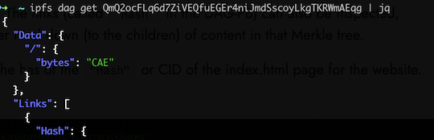
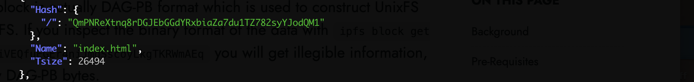
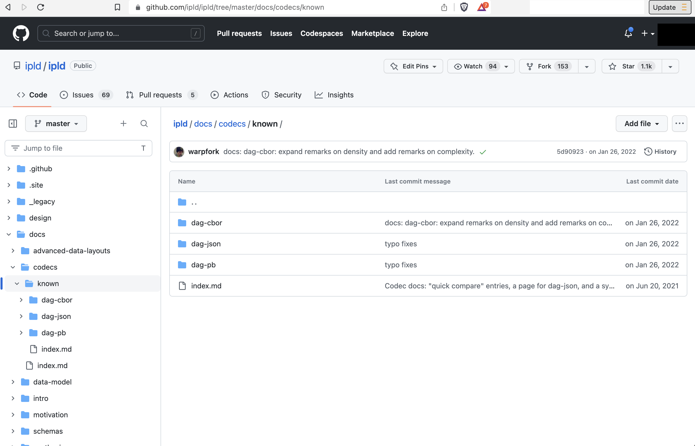
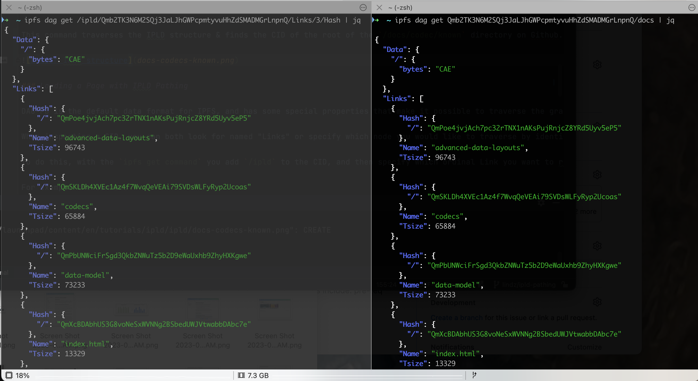

## Background

In this tutorial, you are going to use the IPFS command line API to experience IPLD pathing features which allow you navigate a directed acyclic graph (DAG). You will be navigating the DAG of the [ipld.io](https://ipld.io) website that is hosted on IPFS, thanks to a service called [Fleek.co](/curriculum/dev-tools/fleek/).

Fleek.co can display a static website whose code is hosted on Github. So whenever there is a change to the [ipld.io github repo](https://github.com/ipld/ipld), the changes get added to IPFS through Fleek and the new CID gets updated automatically in the DNS server. Therefore, as you go through the tutorial the CIDs may be different depending on when you go though it.

## Pre-Requisites

* Install IPFS on the command line, if you have not done that yet, [check out this tutorial](https://curriculum.pl-launchpad.io/curriculum/ipfs/setup/)
* Download jq on the command line:
    * Linux or WSL: `sudo apt-get install jq`
    * Mac: `brew install jq`
* Open the [ipld.io](https://ipld.io/) website
* Have the [IPLD Gitub Repo](https://github.com/ipld/ipld) on hand

# video goes here

## Instructions
## Instructions
Once you have installed kubo (formerly go-ipfs) and initiated and ipfs node, start up ipfs with the command`ipfs daemon`, then open a second terminal window to follow the instructions below.
### Install jq

Jq is a tool to help the user view json text easier on the command line. You can go to [stedolan.github.io/jq/download](https://stedolan.github.io/jq/download) to find instructions for your operating system.

### Find the CID for ipld.io website

```
ipfs resolve /ipns/ipld.io
```

You should see the following output in your CLI:

```
/ipfs/QmQ2ocFLq6d7ZiVEQfuEGEr4niJmdSscoyLkgTKRWmAEqg
````

This command can help you find the root CID for any website that is hosted on IPFS through [DNSLink](https://developers.cloudflare.com/web3/ipfs-gateway/concepts/dnslink/). Fleek makes websites readily available on IPFS by auto-updating the DNSLink with the most recent CID.

### Inspect the Root

Now that you have the root CID for the website ipld.io, you can inspect the DAG that makes up the data stored on IPFS.


```
ipfs dag get QmQ2ocFLq6d7ZiVEQfuEGEr4niJmdSscoyLkgTKRWmAEqg | jq
```

You should see the following output in your CLI, which is a list of the CIDs below the root block:

```json
{
  "Data": {
    "/": {
      "bytes": "CAE"
    }
  },
  "Links": [
    {
      "Hash": {
        "/": "QmY55i3pt9gJh4po9cdRJzZFafPAwF7V8etP9xQsnBZ8sD"
      },
      "Name": "FAQ",
      "Tsize": 15452
    },
    {
      "Hash": {
        "/": "QmVWdcKiK2mWpDXQj9DtHsrBqzA4hSLxov5juvaS4wrCZD"
      },
      "Name": "css",
      "Tsize": 85864
    },
…

…
  {
      "Hash": {
        "/": "QmPNReXtnq8rDGJEbGGdYRxbiaZa7du1TZ782syYJodQM1"
      },
      "Name": "index.html",
      "Tsize": 26494
    },
    {
      "Hash": {
        "/": "QmcVrQ8Bhk2S858P4sSedR9PNc8pq2zvLXpsTTPRnLZk86"
      },
      "Name": "x",
      "Tsize": 685
    }
  ]
}
```

This has pulled in the next level of blocks connected to the root CID, and printed it in DAG-JSON format. We use the `jq` command to print the json in an easy-to-read layout.

> The original block is actually DAG-PB format which is used to construct UnixFS file data in IPFS.  If you inspect the binary format of the data with `ipfs block get QmQ2ocFLq6d7ZiVEQfuEGEr4niJmdSscoyLkgTKRWmAEq` you will get illegible information, since it is raw DAG-PB bytes.

DAG-PB has two top-level properties: `Data` and `Links`. The `Data` field has the actual bytes contained in a block. Each `Link` in DAG-PB has a name, a CID and a size. The `Links` contain the `Hash` or CID for the data in the next level below. The `Hash` property can also be inspected, leading you another level down (to the children) of content in that Merkle tree.



You can see here the `"Hash"` or CID of the index.html page for the website.




### Load a Page With an IPFS Path

When a client (i.e a website/a browser via an IPFS gateway) loads a root like in the following manner and doesn’t find a single page, it will look for an `index.html` link, which [ipld.io](http://ipld.io/) has. In this case, the `Links` field is empty, but the `Data` field contains a lot of bytes so the client will load those in. The bytes are Base64 encoded.

```bash
ipfs dag get QmQ2ocFLq6d7ZiVEQfuEGEr4niJmdSscoyLkgTKRWmAEqg/index.html | jq
```

You should see the following output in your CLI:

```json
{
    "Data": {
        "/": { "bytes": "CAIS0s4BPCFET0NUWVBF... "}
    },
    "Links": []
}
```
If you want to navigate to any other block using IPFS pathing, just add the name of the link in the path, similar to what you would do in a linux filesystem.

As an example, if you take a look at this directory in the [IPLD website github repo](https://github.com/ipld/ipld/tree/master/docs/codecs/known):



You can reach this same directory on the CLI by simply adding the filepath on the end of the root CID like so:

```bash
ipfs dag get Qmb2TK3N6M2SQj3JaLJhGWPcpmtyvuHhZdSMADMGrLnpnQ/docs/codecs/known | jq
```

This command traverses the IPLD structure & finds the CID of the root of the `/docs/codec/known` directory on Github. The output that you see should match the file structure of the Github repo above.


### Load a Page with IPLD Pathing

DAG-PB is the default data format for IPFS and has some special properties that make it possible to traverse the graph in the same way you would other filesystems.

When inspecting a CID, you can both look for named "Links" or specify which node you would like to traverse by identifying the link by the number.

To do this, with the `ipfs get command` you add `/ipld` to the CID, and then specify which ordinal Link you want to retrieve by appending `/Links/<number>/Hash`.

Try the command

```bash
ipfs dag get /ipld/Qmb2TK3N6M2SQj3JaLJhGWPcpmtyvuHhZdSMADMGrLnpnQ/Links/3/Hash | jq
```
This will retrieve the information about the 4th link listed under the root CID of `Qmb2TK3N6M2SQj3JaLJhGWPcpmtyvuHhZdSMADMGrLnpnQ`, which has a name of `"docs"`.


```json
{
    "Data": {
        "/": { "bytes": "CAIS0s4BPCFET0NUWVBF..." }
    },
    "Links": []
}
```

The `Links` is an array field, so we use the number 3 to identify which child block we want to access. In this case, it's going to navigate into the `Hash` for `"docs"` (since it's at an index of 3) that will load the block with that CID. You can see that you get the same block you would with IPFS pathing referring to the same block:



### Inspect the Data in a Block
If you add `/Hash/Data` to the end of the path, it will access the DAG-JSON bytes that were transformed into a CID, as opposed to accessing the DAG-PB formatted block. In this example, we are examining the block at an index of 7, which happens to be the `index.html` page:

```bash
ipfs dag get /ipld/Qmb2TK3N6M2SQj3JaLJhGWPcpmtyvuHhZdSMADMGrLnpnQ/Links/7/Hash/Data | jq
```
You should see something like the following in your CLI:

```
{
    "/": {  "bytes": "CAIS0s4BPCFET0NUWVBF... "}
}
```

### Switching Codecs
IPLD pathing, by default, allows you to inspect data in DAG-JSON format, and not the raw byte array. We are going to use a couple commands to inspect the data of the `index.html` page (the `"Link"` at an index of 7) in it's original format.

This command is made up of three parts
* The Pathing command `ipfs dag get`, with the flag `--output-codec=raw `, to inspect the raw data
* The CID of the block, using the block at an idex of 7 under the root block, `Qmb2TK3N6M2SQj3JaLJhGWPcpmtyvuHhZdSMADMGrLnpnQ/Links/7`
* A pointer to the data inside the block (in this case, it's the bytes inside index.html), so you will need to append `/Hash/Data` to the end of the CID to access that data.

Using the flag `--output-codec=raw`  has changed the codec you use to view the data from DAG-JSON to the `RAW` codec and you are able to view the bytes _as they are_.

```bash
ipfs dag get --output-codec=raw /ipld/Qmb2TK3N6M2SQj3JaLJhGWPcpmtyvuHhZdSMADMGrLnpnQ/Links/7/Hash/Data

��<!DOCTYPE html>
<html class="no-js" lang="en-US" prefix="og: http://ogp.me/ns# fb: http://ogp.me/ns/fb#">
<head>

...

<link rel="stylesheet" href="css/tachyons.min.css" />

<link href="https://fonts.googleapis.com/css?family=Open+Sans:400,600,700" rel="stylesheet"/>

<title>IPLD - The data model of the content-addressable web</title>
…
…
```

[//]: # (### Exercise: Using IPLD Pathing to go deep into the DAG)

[//]: # ()
[//]: # (Now that you have learned the basics of IPLD pathing options, we challenge you to navigate to a block **at least** 4 layers deep or more into the ipld.io dag and submit the command you used to reach that point.)

[//]: # ()
[//]: # ({{% embed src=https://docs.google.com/forms/d/e/1FAIpQLSejZokLiXjhecn6Aqr7VXhafsZVOeUeDM1sm76ykiAHtV4SRA/viewform?usp=sf_link width="100%" height="800px" %}})

[//]: # ()
[//]: # (Here is 1 possible answer:)

[//]: # (```bash)

[//]: # (* ipfs dag get /ipld/Qmb2TK3N6M2SQj3JaLJhGWPcpmtyvuHhZdSMADMGrLnpnQ/Links/3/Hash/Links/1/Hash/Links/1/Hash/Links/2/Hash/Links/0/Hash)

[//]: # (```)
