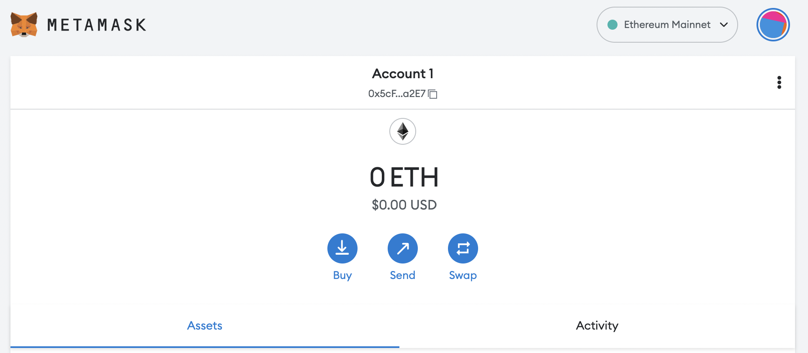

**Metamask** is a crypto wallet and a gateway to blockchain apps.
The main feature of Metamask is its browser extension, which is available for Brave, Chrome, Edge, Firefox, and Opera.

## The Wallet

In terms of its wallet, Metamask works similar to any other crypto wallet. When you create a wallet in Metamask, a public/private key pair is generated.
The public key is used to identify you in the blockchain network, and the private key is used to access your funds.

### Private Key Management

Your private key is probably the most important piece of information of any crypto wallet.
For security reasons, Metamask does NOT store your private key remotely.
Your private key is stored in your browser, and is only used by the Metamask app locally to sign transactions.

Now, consider that a relative wants to use your computer. Without any extra protection, your wallet would be usable by anyone with access to your browser.
To add another security layer, Metamask asks you to create a **password**, which you must provide every time that you want to operate with your funds.

If you forget your password, you still have an opportunity to recover your funds.
When setting your password, you will be asked to take of note of the **secret recovery phrase**.
You must keep this recovery phrase safe, as it provides access to your Metamask wallet.

## Tokens Supported

Only tokens on the Ethereum blockchain are available in Metamask (the so-called ERC-20 tokens).
If you want to store a token from other blockchain, you must use a _wrapper token_.

A _wrapper token_ is a token pegged to the value of another crypto.
For example, the Wrapped Bitcoin (WBTC) runs on the Ethereum blockchain and takes its value from its _parent_, the Bitcoin (BTC).

