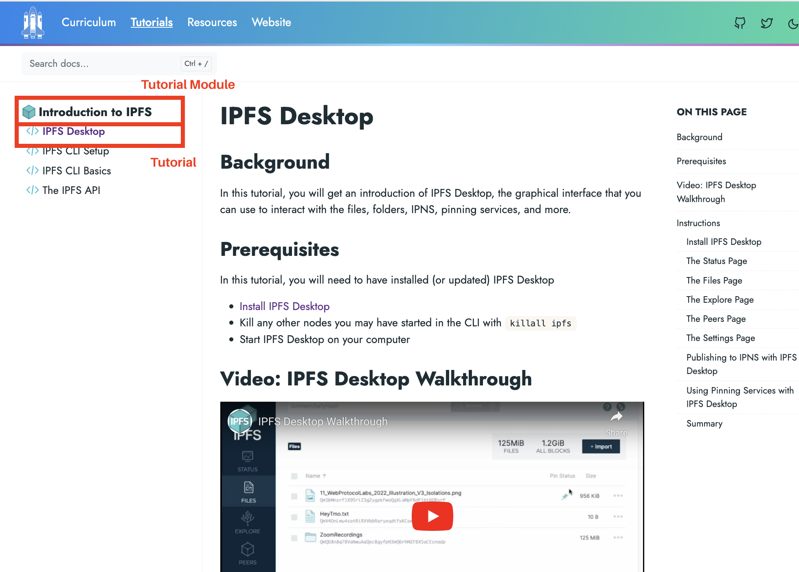
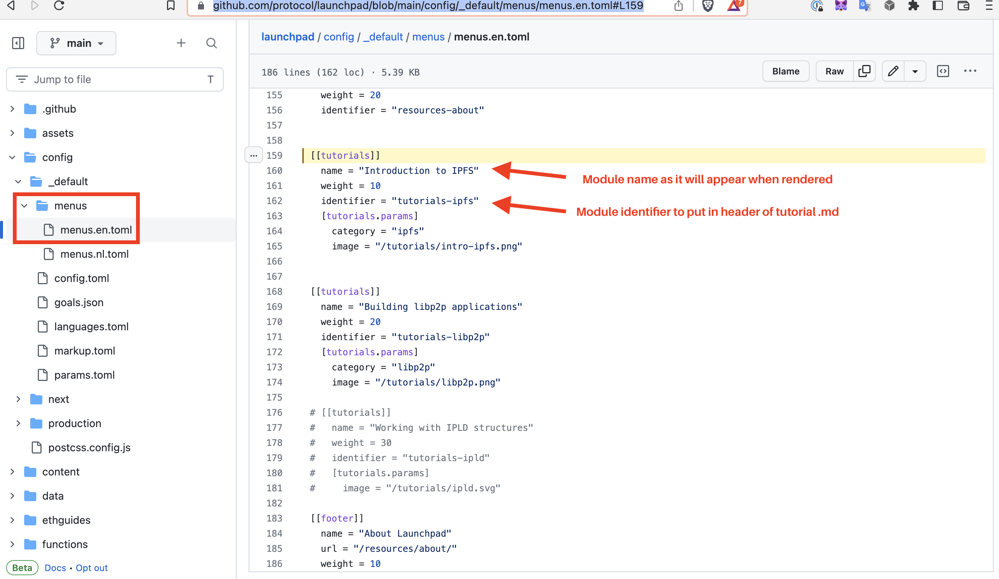
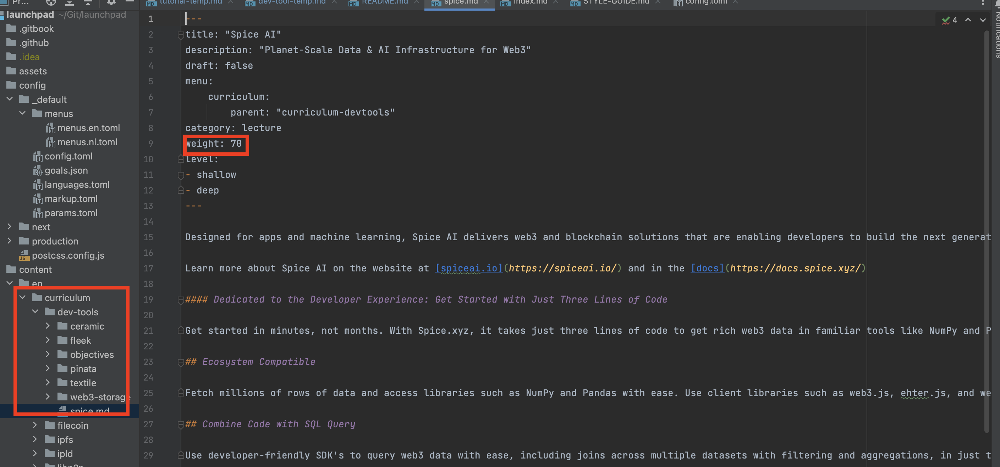

# How to Create Tutorials and Curriculum Pages
This readme will outline the steps to create a Tutorial on the [Tutorial page of the curriculum platform](https://curriculum.pl-launchpad.io/tutorials/) and how to create a page in the [Dev Tools section of the Launchpad curriculum platform](https://curriculum.pl-launchpad.io/curriculum/dev-tools/objectives/).

**Tutorials**

## How to Create a Tutorial

Definitions
* Module: A set of several step-by-step modules
* Tutorial: An individual page in a set of tutorials

  

### Create a new Tutorial
* First, you will need to create a markdown file (or a directory containing a markdown file, if the tutorial has images) in the `/content/en/tutorials` [directory](https://github.com/protocol/launchpad/tree/main/content/en/tutorials) in the root of the repo.
  * Add a tutorial to an existing tutorial module, by simply copy-pasting the tutorials template into the module folder where you will place the file.
       `cp templates/tutorial-temp.md /content/en/tutorials/<module-name>/<tutorial-name.md>`

   * Edit the header/ metadata in the new tutorial:
     Update the `parent:` field in the header, with the identifier from the `config/_default/menus/menus.en.toml` [file](https://github.com/protocol/launchpad/blob/main/config/_default/menus/menus.en.toml):
      ```
     title: "Title (Tutorial)"
     description: "Deep/Shallow Dive Tutorial – Subtitle"
     draft: false
     menu:
       tutorials:
         parent: "<identifier of tutorial module>"
     ```
     * For example, to add to the **Introduction to IPFS** module, you would replace`"<identifier of tutorial module>"`that with `"tutorials-ipfs"` found on here in the [menus.en.toml file](https://github.com/protocol/launchpad/blob/main/config/_default/menus/menus.en.toml#L159)
     
     

     * To add the tutorial within a curriculum module as well, under the `menu` field, add an additional two lines with a `curriculm` field witht he correct file from [menus.en.toml](https://github.com/protocol/launchpad/blob/main/config/_default/menus/menus.en.toml#L91):
       ```
       menu:
         tutorials:
           parent: "tutorials-ipfs"
         curriculum:
           parent: "curriculum-ipfs"
       ```


### Create a new Module
To create a new set of tutorials or Module, follow these steps:
* Create a new directory
  `mkdir /content/en/tutorials/<your-tutorial-module-name>`
* Copy the `.md` template into your new module folder in `content/en/tutorials/<your-tutorial-module-name` (or make a directory with a markdown file if the tutorial has images)
* In `config/_default/menus/menus.en.toml` add a new field:
  ```
  [[tutorials]]
  name = "<Name that will render on the page>"
  weight = <make 10 higher than the previous one >
  identifier = "<tutorial-id-for-header>"
  [tutorials.params]
    category = "libp2p"
    image = "/tutorials/libp2p.png"
  ```

  * `name` This will render on the webpage
  * `weight` controls what order tutorials are displayed in, make it 10 higher
  * `identifier` is
  * `category` create a new unique category name, just make sure it's unique
  * `image' - Find an image and upload to `static/tutorials` [directory](https://github.com/protocol/launchpad/tree/main/static/tutorials)

* When you have created this, mark @enoldev or @walkerlj0 as a reviewer in Github


## How to Create a Dev Tools Page

 * Create a Markdown file or a directory with a markddown file in `content/en/curriculum/dev-tools`
 * Update the `weight` field to be 10 after the very last dev-tools page
   
  _in this example, the last page is currently spice.md, and you would want to make the next page havea  weight of 80_

## How to Create a new Curriculum Module
* Create a new directory
* Add .md Files
* Update `config/_default/menus/menus.en.toml`

```
[[curriculum]]
name = "<New Curriculum Name>"
weight = 20
identifier = "curriculum-<name>"

[curriculum.params]
image = "/logos/ipfs.svg"
width = 100
height = 100
section = "<make up a unique section>"
description = "<Short description>"
```


